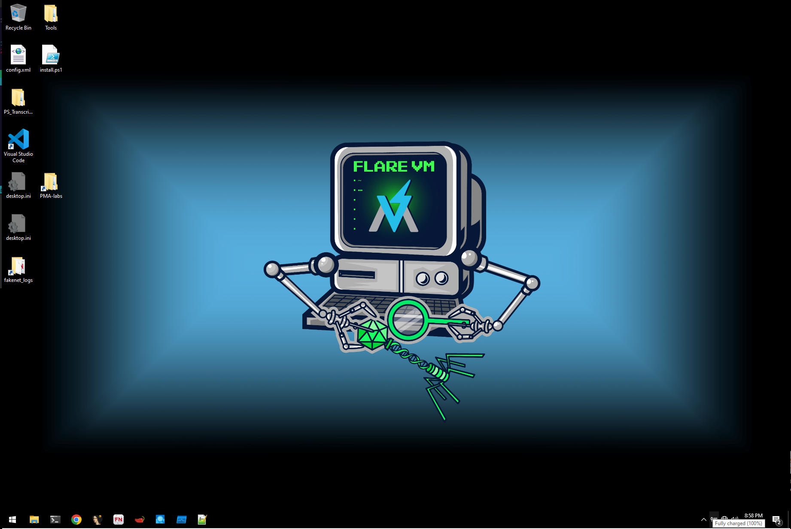

In this guide we are going to learn how to setup a safe and practical lab enviroment for malware analysis. We will be focusing on a windows lab enviroment using **Flare VM**. This is an open source project that contains scripts to setup a windows lab enviroment with tools for analyzing and reversing malware. 

Here is a link to the project:
> <https://github.com/mandiant/flare-vm>

## Choosing a Virtualization Platform:

The most common options for easy virtualization are **vmware** and **virtualbox**. 

In this guide we will be using virtualbox. You can find information about how to download the software here: 
>  <https://www.virtualbox.org/wiki/Downloads>

## Download a Windows 10 iso:
We will need a windows ISO with a version greater or equal to 10.

At the time of writing you can obtain a copy from here:
> <https://www.microsoft.com/en-us/software-download/windows10ISO/>

## Setup the Windows VM:

Before we can use **Flare VM** we will need to setup our windows 10 virtual machine.

I will not be going over how to setup a Windows VM as the steps varry between virtualization software. I will however put links below that show you how to setup a vm.

Preferably we want to use windows 10 pro as it makes the next steps a bit easier.

> You can avoid needing a microsoft account by disconnecting the vm from the internet when running the install. Windows 10 pro also gives an "offline account" option.

Here are the links:
* VM Ware:
    * <https://knowledge.broadcom.com/external/article?legacyId=2128765>
* Virtual Box:
    * <https://docs.oracle.com/cd/E26217_01/E26796/html/qs-create-vm.html>

## Installing Flare:
Once we have our vm up we can begin the install process for Flare!

#### Step 1 Disabling Windows Updates on Windows 10 pro:

* Open Group Policy Editor.
    * Search for "group policy" and click "Edit group policy"
* Follow the path: Computer Configuration > Administrative Templates > Windows Components > Windows Update

* Double-click "Configure Automatic Updates."

* Then set to "Disabled"

If you do not have windows 10 pro on your VM additional methods can be used. 

* You can find them here:  <https://www.windowscentral.com/how-stop-updates-installing-automatically-windows-10>

#### Step 2 Disabling Tamper Protections and Anti Virus:

Flare prefers us to do this via group policy but it can also be done via windows defender.

* Here is a stackoverflow post detailing the process: <https://superuser.com/questions/1757339/how-to-permanently-disable-windows-defender-real-time-protection-with-gpo/1757341#1757341>

We are going to disable real-time protection via group policy like the last step.

* Open the Group Policy Editor again
* Follow this path: Computer Configuration > Administrative Templates > Windows Components > Microsoft Defender Antivirus > Real-time Protection
* Double-click "Turn off real-time protection"

* Set to "Enabled"

To disable microsoft defenderfollow the same process as above with a different path.

* Open the Group Policy Editor
* Follow the path: Computer Configuration > Administrative Templates > Windows Components > Microsoft Defender Antivirus

* Enable "Turn off Microsoft Defender Antivirus"

Now restart the machine.

## Finishing the Install:

Next we are going to run the install scripts for the Flare VM setup. These can be found at their github page: <https://github.com/mandiant/flare-vm>

We are going to follow the instructions as they are listed on gituhub:

They are as follows: 

* Open a `PowerShell` prompt as administrator
* Download the installation script [`installer.ps1`](https://raw.githubusercontent.com/mandiant/flare-vm/main/install.ps1) to your Desktop:
  * `(New-Object net.webclient).DownloadFile('https://raw.githubusercontent.com/mandiant/flare-vm/main/install.ps1',"$([Environment]::GetFolderPath("Desktop"))\install.ps1")`
* Unblock the installation script:
  * `Unblock-File .\install.ps1`
* Enable script execution:
  * `Set-ExecutionPolicy Unrestricted -Force`
    * If you receive an error saying the execution policy is overridden by a policy defined at a more specific scope, you may need to pass a scope in via `Set-ExecutionPolicy Unrestricted -Scope CurrentUser -Force`. To view execution policies for all scopes, execute `Get-ExecutionPolicy -List`
* Finally, execute the installer script as follow:
  * `.\install.ps1`
    * To pass your password as an argument: `.\install.ps1 -password <password>`
    * To use the CLI-only mode with minimal user interaction: `.\install.ps1 -password <password> -noWait -noGui`
    * To use the CLI-only mode with minimal user interaction and a custom config file: `.\install.ps1 -customConfig <config.xml> -password <password> -noWait -noGui`
* After installation it is recommended to switch to `host-only` networking mode and take a VM snapshot

Running this script will take a long time. I recommended to walk away during the install as it can take over 3 hours.

When you return you should be greated by the flare VM background and all the tools installed. This would be a good time to take another VM snapshot.

> Your desktop might look slightly different as I moved some stuff around.

#### Happy reversing....

