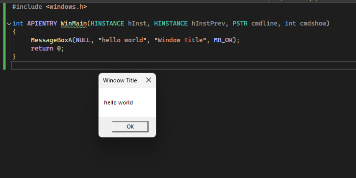
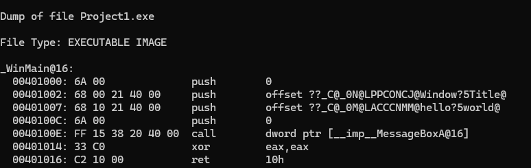
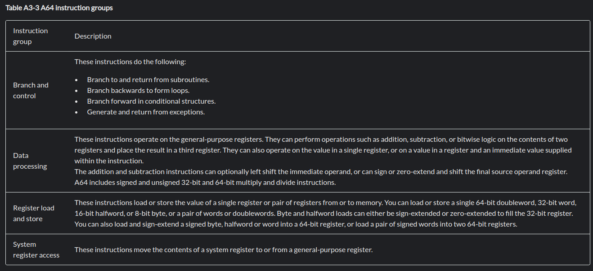
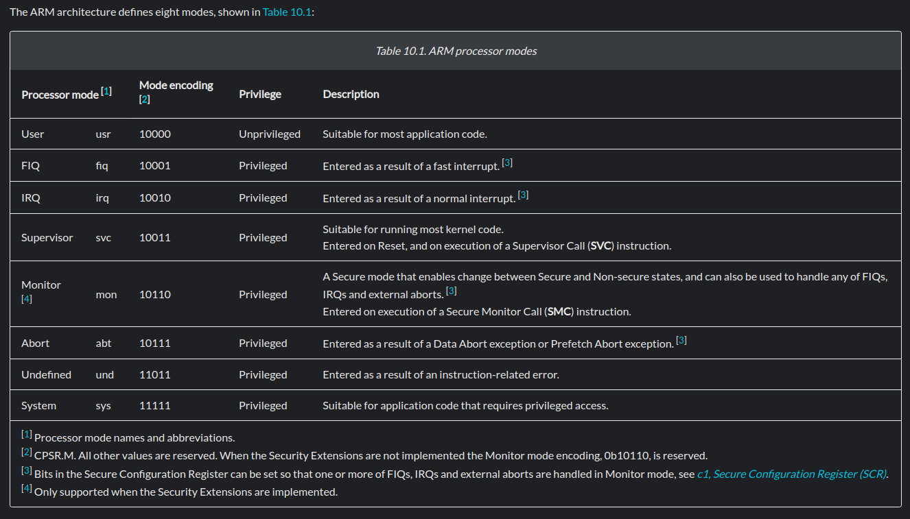
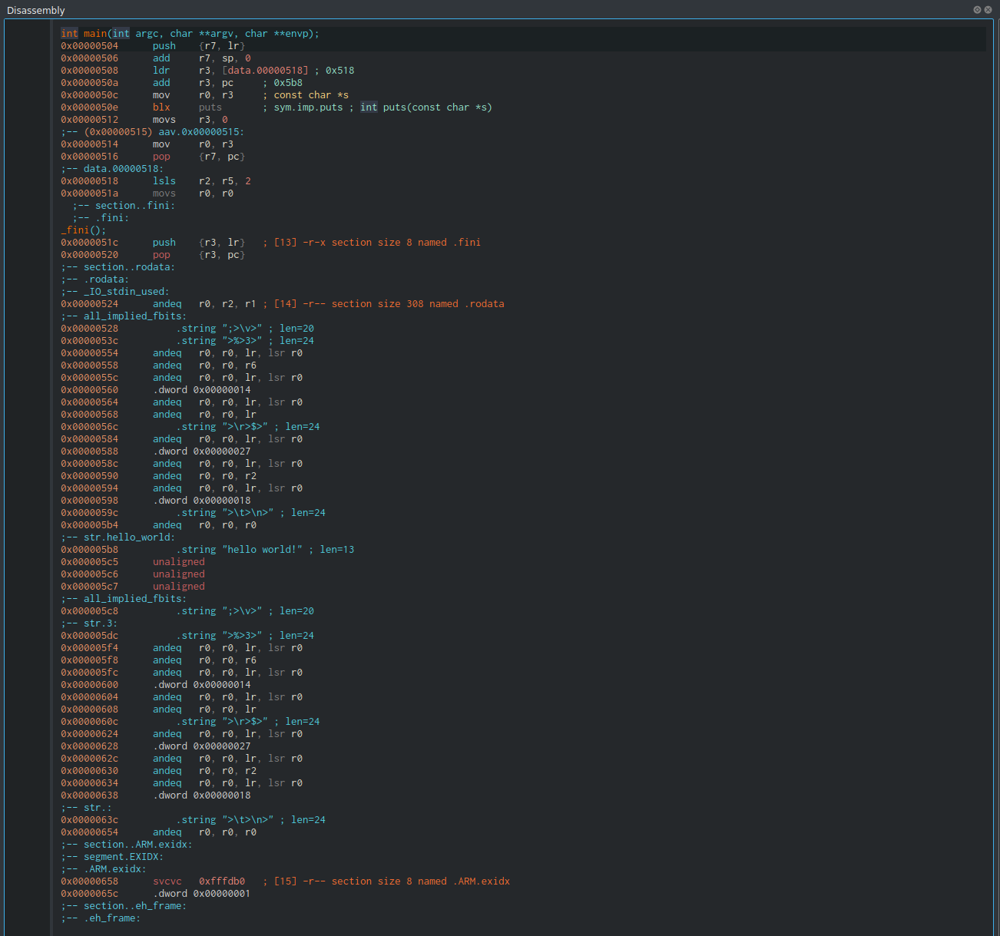

# Basics of Assembly for Makers and Hackers


Assembly language is a low-level programming language that serves as a direct link between high-level languages and machine code, which provides instructions for the CPU. It is a crucial tool for tasks that require low level hardware control. Understanding the basics of ASM is extremely useful for reverse engineering and debugging/developing low level software.

x86/64 and ARM architecture will be discussed.


## CPU Registers:

In order to understand how assembly code works it is a good idea to have a background of how computer memory works.

Registers are memory spaces located internally on the processor. Some main registers are as follows:


* General-purpose:
   * These registers are used to store temporary data for various data operations.
* Instruction pointer(program counter):
   * Contains the address to the next instruction to be executed. It also serves as a counter for the number of instructions.
* Instruction Register:
   * Holds the address of the instruction that is being executed. Once the address from the IP/PC is stored in IR the CPU executes it.
* Stack and frame pointers:
   * The stack pointer points to the top of the stack. Frame pointer always points to a fixed position in the stack.


## Memory:
Memory is a crucial aspect of computers and programs. Memory provides storage space for various data and allows CPU's to process more information and perform more complex operations.
### Virtual Memory:
Virtual memory is an isolated memory space which maps to a physical memory space. A program is allocated a section of virtual memory and is supposed to only access memory within that virtual memory space that is allocated. Virtual memory is often larger than the physical memory on a system and can be used to allow systems with a low amount of physical RAM to run more complex programs, this is accomplished by utilizing disk space. Within these virtual memory spaces there are permission flags which determine what operations the application is allowed to preform. These include READ,WRITE and EXECUTE, these can be combined as well.


In order to access values in memory a program needs its virtual memory address which is mapped to its location in physical hardware. These addresses in these virtual spaces are stored in a stack which is a block of addresses.


Heres an additional article: https://www.geeksforgeeks.org/virtual-memory-in-operating-system/


### Memory Stack


The memory stack follows the same principle of a traditional computer science stack, last in first out. The top of this stack is pointed to by the stack pointer which was briefly discussed above. The stack essentially builds up a stack of building blocks which are all executed in a program in a certain order and can only be pushed onto the stack or popped of the stack.


Heres a good blog post about the stack (with some debugger action as well): https://www.varonis.com/blog/stack-memory-3


## Architectures
Two main CPU architectures exist ARM and x86_64 these two architectures run off of different instruction sets. These instruction sets are as follows:


* **Complex Instruction Set Computer (CISC)**
   * CISC uses complex instructions this set of instructions provides a way of writing small code files in a minimal number of lines. Instructions in CISC can execute multiple operations in one. This can simplify the writing process but can be slower. 
* **Reduced Instruction Set Computer (RISC)**
   * RISC uses simple instruction that usually preform one operation per instruction. This leads to longer code files but can be faster due to not executing any unneeded operations.


## x86/64 ASM Crash Course:


### Registers and Flags:
Below is a table of common GPR's (General Purpose Registers) as well as some special registers and their sizes in x86(32bit) and x64(64bit)


| Register Name | x86 Size (Bytes) | x64 Size (Bytes) |
|---------------|-------------------|-------------------|
| **General-Purpose Registers** | | |
| AL / AX / EAX / RAX | 1 / 2 / 4        | 8                 |
| AH / AX / EAX / RAX | 1 / 2 / 4        | 8                 |
| BL / BX / EBX / RBX | 1 / 2 / 4        | 8                 |
| BH / BX / EBX / RBX | 1 / 2 / 4        | 8                 |
| CL / CX / ECX / RCX | 1 / 2 / 4        | 8                 |
| CH / CX / ECX / RCX | 1 / 2 / 4        | 8                 |
| DL / DX / EDX / RDX | 1 / 2 / 4        | 8                 |
| DH / DX / EDX / RDX | 1 / 2 / 4        | 8                 |
| SI / ESI / RSI     | 2 / 4            | 8                 |
| DI / EDI / RDI     | 2 / 4            | 8                 |
| BP / EBP / RBP     | 2 / 4            | 8                 |
| SP / ESP / RSP     | 2 / 4            | 8                 |
| **Instruction Pointer** | | |
| IP / EIP / RIP     | 2 / 4            | 8                 |
| **Flags / Status Register** | | |
| FLAGS / EFLAGS / RFLAGS | 2 / 4        | 8                 |


Here are some common uses for these registers:


* **eax/rax**:
   * Commonly used to store results of operations and return values of functions.
* **ecx/rcx**:
   * Used in repeating actions as a counter.
* **edx/rdx**:
   * Used to extent mul/div operations to extend the result.
* **edi/rdi, esi/rsi**:
   * These are used when copying bytes in memory, rsi/esi is the source and rdi/edi is the destination.
* **esp/rsp**:
   * These are stack pointers which alway point to the top of the stack.
* **ebp/rbp**:
   * These are base pointers that point to a fixed place in the stack. This can be used with function variables and return values. ebp/rbp is typically left unchanged by a functions operations unlike the stack pointer.
* **eip/rip**:
   * These are the special purpose registers that hold the memory address of the next instruction to be executed.
* **EFLAGS/RFLAGS**:
   * These are special registers that hold the status of the CPU. The values in these registers are affected by logic and mathematical operations and indicate various outcomes such as "equal", "not equal", "overflow", etc...
   * Here is a list of some flags:


| Flag | Name                 | Definition                                                   | Value Returned   |
|------|----------------------|--------------------------------------------------------------|------------------|
| CF   | Carry Flag           | Set if there was a carry out of the most significant bit    | 1 (Set), 0 (Clear) |
| PF   | Parity Flag          | Set if the number of set bits in the result is even          | 1 (Even), 0 (Odd) |
| AF   | Auxiliary Carry Flag | Set if there was a carry from bit 3 to bit 4                | 1 (Set), 0 (Clear) |
| ZF   | Zero Flag            | Set if the result of an operation is zero                    | 1 (Zero), 0 (Non-zero) |
| SF   | Sign Flag            | Set if the result of an operation is negative                | 1 (Negative), 0 (Positive) |
| TF   | Trap Flag            | Enables single-step debugging                                | 1 (Enabled), 0 (Disabled) |
| IF   | Interrupt Enable Flag| When set, interrupts are enabled                            | 1 (Enabled), 0 (Disabled) |
| DF   | Direction Flag       | Controls direction for string operations                     | 1 (Decrement), 0 (Increment) |
| OF   | Overflow Flag        | Set if the result of an operation is too large to fit        | 1 (Overflow), 0 (No Overflow) |
| IOPL | I/O Privilege Level  | Indicates privilege level for I/O operations                 | 0-3 (Privilege Levels) |
| NT   | Nested Task          | Indicates if the processor is in a nested task               | 1 (Nested), 0 (Not Nested) |
| RF   | Resume Flag          | Allows resuming execution after a debugging exception        | 1 (Enabled), 0 (Disabled) |
| VM   | Virtual 8086 Mode    | Indicates if Virtual 8086 mode is enabled                    | 1 (Enabled), 0 (Disabled) |
| AC   | Alignment Check      | Enables alignment checking for memory accesses               | 1 (Enabled), 0 (Disabled) |
| VIF  | Virtual Interrupt Flag | Indicates if interrupts are enabled in Virtual 8086 mode     | 1 (Enabled), 0 (Disabled) |
| VIP  | Virtual Interrupt Pending | Indicates if an interrupt is pending in Virtual 8086 mode    | 1 (Pending), 0 (Not Pending) |
| ID   | ID Flag              | Allows the CPUID instruction to be executed                   | 1 (Enabled), 0 (Disabled) |


### Instructions/Operations:
To add to the confusion different syntax versions exist for ASM the main ones are **Intel** and **AT&T**. Most disassemblers and assemblers use Intel syntax which is what will be used for the following instructions (unless specified). Some assemblers use AT&T syntax the main difference between the two is that the src and dest are swapped.


Example:
* Intel:
   * `mov dest, src`
   * `mov eax, 7 `
* AT&T
   * `mov src, dest`
   * `movl $7, %eax`
   * In at&t syntax registers are denoted with a '%' and immediate values are denoted with a '$'


### Opcode,src and dest:
   * Opcode refers to the operation/instruction name such as `mov`,`div`,`mul`, etc...
   * Opcode is typically followed by a 'src' and 'dest'
   * Dest is the destination of the result produced, sometimes it is also used in the arithmetic itself.
       * `add eax, ebx ; eax = (eax+ebx)`
   * Src is the source of the value in the operation.
   * Some operations only have one value used. In these cases it represents either the source and destination or simply just the destination or source.
       * `inc ecx ; ecx = (ecx + 1)`
       * `push "src" ; push source on the stack`


Here is a list of some common instructions:


| Operation            | AT&T Syntax                     | Intel Syntax                  | Description                                                 |
|----------------------|--------------------------------|--------------------------------|-------------------------------------------------------------|
| Move immediate       | `movl $7, %eax`                | `mov eax, 7`                   | Move the immediate value `7` into `eax`                    |
| Move register        | `movl %ebx, %ecx`             | `mov ecx, ebx`                 | Move the value from `ebx` to `ecx`                         |
| Move memory to reg   | `movl 8(%ebp), %eax`          | `mov eax, [ebp+8]`             | Move value from memory at `8` bytes offset from `ebp` to `eax` |
| Move reg to memory   | `movl %eax, 16(%ebp)`         | `mov [ebp+16], eax`            | Move value from `eax` to memory at `16` bytes offset from `ebp` |
| Add                  | `addl $5, %ebx`               | `add ebx, 5`                   | Add value `5` to `ebx`                           |
| Subtract             | `subl $4, %ecx`              | `sub ecx, 4`                   | Subtract value `4` from `ecx`                    |
| Multiply             | `imull %ebx, %eax`             | `imul eax, ebx`                | Multiply `eax` by `ebx`, result in `eax`                   |
| Divide               | `divl %ebx`                    | `div ebx`                      | Divide `eax` by `ebx`, result in `eax` and `edx` (for quotient and remainder) |
| Compare              | `cmpl $10, %ecx`              | `cmp ecx, 10`                  | Compare `ecx` with value `10`                     |
| Jump if zero         | `jz label`                     | `je label`                     | Jump to `label` if zero flag is set                        |
| Jump if not zero     | `jnz label`                    | `jne label`                    | Jump to `label` if zero flag is not set                    |
| Jump                 | `jmp dest`                     | `jmp dest`                     | Jump to `dest`                                              |
| Call procedure       | `call function`                | `call function`                | Call the procedure at `function` address                   |
| Return               | `ret`                          | `ret`                          | Return from the procedure                                  |
| Push                 | `pushl %eax`                   | `push eax`                     | Push `eax` onto the stack                                  |
| Pop                  | `popl %eax`                    | `pop eax`                      | Pop value from stack into `eax`                            |
| Test                 | `testl %ebx, %eax`             | `test eax, ebx`                | Perform a bitwise AND between `ebx` and `eax`, setting flags |
| Multiply (unsigned)  | `mull %ebx`                    | `mul ebx`                      | Multiply `eax` by `ebx`, result in `eax` and `edx` (for result) |
| Divide (unsigned)    | `divl %ebx`                    | `div ebx`                      | Divide `edx:eax` by `ebx`, result in `eax` (quotient) and `edx` (remainder) |
| Increment            | `incl %eax`                    | `inc eax`                      | Increment `eax` by `1`                                     |
| Decrement            | `decl %eax`                    | `dec eax`                      | Decrement `eax` by `1`                                     |
| OR                   | `orl %ebx, %eax`               | `or eax, ebx`                  | Perform a bitwise OR between `ebx` and `eax`               |
| AND                  | `andl %ebx, %eax`              | `and eax, ebx`                 | Perform a bitwise AND between `ebx` and `eax`              |
| XOR                  | `xorl %ebx, %eax`              | `xor eax, ebx`                 | Perform a bitwise XOR between `ebx` and `eax`              |
| NOT                  | `notl %eax`                    | `not eax`                      | Perform a bitwise NOT on `eax`                             |
| Load Effective Address | `leal 8(%ebp), %eax`        | `lea eax, [ebp+8]`             | Load the effective address of `8(%ebp)` into `eax`        |
| Move with Zero-Extend | `movzbl 8(%ebp), %eax`       | `movzx eax, byte ptr [ebp+8]`  | Move value from memory at `8` bytes offset from `ebp` into `eax`, zero-extended |

### Calling Conventions:

Passing arguments to functions in ASM can be done in different ways using different **calling conventions**. These calling conventions vary by use case and or compiler their is a list at the bottom of this section.


`stdcall` is the convention this will be focused on which is used in the WIN32 api.

When using `stdcall` arguments are pushed onto the stack right to left.

based on a helloworld message box program we can examine how the function args are treated in assembly instructions:

```
#include <windows.h>

int APIENTRY WinMain(HINSTANCE hInst, HINSTANCE hInstPrev, PSTR cmdline, int cmdshow) {
    MessageBoxA(NULL, "hello world", "Window Title", MB_OK);
    return 0;
}

```
First the WinMain function is created which is what will get called when the program executes (this is just like a normal main func) the APIENTRY resolves to `__stdcall` which specifys the calling convention. Within the main function we call the messagebox function with 4 parameters in the assembely it will be shown that these arguments get pushed first from right to left due to the calling convention.

WinMain function docs: 
> <https://learn.microsoft.com/en-us/windows/win32/learnwin32/winmain--the-application-entry-point>

MessageBox function docs: 
> <https://learn.microsoft.com/en-us/windows/win32/api/winuser/nf-winuser-messagebox>


**This is the program output:** 



Disassembling the program it looks like this.


It is shown that the arguments are pushed to the stack right to left starting with `0` then `Window Title` then `Hello World` then `0`.
Then the function is called and then the program returns. The return value is stored in `eax` and the `xor eax eax` is setting that value to zero. `stdcall` puts the task of stack cleanup on the callee which in this case is the messagebox function.


Here is a list and some info on common calling conventions:

- **`cdecl` (C Declaration)**
  - **Stack Cleanup**: Caller cleans up the stack.
  - **Argument Passing**: Arguments pushed onto the stack from right to left.
  - **Return Value**: Placed in `EAX` (x86) or `RAX` (x64).
  - **Usage**: Default for C/C++ on x86 systems.

- **`stdcall` (Standard Call)**
  - **Stack Cleanup**: Callee cleans up the stack.
  - **Argument Passing**: Arguments pushed onto the stack from right to left.
  - **Return Value**: Placed in `EAX` (x86) or `RAX` (x64).
  - **Usage**: Commonly used in WinAPI functions.

- **`fastcall`**
  - **Stack Cleanup**: Callee cleans up the stack.
  - **Argument Passing**: First two arguments in registers (`ECX`, `EDX` on x86; `RCX`, `RDX`, `R8`, `R9` on x64); others on the stack.
  - **Return Value**: Placed in `EAX` (x86) or `RAX` (x64).
  - **Usage**: Optimized for frequently called functions.

- **`thiscall`**
  - **Stack Cleanup**: Callee cleans up the stack.
  - **Argument Passing**: `this` pointer in `ECX` (x86); other arguments on the stack.
  - **Return Value**: Placed in `EAX` (x86) or `RAX` (x64).
  - **Usage**: For calling member functions of C++ classes.

- **`vectorcall`**
  - **Stack Cleanup**: Callee cleans up the stack.
  - **Argument Passing**: Integer arguments in `RCX`, `RDX`, `R8`, `R9`; vector arguments in `XMM0`, `XMM1`, etc.
  - **Return Value**: Placed in `RAX` or `XMM0`.
  - **Usage**: Optimized for functions using vector types like `float` or `double`.

- **`syscall`**
  - **Stack Cleanup**: Not directly involved; parameters passed in registers.
  - **Argument Passing**: Parameters in registers (`RDI`, `RSI`, `RDX`, `R10`, `R8`, `R9` on x64).
  - **Return Value**: Placed in `RAX`.
  - **Usage**: Used for making system calls in operating systems like Linux.

- **`ms_abi` / `sysv_abi` (Microsoft vs. System V x64 Calling Conventions)**
  - **Stack Cleanup**: Callee cleans up the stack.
  - **Argument Passing**: 
    - **Microsoft ABI**: Integer/pointer arguments in `RCX`, `RDX`, `R8`, `R9`; floating-point arguments in `XMM0`-`XMM3`.
    - **System V ABI**: Integer/pointer arguments in `RDI`, `RSI`, `RDX`, `RCX`, `R8`, `R9`; floating-point arguments in `XMM0`-`XMM7`.
  - **Return Value**: Placed in `RAX` or `XMM0`.
  - **Usage**: `ms_abi` for Windows x64, `sysv_abi` for Unix-like systems on x64.


## ARM Assembly Crash Course:


This will be somewhat similar to the above but ARM uses RISC. The benefit of this is efficiency and energy/heat management. Processors with less transistors can run using RISC making them ideal for IoT, mobile and embedded devices.


ARM has three main architecture profiles `A`,`R` and `M` they are as follows:


* A (Application profiles, Cortex A Family of Chips):
  * "Application profiles implement a traditional ARM architecture with multiple modes and support a virtual memory system architecture based on an MMU. These profiles support both ARM and Thumb instruction sets."
* R (Real-time profiles, Cortex-R Family of Chips):
  * "Real-time profiles implement a traditional ARM architecture with multiple modes and support a protected memory system architecture based on an MPU."
* M (Microcontroller profiles, Cortex-M Family of Chips):
  * "Microcontroller profiles implement a programmers' model designed for fast interrupt processing, with hardware stacking of registers and support for writing interrupt handlers in high-level languages. The processor is designed for integration into an FPGA and is ideal for use in very low power applications."


  > <https://developer.arm.com/documentation/dui0471/m/key-features-of-arm-architecture-versions/arm-architecture-profiles>


ARM just like x86_64 architecture uses registers to store data and perform computations.


The registers in ARM are as follows:


### ARM 32-bit Registers (ARMv7)


| Register  | Description                                 |
|-----------|---------------------------------------------|
| **R0-R12**| General-purpose registers                    |
| **R13**   | Stack Pointer (SP)                           |
| **R14**   | Link Register (LR)                           |
| **R15**   | Program Counter (PC)                         |
| **CPSR**  | Current Program Status Register              |
| **SPSR**  | Saved Program Status Register                |


- **R0-R12**: Used for general-purpose storage.
- **R13 (SP)**: Points to the current stack location.
- **R14 (LR)**: Stores the return address for function calls.
- **R15 (PC)**: Holds the address of the next instruction to be executed.
- **CPSR**: Contains flags and control bits that affect processor operation, including `APSR` and interrupt enable bits.
- **SPSR**: Used to save the CPSR value when handling exceptions, allowing the processor to return to the previous state after an exception.
- **APSR**: Used to store condition code flags.


### ARM 64-bit Registers (ARMv8)


| Register  | Description                                 |
|-----------|---------------------------------------------|
| **X0-X30**| General-purpose registers                    |
| **X31**   | Zero Register (ZR)                           |
| **SP**    | Stack Pointer                               |
| **LR**    | Link Register                               |
| **PC**    | Program Counter                             |
| **PSTATE**| Processor State Register                    |


- **X0-X30**: Used for general-purpose storage. X30 is also the Link Register (LR) in the ARMv8 architecture.
- **X31 (ZR)**: Used as a representation of the zero register or the `sp` stack pointer (x31 doesn't really exist it is a representation).
- **SP**: Points to the current stack location.
- **LR**: Holds the return address for function calls (same role as X30).
- **PC**: Holds the address of the next instruction to be executed.
- **PSTATE**: Contains flags and control bits, including condition codes and system status information.


### Instruction set ARM:


ARM instruction sets can be broken into the following groups:



> <https://developer.arm.com/documentation/100076/0100/Instruction-Set-Overview/Overview-of-AArch64-state/A64-instruction-set-overview?lang=en>


Here is a list of all the A64 instructions for ARM(there is a lot):
> <https://developer.arm.com/documentation/100076/0100/A64-Instruction-Set-Reference/A64-General-Instructions/A64-instructions-in-alphabetical-order?lang=en>


Here are some basic/common ones:


| Mnemonic | Description                         | Example                             |
|----------|-------------------------------------|-------------------------------------|
| `MOV`    | Move data                           | `MOV R0, #1`  *(Move the value 1 into register R0)* |
| `ADD`    | Add two registers                    | `ADD R1, R2, R3`  *(Add the values in R2 and R3, store the result in R1)* |
| `SUB`    | Subtract one register from another   | `SUB R4, R5, #10`  *(Subtract 10 from the value in R5, store the result in R4)* |
| `MUL`    | Multiply two registers               | `MUL R6, R7, R8`  *(Multiply the values in R7 and R8, store the result in R6)* |
| `DIV`    | Divide one register by another       | `DIV R9, R10, R11`  *(Divide the value in R10 by the value in R11, store the result in R9)* |
| `AND`    | Logical AND between two registers    | `AND R12, R13, R14`  *(Perform a bitwise AND between R13 and R14, store the result in R12)* |
| `ORR`    | Logical OR between two registers     | `ORR R15, R16, R17`  *(Perform a bitwise OR between R16 and R17, store the result in R15)* |
| `EOR`    | Logical XOR between two registers    | `EOR R18, R19, R20`  *(Perform a bitwise XOR between R19 and R20, store the result in R18)* |
| `CMP`    | Compare two registers                | `CMP R21, R22`  *(Compare the value in R21 with the value in R22, affecting flags)* |
| `B`    | Branch                | `B label`       *(Branch to 'label' and dont return)*|
| `BL`     | Branch with link (call function)     | `BL function`  *(Branch to 'function' and link the next instruction to `LR` expecting to return)* |
| `LDR`    | Load register from memory            | `LDR R23, [R24]`  *(Load the value from the address in R24 into R23)* |
| `STR`    | Store register to memory             | `STR R25, [R26]`  *(Store the value in R25 into the address in R26)* |


`syscalls` can also be used in ARM and are accessed using the `SVC` (Supervisor Call). The syntax looks like `svc #0`


an example of calling a `write` syscall in arm would look like this:


```
mov r7, #4 @ 4 is the write syscall


svc #0 @ hand control to kernel


mov r0, #0 @ status code to 0
mov r7, #1 @ syscall 1 is exit
svc #0 @ invoke the call


```


A good way to find how to invoke syscalls is by using the `man syscall` command on linux.


This is a table from the result of that command:


```
  Architecture calling conventions
      Every architecture has its own way of invoking and passing arguments to the kernel.  The details for various architec‐
      tures are listed in the two tables below.


      The first table lists the instruction used to transition to kernel mode (which might not be the fastest or best way to
      transition  to  the kernel, so you might have to refer to vdso(7)), the register used to indicate the system call num‐
      ber, the register(s) used to return the system call result, and the register used to signal an error.


      Arch/ABI    Instruction           System  Ret  Ret  Error    Notes
                                        call #  val  val2
      ───────────────────────────────────────────────────────────────────
      alpha       callsys               v0      v0   a4   a3       1, 6
      arc         trap0                 r8      r0   -    -
      arm/OABI    swi NR                -       r0   -    -        2
      arm/EABI    swi 0x0               r7      r0   r1   -
      arm64       svc #0                w8      x0   x1   -
      blackfin    excpt 0x0             P0      R0   -    -
      i386        int $0x80             eax     eax  edx  -
      ia64        break 0x100000        r15     r8   r9   r10      1, 6
      m68k        trap #0               d0      d0   -    -
      microblaze  brki r14,8            r12     r3   -    -
      mips        syscall               v0      v0   v1   a3       1, 6
      nios2       trap                  r2      r2   -    r7
      parisc      ble 0x100(%sr2, %r0)  r20     r28  -    -
      powerpc     sc                    r0      r3   -    r0       1
      powerpc64   sc                    r0      r3   -    cr0.SO   1
      riscv       ecall                 a7      a0   a1   -
      s390        svc 0                 r1      r2   r3   -        3
      s390x       svc 0                 r1      r2   r3   -        3
      superh      trap #0x17            r3      r0   r1   -        4, 6
      sparc/32    t 0x10                g1      o0   o1   psr/csr  1, 6
      sparc/64    t 0x6d                g1      o0   o1   psr/csr  1, 6
      tile        swint1                R10     R00  -    R01      1
      x86-64      syscall               rax     rax  rdx  -        5
      x32         syscall               rax     rax  rdx  -        5
      xtensa      syscall               a2      a2   -    -


```


A helpful site for finding syscalls is:
> <https://syscall.sh/>


### ARM CPU modes:


A final thing to note is how ARM processors can run in various modes. They are defined as follows:



> <https://developer.arm.com/documentation/ddi0406/b/System-Level-Architecture/The-System-Level-Programmers--Model/ARM-processor-modes-and-core-registers/ARM-processor-modes?lang=en>


Putting all that information together here is an example of a disassembled 32-bit hello world program compiled for ARM.



## Conclusion:


Being "ARM"ed with this knowledge of low level systems and assembly will create a solid base of understanding which will be crucial for reverse engineering, hacking or creating. 


## References/Resources:

* Mastering Malware Analysis by Alexey Kleymenov and Amr Thabet
  * <https://www.packtpub.com/en-us/product/mastering-malware-analysis-9781803240244>
* Practical Malware Analysis by Michael Sikorski and Andrew Honig
  * <https://nostarch.com/malware>
* <https://riptutorial.com/x86/example/6976/flags-register>
* <https://www.cs.yale.edu/flint/cs421/papers/x86-asm/asm.html>


