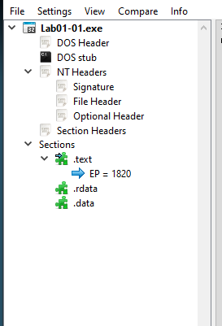
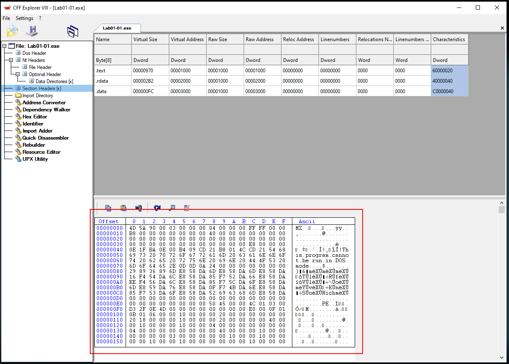

## What is the PE File Format?

The PE file format is the Portable Executable file format. All windows executables and object files follow the PE file structure.

There is a lot of detail about why the PE file format is used but the basic rundown is it provides a effecient and manageable solution to data and memory management and supports dynamic linking, relocation and additonal resources. It is also supported by various processors and used in multipule file types.


The PE file format can be broken down like this.

### PE File Format Structure

| **Section**          | **Description**                                                                 |
|----------------------|---------------------------------------------------------------------------------|
| **DOS Header**       | Contains DOS-specific information and a signature ("MZ").                        |
| **DOS Stub**         | Small program that runs if the file is executed in DOS, usually displaying a message like "This program cannot be run in DOS mode." |
| **PE Header (NT Header)** | Marks the beginning of the PE format and contains important information like the signature (`PE\0\0`).                  |
| **File Header**      | Part of the PE Header; includes information about the file such as machine type, number of sections, and timestamp.  |
| **Optional Header**  | Also a part of the PE Header; contains additional information for loading a PE file. |
| **Section Table**    | Lists the sections of the PE file, such as `.text`, `.data`, `.rdata`, etc., with details on their sizes and locations. |
| **Sections**         |  Sections of the PE file, which can include:                             |
| - **.text**           | Contains executable code.                                                        |
| - **.data**           | Contains initialized data.                                                        |
| - **.rdata**          | Contains read-only data, like constants.                                          |
| - **.reloc**          | Contains relocation information if needed.                                        |
| - **.debug**          | Contains debugging information (if present).                                      |

We can see that structure when using a PE analysis tool like PE-Bear or CFF Explorer:



The hex looks like this:



## DOS Header:


The DOS Header is the first 64 bits of a PE file and starts with the hex `4D` `5A` or "MZ", these are the initials of Mark Zbikowski a former Microsoft engineer.


## DOS Stub:


The DOS Stub is a small application that checks if the file is being executed in DOS, if so it prints "This program cannot be run in DOS mode."


## PE Header/NT Header:


The PE header begins with the hex `50` `45` or "PE" followed by two null bytes, following the two null bytes are two headers the `File Header` and the `Optional Header`.


## File Header:
The File Header is a COFF file header and is 20 bytes. It contains information such as `Machine`, `NumberOfSections`,`TimeDateStamp` and `Characteristics`.


The File Header is defined like this:
```
typedef struct _IMAGE_FILE_HEADER {
 WORD  Machine;
 WORD  NumberOfSections;
 DWORD TimeDateStamp;
 DWORD PointerToSymbolTable;
 DWORD NumberOfSymbols;
 WORD  SizeOfOptionalHeader;
 WORD  Characteristics;
} IMAGE_FILE_HEADER, *PIMAGE_FILE_HEADER;


```
> From MSDN: <https://learn.microsoft.com/en-us/windows/win32/api/winnt/ns-winnt-image_file_header>


We can see this info using a PE analysis tool:


## Optional Header:


The optional header follows the file header and it contains many more options than the file header.


Here is the definition of the 32-bit optional header:
```


typedef struct _IMAGE_OPTIONAL_HEADER {
 WORD                 Magic;
 BYTE                 MajorLinkerVersion;
 BYTE                 MinorLinkerVersion;
 DWORD                SizeOfCode;
 DWORD                SizeOfInitializedData;
 DWORD                SizeOfUninitializedData;
 DWORD                AddressOfEntryPoint;
 DWORD                BaseOfCode;
 DWORD                BaseOfData;
 DWORD                ImageBase;
 DWORD                SectionAlignment;
 DWORD                FileAlignment;
 WORD                 MajorOperatingSystemVersion;
 WORD                 MinorOperatingSystemVersion;
 WORD                 MajorImageVersion;
 WORD                 MinorImageVersion;
 WORD                 MajorSubsystemVersion;
 WORD                 MinorSubsystemVersion;
 DWORD                Win32VersionValue;
 DWORD                SizeOfImage;
 DWORD                SizeOfHeaders;
 DWORD                CheckSum;
 WORD                 Subsystem;
 WORD                 DllCharacteristics;
 DWORD                SizeOfStackReserve;
 DWORD                SizeOfStackCommit;
 DWORD                SizeOfHeapReserve;
 DWORD                SizeOfHeapCommit;
 DWORD                LoaderFlags;
 DWORD                NumberOfRvaAndSizes;
 IMAGE_DATA_DIRECTORY DataDirectory[IMAGE_NUMBEROF_DIRECTORY_ENTRIES];
} IMAGE_OPTIONAL_HEADER32, *PIMAGE_OPTIONAL_HEADER32;


```


> From MSDN: <https://learn.microsoft.com/en-us/windows/win32/api/winnt/ns-winnt-image_optional_header32>


We can also examine these values using a analysis tool:





At the end of the optional header `Data Directory` can be found.


This contains information about data structures that might be included in the file.


## Section Header:


After the optional header there is the section header. Each item in this header refers to a section of the file.


This contains various fields such as
* `Name`
   * Name of the section.
* `VirtualSize`:
   * The size of the data in memory.
* `SizeOfRawData`:
   * The size of the data on the disk.
* `VirtualAddress`:
*  The relative virtual address of the start of a section in memory.
* `PointerToRawData`:
   * The offset to the start of the section. ie: the address of the start of the section based on the start of the file.
* `Characteristics`:
   * The memory protection flags in place such as `READ`,`WRITE`,`EXECUTE`.


## Rich Header


The rich header is located under the DOS Stub, the rich header contains a checksum which is calculated and serves as a XOR key for the content of the header. The decrypted contents hold information about what software was used to create the file.


# Conclusion:
Understanding the PE structure is a vital tool for analyzing malware. Utilizing PE analysis tools can provide crucial information during the course of an investigation.


## References/Resources:

* <https://en.wikipedia.org/wiki/Portable_Executable#History>

* <https://learn.microsoft.com/en-us/windows/win32/debug/pe-format>

* Mastering Malware Analysis by Alexey Kleymenov and Amr Thabet 
   * <https://www.packtpub.com/en-us/product/mastering-malware-analysis-9781803240244>
   
* Practical Malware Analysis by Michael Sikorski and Andrew Honig 
   * <https://nostarch.com/malware>

* <https://tech-zealots.com/malware-analysis/pe-portable-executable-structure-malware-analysis-part-2/>


