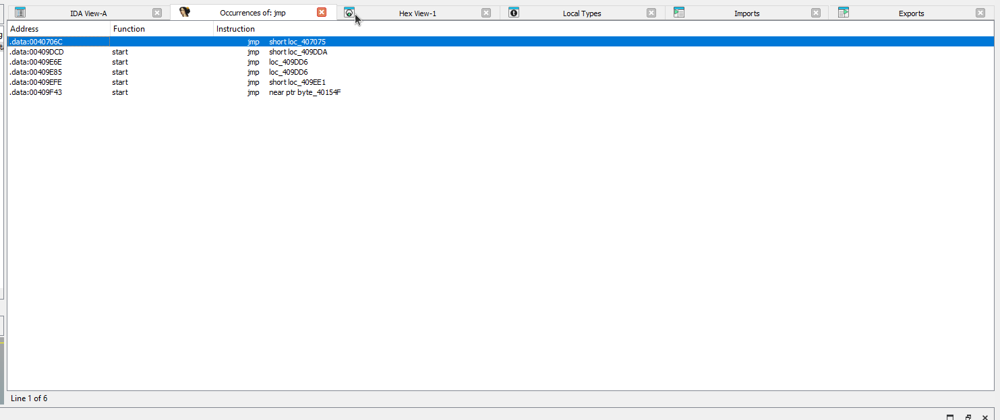
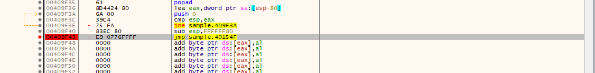
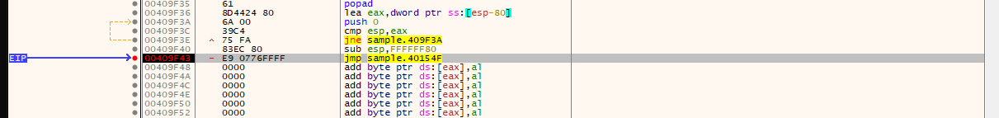
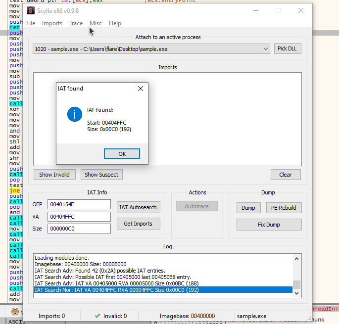
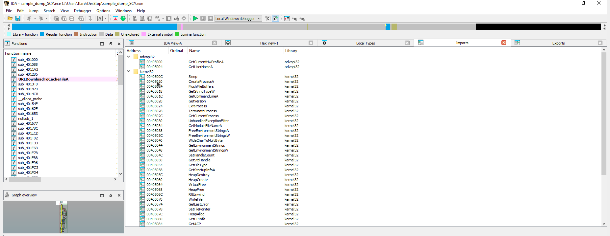

Many malware authors do not want their payloads to be easily reversible and they will partake in various methods to deter an analyst from studying the binary. Some of these methods are to utilize encryption, packing, obfuscation, self deletion, debugger detection and more. Let's start with exploring packing.


## Packing:


Packers are used to compress and sometimes encrypt an executable file and its data and code together. It includes code within to unpack the file.


There are various types of "packers" which utilize different techniques to pack or encrypt a file.


* Basic Packers:
   The focus of these packers is to compress files and reduce the total file size. They are not designed for hiding code traits and are often very common and easily unpacked. Some examples are:
  * **UPX** - An open source packer that can pack and unpack files.
  * **MPRESS** - Was designed for compression but can be used by malicious actors.
* Protection Packers:
   Used to prevent reverse engineering of the source code, these packers are often marketed to companies to protect their code from hackers or industry opponents. Some examples are:
  * **The Enigma Protector** - Used to protect code from reverse engineering, gets used by malware authors as well as game hackers to try to hide their malicious activity.
  * **ExeStealth** - used to encrypt and obfuscate code for software and copy protection, used by malware authors as well.
  * **Themida** - Created by Oreans used to protect software from reversing, gets used by games to prevent reversing.
  * **VMProtect** - A strong anti reversing tool which runs the executable in a VM, used by games companies and more.
* Malicious Encryptors/Packers:
  * This category includes custom packers created for the purpose of hiding malicious code and avoiding anti-virus detection. These are extremely suspicious, if you come across a packing scheme that is not available on the clear web or a legal channel it can be a big sign that the file is malicious.


## Examining a packed sample:


There are a lot of ways to identify a packed sample here a few examples:


* #### Using static signatures and static analysis tools:
  * Packed samples can have certain signatures which are unique to a packing method. PE analysis tools can be used to detect these signatures.
  * In the image below it shows that the sample was packed with **UPX**.


  


* #### Suspicious stub execution:
  * When packers compress a file they will often compress the PE file sections. They also will often add a section for unpacking code, if the PE file starts code execution from a later section it can be evidence that a decryption or unpacking is occuring.
  * Often a sign this is occurring is if the entry point of the file is pointing to a later section with `EXECUTE` permissions.


* #### Section names:
  * PE section names are `.text`,`.data`,`.idata`,`.rsrc` and `.reloc`. If a sample is packed these names can change and it can be obvious that the sample is packed.
  * In the image below it shows a packed samples header names:
  


## Unpacking a sample:


### Automatic Unpacking:


Automatic unpacking is pretty straightforward and utilizes using tools to automatically unpack a file.


Here is an example based on a sample from the [PMA](https://nostarch.com/malware) book:


* The file is packed using UPX 3.04

*  When the file is opened in IDA it only contains 1 function `start` and a very small import table.

* Unpack the file with CFF Explorer and the UPX utility.

* Save the file.

* Re-opening the sample in IDA all the imports and functions now appear and the sample is ready for analysis.


### Manual Unpacking:
Manual unpacking is a more involved process and requires specific techniques to accomplish. Most of these techniques involve searching for the **OEP**(Original entry point) as this is transferred once the sample is unpacked. This can be accomplished with stack backtracking, dynamic memory monitoring or searching for the transfer to the OEP in a debugger and disassembler. Once the sample is unpacked it can be dumped to memory and then the import table can be fixed. Some tools can attempt to automatically do this such as `ollydump` or `scylla`.


Here is an example based on a sample from the [PMA](https://nostarch.com/malware) book:


* Using DIE it shows that a modified UPX packing method is being used.


* When the file is opened in IDA it only contains 1 function `start` and a very small import table.

* Many unpackers use `jmp` as a means to transfer control to the unpacked code. A search for `jmp` instructions leaves a few results.



* The one that stood out was a jump at the address `0x409F43` as it jumps far away and to invalid instructions.


* Setting a breakpoint on the address in x32 debugger


* When the program is run again `eip` is stopped at the breakpoint.

* Single step/step into and the eip moves to the unpacked code. From here the process memory can be dumped with `scylla`.

* Open scylla and auto search.

* Get imports and then dump

* After the program is dumpped, fix the dump which will make the program analyzable in IDA.
 
* Re-opening the sample in IDA all the imports and functions now appear and the sample is ready for analysis.
 


## Encryption:


Encryption is often used in malware samples to encrypt information such as strings,network communication or a victims data. Encryption is a complex topic and various encryption methods exist with varying levels of complexity.


There are two main types of encryption algorithms


### Symmetric algorithms:
* Single Key Encryption: Uses the same key for both encryption and decryption which is shared by both parties.
* Key Management: Requires the key to be securely distributed as both parties must have the same key.


### Asymmetric algorithms:


* Two-Key Encryption: Uses a pair of keys – a public key for encryption and a private key for decryption.
* Key Management: oOnly the public key is shared and the private key is kept secret.


### Basic Encryption:
Malware authors can make use of simple custom algorithms that can be made up of the following instructions: `xor`,`add`,`sub`,`rol`,`ror`,`sar` and `shr`. This method can throw off an analyst who might only be lookin for cryptographic API calls which are used with more complex algorithms. The basic method of cracking an encryption scheme comes down to the following.


* Identifying the data read:
  * The algorithm needs to read data from somewhere and the address from which it reads should change over the runtime of the function as it encrypts more.
* Identify where the encryption occurs:
  * Make sure that what you are looking at really is encrypting the data and not just a part of a different function.
* Identifying the data write:
  * Much like a data read the algorithm needs to write out the data and this address should be changing just like the read data.
* Look for loops:
  * Oftentimes encryption will take place in a loop.


### X-RAYING:


X-raying can be used to brute force a basic encryption algorithm such as one that uses `xor`. PE files contain strings such as `This program cannot run in DOS mode` and these expected plaintext strings can be used to `xor` against the ciphertext. Tools like `XORSearch` can be used for this which covers basic algorithms such as `xor`.


### Advanced Encryption:


Advanced encryption algorithms can be used by malware authors to encrypt data and while these are more mathematically complex malware authors will often not self implement these algorithms and instead use API calls. Seeing cryptographic API calls in a sample can help identify the algorithm used.


These methods often use Windows API to encrypt data. The steps to accomplish this are as follows:


* #### Connect to the API:
  * This can be done with the following call `CryptAcquireContext(&hProv, NULL, NULL, PROV_RSA_FULL, 0)`
* #### Key gen:
  * This can be done in two ways here is the common method:
  * Create a hash of plaintext key:
     * `CryptCreateHash(hCryptProv, CALG_MD5, 0, 0, &hHash)`
     * `CryptHashData(hHash, reinterpret_cast<const BYTE*>(plaintext.c_str()), plaintext.length(), 0)`
  * Next the key is generated:
     * `CryptDeriveKey(hCryptProv, CALG_DES, hHash, 0, &hKey)`
     * Here we can determine the algorithm used based on the second argument, in this case it is `CALG_DES` which is for `DES`.
     * Here is a list of all them: <https://learn.microsoft.com/en-us/windows/win32/seccrypto/alg-id>
* #### Encrypt/Decrypt:
  * The key is used to encrypt or decrypt the data using the following:
     * `CryptEncrypt(hKey, 0, TRUE, 0, encryptedData.data(), &encryptedDataLen, encryptedData.size())`
     * `CryptDecrypt(hKey, 0, TRUE, 0, decryptedData.data(), &decryptedDataLen)`
* #### Free memory/destroy key:
  * Free up the memory with the following:
  * `CryptDestroyKey(hKey);`
  * `CryptDestroyHash(hHash);`
   * `CryptReleaseContext(hCryptProv, 0);`


### Using CNG API:


Microsoft has a new set of API which they are phasing in and recommend to use when developing. Malware typically uses the last method for encryption but as time goes on maybe more samples will appear using CNG. The benefit of this API is it is much simpler which is good for analysis but not good for the malware authors.


Here is how it works:


* #### Initialize the algorithm:
  * Set the algorithm to use.
  * `BCryptOpenAlgorithmProvider(&hAlgorithm, BCRYPT_AES_ALGORITHM, NULL, 0);`
* #### Generate the key:
  * You can either import a key or generate a key.
  * `BCryptGenerateSymmetricKey(hAlgorithm, &hKey, NULL, 0, key.data(), key.size(), 0);`
* #### Encrypt/decrypt:
  * `BCryptEncrypt(hKey, const_cast<PUCHAR>(inputData.data()), inputData.size(), NULL, iv.data(), iv.size(), outputData.data(), bufferSize, &resultLength, BCRYPT_BLOCK_PADDING);`
* #### Cleanup
  * `    BCryptCloseAlgorithmProvider(hAlgorithm, 0);`


> More info on CNG can be found here in MSDN: <https://learn.microsoft.com/en-us/windows/win32/seccng/typical-cng-programming>


## Obfuscation:


Obfuscation is a technique used to make code more secure by making it harder to understand when reverse engineering. This can range in difficulty from simply renaming functions and variables to using check sums and offsets to call API functions instead of calling by name. Here are some methods used in obfuscated code:


* #### Random/Junk code:
  * This is the action of inserting "junk" or useless code into a program to make it more complex to analyze.
* #### Control flow obfuscation:
  * The act of rearranging code in a pointlessly confusing layout to confuse an analyst and keep them from easily being able to follow the control flow of a program or subroutine. Utilizes conditional instructions that are always true or false or removing a `ret` from the end of a subroutine in favor of `pop` and `jmp` to confuse a disassembler as well as the analyst.
* #### Obfuscating function calls:
  * There are various methods to accomplish this some of them are as follows:
  * Using checksums:
     * Using this method malware is able to hide its used API names from static analysis tools. The method involves calculating a checksum, passing it to a function and then that function searches through library tables to find the proper API.  
  * Proxy functions:
     * Uses a proxy function to calculate the address of the required function and then executes.
  * Dynamic code generation:
     * This method involves using some form of dynamic aspect to resolve function names; this could include using a hash, encryption scheme or calculating a function's address.


## Anti-Debugging:


### Debugger detection:
Some malware will take efforts to protect itself from being run in a debugger to help keep its functionality a secret. Let's examine some ways this is accomplished:


* #### Using PEB(Process Environment Block):
  * Using the PEB is a very easy and common way to detect if a program is being run in a debugger. Here is the structure of the PEB:


```
typedef struct _PEB {
 BYTE                          Reserved1[2];
 BYTE                          BeingDebugged;
 BYTE                          Reserved2[1];
 PVOID                         Reserved3[2];
 PPEB_LDR_DATA                 Ldr;
 PRTL_USER_PROCESS_PARAMETERS  ProcessParameters;
 PVOID                         Reserved4[3];
 PVOID                         AtlThunkSListPtr;
 PVOID                         Reserved5;
 ULONG                         Reserved6;
 PVOID                         Reserved7;
 ULONG                         Reserved8;
 ULONG                         AtlThunkSListPtr32;
 PVOID                         Reserved9[45];
 BYTE                          Reserved10[96];
 PPS_POST_PROCESS_INIT_ROUTINE PostProcessInitRoutine;
 BYTE                          Reserved11[128];
 PVOID                         Reserved12[1];
 ULONG                         SessionId;
} PEB, *PPEB;
```
> <https://learn.microsoft.com/en-us/windows/win32/api/winternl/ns-winternl-peb>


  * The second param at offset 2 is set to True or 1 if the program is being debugged. This can be checked by malware using various methods.
  * A simple way to do this is to use `NtQueryInformationProcess` with a `ProcessBasicInformation` argument or `0`. This can also be done with the `IsDebuggerPresent` function.


NtQueryInformationProcess function:


```
__kernel_entry NTSTATUS NtQueryInformationProcess(
 [in]            HANDLE           ProcessHandle,
 [in]            PROCESSINFOCLASS ProcessInformationClass,
 [out]           PVOID            ProcessInformation,
 [in]            ULONG            ProcessInformationLength,
 [out, optional] PULONG           ReturnLength
);


```
> <https://learn.microsoft.com/en-us/windows/win32/api/winternl/nf-winternl-ntqueryinformationprocess>


IsDebuggerPresent function:


`BOOL IsDebuggerPresent();`


> <https://learn.microsoft.com/en-us/windows/win32/api/debugapi/nf-debugapi-isdebuggerpresent>


  * An additional method is to use the `NtGlobalFlag` which is in the PEB at offset `0x68`(32-bit) or `0xBC`(64-bit). This flag is set to `0` by default but when a debugger is present the value is set to `0x70`.


  * The flag has three values which all add up to 0x70:


| Flag       | Value           |
|------------|-----------------|
| `FLG_HEAP_ENABLE_TAIL_CHECK` | 0x10 |
| `FLG_HEAP_ENABLE_FREE_CHECK `  | 0x20|
| `FLG_HEAP_VALIDATE_PARAMETERS  `  | 0x40  |


  * Malware can check this by searching the offset of the PEB and comparing the value to 70h.


heres is a pseudo codeish example:
```
mov eax fs:[30h] ; PEB
cmp [eax+68], 70h ; cmp ntglobalflag value to 70h;
je ; Debug found jmp if equal


```


  * Another PEB structure called `ProcessHeap` located at offset `0x18`(32-bit) or `0x30`(64-bit) can be used to detect a debugger as well.
  * This is accomplished by checking two fields `Flags` and `ForceFlags`.
  *  `Flags` should be equal to `HEAP_GROWABLE` which is `2`.
  * `ForceFlags` should be equal to `0`.
  * These flags are located at different offsets based on the system and OS:
  * `Flags`:
     * 32-bit:
        * `0x0c` - XP
        * `0x40` - Vista and up
     *64-bit:
        * `0x14` - XP
        * `0x70` - Vista and up
   * `Flags`:
     * 32-bit:
        * `0x10` - XP
        * `0x44` - Vista and up
     *64-bit:
        * `0x18` - XP
        * `0x74` - Vista and up


  * These techniques can be avoided/mitigated with plugins such as `SycllaHide` or `HideOD`. You can also set the flags manually in a debugger or utilize breakpoints and `NOP` instructions to jump over the checks in a debugger.


* #### Using process handles:
  * Malware can utilize a variety of API calls which can reveal a debugger, here are some examples:
  * `CloseHandle`:
     * When this function is used to close an invalid handle if running under a debugger it will return the following error `EXCEPTION_INVALID_HANDLE (0xC0000008)` which indicates a debugger is present.
  * `CreateFile`:
     * Malware will attempt to open its own file with exclusive access. Certain debuggers keep a handle of the file open which would cause the operation to fail and reveal the debugger.
  * `OpenProcess`:
     * Certain debuggers can be detected by attempting to open the `csrss.exe` process.


  * These methods can be mitigated by tracing the program and patching the unwanted checks.
* #### Timing:
  * Malware can utilize timing functions to analyze how much time has passed before and after executing an instruction, significant delay can indicate a debug attempt is being made.
  * Mitigation includes patching the timing checks.
* #### Breakpoint Detection:
  * When a program is being single stepped through the trap flag in the `EEFLAGS` register is set. While it is not a trivial process malware can look for this and use it to detect a debugger.
  * Other methods include checking for breakpoints which use `INT3`. Malware can scan for this and determine if it's being run in a debugger.
  * Mitigation involves using hardware breakpoints, patching checks and single stepping vs using breakpoints.


There are a lot of ways malware can detect debuggers and each one is slightly different but usually the easiest way to avoid these checks is to use a plugin or simply patch or jump the checks within a debugger.


### Debugger Evasion:


### VM detection:
Most malware analysis occurs within a VM and malware authors know this, therefore some malware will attempt to detect if it is being run in a sandbox or in a VM. There are many ways to accomplish this, a few of them are as follows:


* #### Searching for inconsistency with instructions.
  * Oftentimes VM's will have different values than a regular computer for example the `CPUID` instruction can return various pieces of information that reveals a VM. Another example is the `IN` instruction. Both of these can be a sign a VM is being used.
* #### Searching for Processes and Registries:
  * Oftentimes VM software utilizes unique software on the guest machine to provide features such as shared folders or clipboards. Malware can search for these programs and that can be a give away that it is being virtualized.
  * Registry keys can also be used to a similar effect as VM's have unique registry entries.
* #### Windows managed information:
  * WMI can be used to determine if the system is being virtualized or not. This can be done via powershell scripts or by a WMI query.


Various other techniques exist and all typically revolve around searching for strings/names that give away that a machine is being virtualized. This could be searching for a shared folder, viewing the network card information, analyzing usernames, or searching for known default values unique to VM providers.


In order to mitigate these techniques you can customize or "harden" aspects of your VM.


## Conclusion:


Although malware can deploy various methods of evasion and reverse engineering detection there is often a solution to get around the tactic used. Oftentimes this comes down to just making life harder for an analyst and wasting their time. 


## References/Resources:


* Mastering Malware Analysis by Alexey Kleymenov and Amr Thabet
  * <https://www.packtpub.com/en-us/product/mastering-malware-analysis-9781803240244>
* Practical Malware Analysis by Michael Sikorski and Andrew Honig
  * <https://nostarch.com/malware>
* <https://learn.microsoft.com/en-us/windows/win32/seccng/cng-portal>
* <https://learn.microsoft.com/en-us/windows/win32/seccrypto/cryptography-portal>
* <https://www.aldeid.com/wiki/PEB-Process-Environment-Block/NtGlobalFlag>
* <https://www.aldeid.com/wiki/PEB-Process-Environment-Block/ProcessHeap>
* <https://anti-debug.checkpoint.com/>

