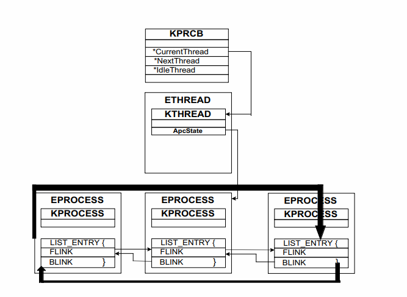

## What is the Kernel?
In the simplest terms possible the kernel is like a bridge between the software and the bare bones hardware. The kernel has full access to the hardware of the computer and can utilize any memory address directly. There are various types of kernels but they all function similarly and the usage of **kernel mode** is utilized only for the most important and trusted low level programs. Mistakes in kernel mode cause a system halt.


Most programs we run are run in user mode which also for mistakes that won't crash an entire system. User mode programs however often times need to communicate with the kernel to do things like create a file, this is accomplished using **system calls** which allow the user land application to switch to kernel mode to complete a privileged action. The permissions of a system are governed by the processor which utilizes hardware restrictions; these are often shown as "protection rings."


Here is an example of an x86 ring structure:


> <https://en.wikipedia.org/wiki/Protection_ring>


While that diagram contains all three rings most of the time only ring 0 and ring 3 are used. In some cases the other two rings are used for virtualization and other tasks. The rings decrease as privilege increases ie: ring 3 has the least privileges and ring 0 has the most.


## The Windows OS:


* User mode:
  * Consists of user mode processes which can be viewed by the user. These applications can use API's under three main subsystems `Win32`,`POSIX` and `WSL (Windows Subsystem for Linux)`. DLLs are also included here which can be used to communicate with the kernel.
* Kernel mode:
  * Kernel mode is the low level system/mode in charge of handling all the resources of a machine this includes memory, UI, sound, hardware, etc... Kernel mode is used to stop user mode from having access to these resources and instead a user mode application must make a request/call to the kernel to complete a task. Kernel mode includes various system services and the "kernel" sits between those services and the HAL (Hardware Abstraction Layer).


Here is a diagram:


> <https://en.wikipedia.org/wiki/Architecture_of_Windows_NT>


## Device Drivers:
Device drivers are kernel level drivers that are used to interact with hardware or in other words "devices." Most hardware has drivers that are created by the manufacturer and used to communicate with the device. Device drivers allow for a standardized way of communicating I/O requests.


Device drivers also do not need to be attached to a device/hardware; they can also be malware modules or anti-virus modules.


## What is a Rootkit?


Rootkits are a often stealthy low-level collection of software that often utilizes a backdoor to perform malicious actions on a system. Various types of rootkits exist here are some examples:


| **Type**            | **Description**                                                                                     | **Examples**                              
|---------------------|-----------------------------------------------------------------------------------------------------|------------------------------------------|---------------------------|
| **Kernel Mode Rootkit** | Operates within the operating system kernel, allowing deep integration and control over the system. | Blue Pill, Stuxnet                        | 
| **Firmware Rootkit**   | Resides in the firmware of hardware components like BIOS/UEFI, making it persistent and difficult to detect. | LoJax                            | 
| **Bootloader Rootkit/Bootkits** | Injects itself into the bootloader process, altering the boot sequence to gain control before the OS loads. This can be accomplished by infecting the MBR. |  TDL4                               |
| **User Mode Rootkit**   | Operates at the user level and typically relies on exploiting vulnerabilities in applications or the OS. | HackerDefender, Phalanx                   | 
| **Hypervisor Rootkit**  | Functions at the hypervisor level (virtual machine monitor) ring 1, intercepting and modifying system calls and operations. Generally seen only as PoC's. | Blue Pill                                |                        


## Rootkit Hooking Methods:


Rootkits can use various types of "hooking" tactics to inject themselves into the kernel request process.


| **Hooking Method**            | **Description**                                                                                                      | **Method**                                                                                              | **Example**                                               |
|-------------------------------|----------------------------------------------------------------------------------------------------------------------|---------------------------------------------------------------------------------------------------------|-----------------------------------------------------------|
| **SSDT Hooking** | Modifies the SSDT (System Service Descriptor Table) to redirect requests to a malicious function | Needs to find `KeServiceDescriptorTable` and then modify functions within . | Can be used for hiding files from AV by returning false results to AV queries.
|**Inline Hooking**| Modifies the code of a function directly to insert a jump to custom code.                                               | The rootkit overwrites the start of a function with a jump instruction to its own code, which then executes and optionally calls the original function. | Modifying `ZwQuerySystemInformation` to prevent detection of certain system components. |
| **Import Address Table (IAT) Hooking** | Modifies the table of function pointers used by a process to resolve API calls.                                         | Alters the entries in the IAT of a process so that calls to standard library functions are redirected to malicious code. | Redirecting `LoadLibrary` calls to a malicious DLL.       |
| **IRP Hooking**    | Intercepts and manipulates I/O Request Packets (IRPs) to control or alter I/O operations.              | Modifies IRP dispatch tables or internal driver code to redirect or handle IRPs differently.   Hiding files from directory listings.            | Using a completion routine to execute a rootkit driver. |
| **DKOM Hooking**   | Directly modifies kernel data structures to hide or alter kernel objects like processes or modules.    | Alters kernel data structures or lists (e.g., process lists) to hide or modify system objects.                   |  Hiding processes from task managers and AV.             |


A further breakdown of a few methods:


### IRP Hooking:
IRP or I/O Request Packets are in charge of input requests and output responses from a device.


The IRP object is defined like this via MSDN:
```
typedef struct _IRP {
 CSHORT                    Type;
 USHORT                    Size;
 PMDL                      MdlAddress;
 ULONG                     Flags;
 union {
   struct _IRP     *MasterIrp;
   __volatile LONG IrpCount;
   PVOID           SystemBuffer;
 } AssociatedIrp;
 LIST_ENTRY                ThreadListEntry;
 IO_STATUS_BLOCK           IoStatus;
 KPROCESSOR_MODE           RequestorMode;
 BOOLEAN                   PendingReturned;
 CHAR                      StackCount;
 CHAR                      CurrentLocation;
 BOOLEAN                   Cancel;
 KIRQL                     CancelIrql;
 CCHAR                     ApcEnvironment;
 UCHAR                     AllocationFlags;
 union {
   PIO_STATUS_BLOCK UserIosb;
   PVOID            IoRingContext;
 };
 PKEVENT                   UserEvent;
 union {
   struct {
     union {
       PIO_APC_ROUTINE UserApcRoutine;
       PVOID           IssuingProcess;
     };
     union {
       PVOID                 UserApcContext;
#if ...
       _IORING_OBJECT        *IoRing;
#else
       struct _IORING_OBJECT *IoRing;
#endif
     };
   } AsynchronousParameters;
   LARGE_INTEGER AllocationSize;
 } Overlay;
 __volatile PDRIVER_CANCEL CancelRoutine;
 PVOID                     UserBuffer;
 union {
   struct {
     union {
       KDEVICE_QUEUE_ENTRY DeviceQueueEntry;
       struct {
         PVOID DriverContext[4];
       };
     };
     PETHREAD     Thread;
     PCHAR        AuxiliaryBuffer;
     struct {
       LIST_ENTRY ListEntry;
       union {
         struct _IO_STACK_LOCATION *CurrentStackLocation;
         ULONG                     PacketType;
       };
     };
     PFILE_OBJECT OriginalFileObject;
   } Overlay;
   KAPC  Apc;
   PVOID CompletionKey;
 } Tail;
} IRP;
```


> <https://learn.microsoft.com/en-us/windows-hardware/drivers/ddi/wdm/ns-wdm-_irp>


A request path of drivers is used until the "message" can be interpreted by the device targeted. For example a keystroke is transmitted from the keyboard to the driver then on to the next driver and on and on until it reaches the application using the keystroke like vscode.


A rootkit can hook into this chain and modify the requests and responses, a rootkit can use this to make itself invisible to a researcher or user.


### DKOM Hooking:
DKOM (Direct kernel object manipulation) hooking is very common and powerful. Malware authors are able to hide their code in ways that almost make the rootkit completely undetectable. As well the changes made using DKOM are generally inaccessible to anti-virus as they are made in a kernel object. In order to do this on Windows the `EPROCESS` structure is used and modified.


The method of attack typically looks like this on Windows:


* Find current process `EPROCESS`
* Traverse `ActiveProcessLinks` to find the `EPROCESS` struct of the malicious process to hide.
* Locate the previous `EPROCESS` and point to the process following the one that is to be hidden.
* Locate the next process and change the process to point at the process before the one that is to be hidden.


Linux follows a similar series of steps but uses different object models.


Here is an image showing what this looks like:



> <https://www.blackhat.com/presentations/win-usa-04/bh-win-04-butler.pdf> on slide 19.


### Kernel Mode Process Injection:


Process injection can be used as a way for malware to maintain persistence or hide itself. A device driver attaches to a process to read or write the memory within that process. **stuxnet** is an example of a rootkit that uses kernel mode process injection.


This code can then be executed using an APC(Asynchronous Procedure Call) call; these calls are executed in an ordered queue within a thread allowing malware authors to execute code within a process.


# Conclusion:
Understanding the basics of the Windows kernel and kernels in general can be useful knowledge for an analyst to have in order to analyze old and new rootkit threats. Having a basic understanding of some methods used by malware to accomplish kernel mode hooking can help when analyzing a rootkit sample.


## References/Resources:


* Mastering Malware Analysis by Alexey Kleymenov and Amr Thabet
 * <https://www.packtpub.com/en-us/product/mastering-malware-analysis-9781803240244>
* Practical Malware Analysis by Michael Sikorski and Andrew Honig
 * <https://nostarch.com/malware>
* Good list of hooking methods from SANS:
  * <https://www.sans.org/media/score/checklists/rootkits-investigation-procedures.pdf>
* Blackhat slide-deck:
  * <https://www.blackhat.com/presentations/win-usa-04/bh-win-04-butler.pdf>
* <https://www.infosecinstitute.com/resources/malware-analysis/types-of-rootkits/>
* <https://learn.microsoft.com/en-us/windows-hardware/drivers/gettingstarted/user-mode-and-kernel-mode>
* <https://en.wikipedia.org/wiki/Architecture_of_Windows_NT>


