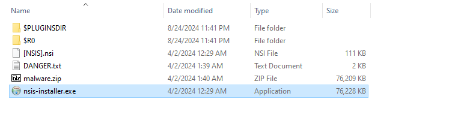

## Intro:
Subatomic is a retired(writeups enabled) Sherlock room located on Hack The Box. "With Sherlock levels you will be asked to dive into the aftermath of a targeted cyber attack and unravel the dynamics behind them, based on the knowledge provided. Ready to start the investigation?"

The subatomic level information is as follows:

link to room: <https://app.hackthebox.com/sherlocks/Subatomic/play>

##### Scenario:

"Forela is in need of your assistance. They were informed by an employee that their Discord account had been used to send a message with a link to a file they suspect is malware. The message read: "Hi! I've been working on a new game I think you may be interested in it. It combines a number of games we like to play together, check it out!". The Forela user has tried to secure their Discord account, but somehow the messages keep being sent and they need your help to understand this malware and regain control of their account! Warning: This is a warning that this Sherlock includes software that is going to interact with your computer and files. This software has been intentionally included for educational purposes and is NOT intended to be executed or used otherwise. Always handle such files in isolated, controlled, and secure environments. One the Sherlock zip has been unzipped, you will find a DANGER.txt file. Please read this to proceed."

**Although write ups are allowed, flags for this challenge will not be given directly but the steps for finding them are described, there are many ways to find some of these flags and I encourage all who read this to try it on their own first.**

## Analysis:

Step one is to extract our samples. I am on windows so I will use `7zip`. The password for the first zip can be found on the hack the box site; it is the key emblem next to the challenge zip.

Read the danger.txt in order to find the password then unzip the malware zip.

We are given specific tasks/questions to answer, let's start analyzing.

* 1: What is the Imphash of this malware installer?
  * The imphash or import hash is a special hash used to identify and track malware using a hash created from a files imports/API's.
  * We can find this and other useful info by submitting the sample to VirusTotal.

* 2: The malware contains a digital signature. What is the program name specified in the SpcSpOpusInfo Data Structure?
  * This info can also be found in VT. SpcSpOpus contains info about a program's digital signature. Oddly enough this program seems to be posing as some kind of gaming installer and something else (which is the flag).

#### Extracting the Code:

This file is a "nullsoft scriptable install" this means we can extract the files out of it.

After extracting we have this:

* 3: The malware uses a unique GUID during installation, what is this GUID?
  * We can find this info by examining the `.nsi` file in notepad or another text editor.
  * When opening this we can see that there are a bunch of strings to be used with the installer but we want to scroll past all of that until we see what looks like a scripting language.
  * This is where we can find information such as the GUID and information about where the app is being extracted from.

  * App info:
  
  * We can see that `app-32.7z` is being extracted. This means we can most likely extract it ourselves and find the source code.
  * GUID:
 

Next let's see what is inside the `app-32.7z`.

  * The first thing that is eye-catching is this exe. With some further analysis we learn that this is an electron application.

Within an electron app there is an `.asar` file which contains the packaged application. This is located in resources and we will need to unpack the code out of it. This can be done in various ways such as with a 7zip extention or with node and the asar package module.

I used the command `npx @electron/asar extract app.asar {dest_folder_name}` from within the resources folder.
You could also install the asar tool from node and use that.

* 4: The malware contains a package.json file with metadata associated with it. What is the 'License' tied to this malware?
  * Now that we have extracted the application code out we can easily access the `package.json` file and read the License info.
  
  * Along with that info we can also see app dependencies.
#### Analyzing the Code:
* 5: The malware connects back to a C2 address during execution. What is the domain used for C2?
  * In order to find this info we are going to need to start reversing and examining the code. Lucky for us we have extracted out a plain `app.js` file which means we can use a IDE to view the code.
  
  * Unfortunately the code is very obfuscated.
 
  

  * I used a tool and got a pretty decent result of deobfuscation but I don't think we are going to gain much from attempting to statically analyze this. Let's debug.

  * First attempt at the debug and we get the following result. 
  

  * In order to fix this we need to update the @primno/dpapi module. First we delete the module folder.
  
  * Then we can reinstall the module `npm install @primno/dpapi` using cmd.
  
  * Another issue this time in `sqlite3`. We will repeat the same steps again.
  
  * After deleting the `sqlite3` folder, reinstall.
  

  * Once we attempt to debug again we can see that the file begins to run. Once the file is running, we will try to stop it as quickly as possible so we can step through the program and watch the variables and call stack.

  * This can be done using the controls at the top of vscode.

  
  
  * Step over,step in and step out can be used to move forward in the program.
     * Here is a great blog post if you want to brush up on the different controls:
     * <https://pawelgrzybek.com/continue-step-over-step-into-and-step-out-actions-in-visual-studio-code-debugger-explained/>
  * Eventually we will find some interesting stuff on the `call stack` the thing that caught my eye was `newInjection` clicking on this will take you to a js file with lots of suspicious looking code.
  * Some function and variable names include `stealFirefoxTokens()`,`infectedDiscords`,`discordInjection()`, etc...

 
  * By debugging we are able to avoid the obfuscation and view the files as they are being called or generated dynamically. We can now answer the previous and following questions.

* 5: The malware connects back to a C2 address during execution. What is the domain used for C2? and 7: The malware is looking for a particular path to connect back on. What is the full URL used for C2 of this malware?
  * The C2 server is a command and control server used by malicious actors to communicate with their malware.
  * We need to provide the domain name and this can be found in the file as well as the full path to the API which is question 7.

  * Within that same image we can also see the checkVM function and the task list function, both of these are used for determining whether the malware is being run in a VM or under a debugger. It also contains the answer for question 9 and 10.

* 9: The malware checks for a number of hostnames upon execution, and if any are found it will terminate. What hostname is it looking for that begins with arch?

* 10: The malware looks for a number of processes when checking if it is running in a VM; however, the malware author has mistakenly made it check for the same process twice. What is the name of this process?  

* 6: The malware attempts to get the public IP address of an infected system. What is the full URL used to retrieve this information?
  * As we debug further we can find the `newInjection` function which contains the info for this flag.

* 8: The malware has a configured user_id which is sent to the C2 in the headers or body on every request. What is the key or variable name sent which contains the user_id value?
  * The user_id value is set at the top of the file where the API is defined throughout the file. We can see a repeated section of code which sends data to the C2.
  

* 11: The malware has a special function which checks to see if C:\Windows\system32\cmd.exe exists. If it doesn't it will write a file from the C2 server to an unusual location on disk using the environment variable USERPROFILE. What is the location it will be written to?
  * At the bottom of the file we can find a function that is checking whether or not cmd.exe exists, if not the malware will download cmd.exe from the c2 and place it in a strange dir. We can find that by examining the function code.
  

* 12: The malware appears to be targeting browsers as much as Discord. What command is run to locate Firefox cookies on the system?
  * At first I went to the `stealFirefoxTokens` function and searched through there but I could not find the right command. After some time walking through the code I found the `getFirefoxCookies` function which contained the code for collecting the browser cookies. The command is a `sql` style command.

  
 

* 13: To finally eradicate the malware, Forela needs you to find out what Discord module has been modified by the malware so they can clean it up. What is the Discord module infected by this malware, and what's the name of the infected file?
  * This one took me some time to figure out as I had the module correct but I got confused about how to input the answer into HTB.
  * When looking into the functions we can find a method which is performing an injection into a Discord module. The module name and file associated can be found in the function.
  

## Conclusion:

This was overall a really fun challenge that involved some real world malware. The creator of this challenge has a blog and YouTube channel with lots of useful information regarding security and malware analysis <https://www.jaiminton.com/>.

