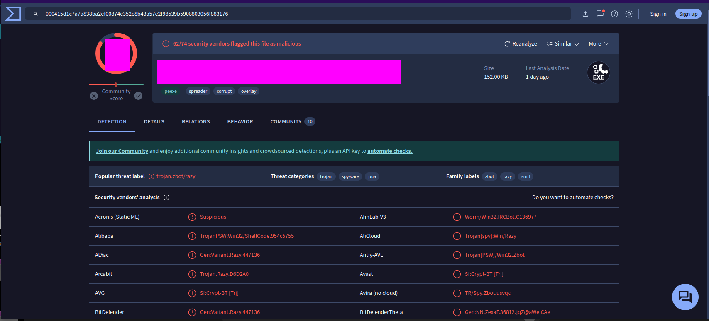
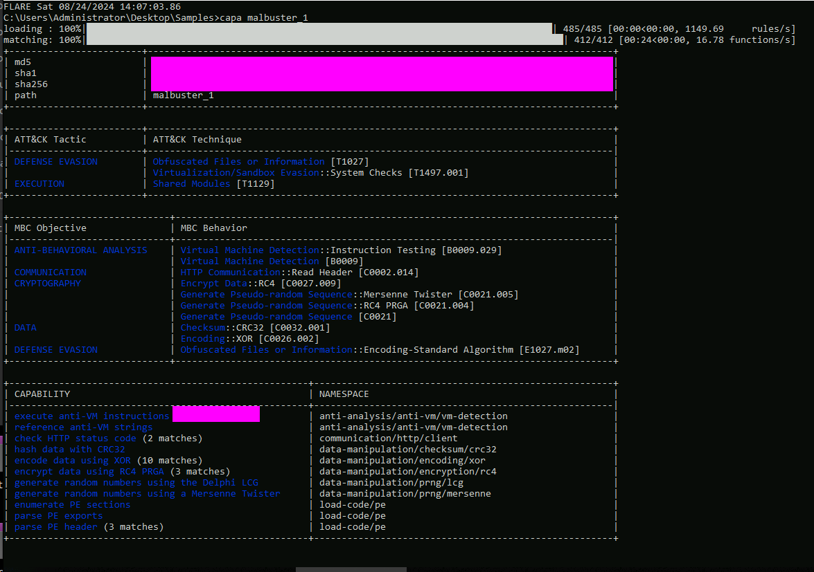

## Intro:
Malbuster is a premium room located on Try Hack Me. It is designed around the idea of being tasked with analyzing a sample from your SOC team. 

link to room: <https://tryhackme.com/r/room/malbuster>

Room description:

##### Scenario

"You are currently working as a Malware Reverse Engineer for your organisation. Your team acts as a support for the SOC team when detections of unknown binaries occur. One of the SOC analysts triaged an alert triggered by binaries with unusual behaviour. Your task is to analyse the binaries detected by your SOC team and provide enough information to assist them in remediating the threat."

**Flags for this challenge will not be given directly but the steps for finding them are described, there are many ways to find some of these flags and I encourage all who read this to try it on their own first.** 

## Analysis:

We can find our samples in `C:\Users\Administrator\Desktop\Samples`

We are given specfic tasks/questions to anwser, lets start analyzing.

* 1: Based on the ARCHITECTURE of the binary, is malbuster_1 a 32-bit or a 64-bit application? (32-bit/64-bit):
* 2: What is the MD5 hash of malbuster_1?
   * We can find this info using an analysis tool such as CFF Explorer or PE Studio.
   
   * We can see what size the file is and we can see the MD5 hash as well.

* 3: Using the hash, what is the number of detections of malbuster_1 in VirusTotal?
   * Inputing the hash into VT we get the following which shows the number of detections.
   
* 4: Based on VirusTotal detection, what is the malware signature of malbuster_2 according to Avira?
   * Getting the hash in PE Bear.
  
   * Inputing the hash of malbuster_2 to VT results in the following.
   
   * We want the signature associated with Avira.

* 5: malbuster_2 imports the function _CorExeMain. From which DLL file does it import this function?
   * We can find this info looking at the imports within PE Bear or another static analysis tool.
   
* 6: Based on the VS_VERSION_INFO header, what is the original name of malbuster_2?
   * We can find this easily using PE Studio.
   
* 7: Using the hash of malbuster_3, what is its malware signature based on abuse.ch?
   * Submitting the hash of malbuster_3 on Malware Bazaar leads to the following results.
   
* 8: Using the hash of malbuster_4, what is its malware signature based on abuse.ch?
   * Submitting the hash of malbuster_4 on Malware Bazaar leads to the following results.
   
* 9: What is the message found in the DOS_STUB of malbuster_4?
   * We can find this info using a hex editor or a tool like PE Bear which has a hex editor view in addition to providing PE information.
   * The normal `DOS_STUB` message is "This program cannot be run in DOS mode." This is not the case for this challenge.

    
* 10: malbuster_4 imports the function ShellExecuteA. From which DLL file does it import this function?
   * To find this we can return to PE Bear and view the imports section. There are a lot of libraries but you can sift through until you find what you are looking for.
* 11: Using capa, how many anti-VM instructions were identified in malbuster_1?
   * Initially I used the VirusTotal behavior analysis but wanted a cleaner result so I ran Capa on the sample directly.
   * Within the `samples` dir use the command `capa malbuster_1.exe` and observe the results.

* 12: Using capa, which binary can log keystrokes?
   * There are various ways to solve this flag. I chose to use capa on all the files and see what the results were.
   * One of the samples needs to be run with `-v` as it is a .net module.
   * When you have the correct file you will be able to see output from capa indicating a keylogger:

* 13: Using capa, what is the MITRE ID of the DISCOVERY technique used by malbuster_4?
   * Running `capa malbuster_4` results in the following.
   

## Conclusion: 

Just like that the room is solved, this was a pretty simple malware challenge that can help people get familar with the unique tools used in malware analysis.