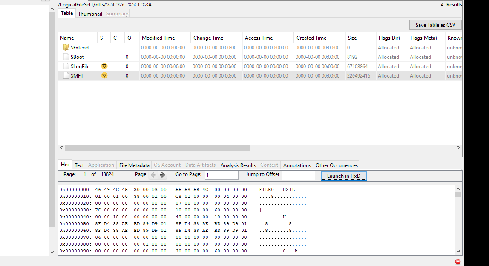
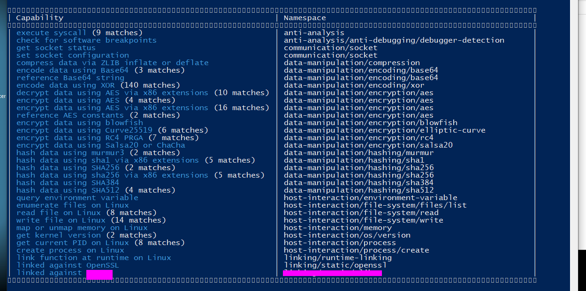

# Intro:
Safecracker is a retired(writeups enabled) Sherlock room located on Hack The Box. "With Sherlock levels you will be asked to dive into the aftermath of a targeted cyber attack and unravel the dynamics behind them, based on the knowledge provided. Ready to start the investigation?"

The level information is as follows:

link to room: <https://app.hackthebox.com/sherlocks/Subatomic/play>

##### Scenario:

"We recently hired some contractors to continue the development of our Backup services hosted on a Windows server. We have provided the contractors with accounts for our domain. When our system administrator recently logged on, we found some pretty critical files encrypted and a note left by the attackers. We suspect we have been ransomwared. We want to understand how this attack happened via a full in-depth analysis of any malicious files out of our standard triage. A word of warning, our tooling didn't pick up any of the actions carried out - this could be advanced. Warning This is a warning that this Sherlock includes software that is going to interact with your computer and files. This software has been intentionally included for educational purposes and is NOT intended to be executed or used otherwise. Always handle such files in isolated, controlled, and secure environments. One the Sherlock zip has been unzipped, you will find a DANGER.txt file. Please read this to proceed."

**Although write ups are allowed, flags for this challenge will not be given directly but the steps for finding them are described, there are many ways to find some of these flags and I encourage all who read this to try it on their own first.**

# Analysis:

## Unzipping:
Step one is to extract the samples. I am using windows so I will use `7zip`. The password for the first zip can be found on the hack the box site; it is the key emblem next to the challenge zip.

Read the danger.txt for the password...

Then unzip the rest of the files.

We are greeted to various files upon unzipping. After examining the files it can be determined that this is a system dump done using Kape.

These can be examined with digital forensic tools such as FTK Imager or Autopsy. I used Autopsy(the downside to Autopsy is that it can be slow). You could also simply parse through the files yourself in the file explorer window.

Windows file explorer:

Autopsy:

We are given specific tasks/questions to answer, let's start analyzing.

## Examining the System Dump:

* #### Task 1 - Which user account was utilized for initial access to our company server?

This can be found by viewing "OS Accounts" in autopsy. We can see admin accounts and system accounts and then at the bottom we can see the employee user.

* #### Task 2 - Which command did the TA utilize to escalate to SYSTEM after the initial compromise?

We can find this by examining the files in the system dump by looking for the console history.

* #### Task 18 - What is the bitcoin address in the ransomware note?

This can be found in the ransom note left by the attackers. The note can be found by opening one of the encrypted files that was changed to a `.note`.

* #### Task 17 - What file extension does the ransomware rename files to?

We can see that some files are renamed with a suspicious file extension when we examine the files.

* #### Task 13 - Out of this list, what extension is not targeted by the malware? .pptx,.pdf,.tar.gz,.tar,.zip,.exe,.mp4,.mp3

Pick one of the extensions above.

I was able to figure this out by simply examining the files that were infected and which were not, there was a little guesswork involved but there is a file that is present in a user dir that does not have an encrypted twin.

* #### Task 3 - How many files have been encrypted by the ransomware deployment?

This can be found by making use of the `mft` or `master file table`. We can examine the hex of the `mft` and then search for the file extension used by the attackers to help determine the number of files that were encrypted.

MFT:

MFT Hex:

Search:

> Some of the results are false positives so you will have to search through the results to find the right number.

## Reversing:

This section will be organized in the order I found these flags. First I did static analysis with IDA on Windows then I switched to linux to further debug and analyze the binary.

* #### Task 14 - What compiler was used to create the malware?

This can be found using a tool like `die` or by examining the sections of the binary.

* #### Task 16 - What is the contents of the .comment section?

This can be found using Ghidra or Cutter and examining the sections of the binary.

* #### Task 4 - What is the name of the process that the unpacked executable runs as?

This can be found in various ways but is easily found when statically analyzing the file.

* #### Task 7 - What was the encryption key and IV for the packer?

This can be found when examining the binary in `ida` or a different decompiler. The values are hardcoded.

The whole key can be found when looking at the strings.

* #### Task 6 - What encryption was the packer using?

In the binary we can find various references to the `openssl` package and more specifically `crypto/evp/****`. For this flag I found an encryption scheme mentioned in the binary and then used `chat GPT` to list all the options of said encryption scheme and found the one that matched the key size used.

* #### Task 8 - What was the name of the memoryfd the packer used?

This can be found when statically analyzing the binary and is passed to the `memfd create` function.

* #### Task 10 - What compression library was used to compress the packed binary?

This can be found by using the binary strings, `capa` output or with a little investigating in `ida` and on google.

* #### Task 11 - The binary appears to check for a debugger, what file does it check to achieve this?

This can be found using `ltrace`.

* #### Task 20 - It appears that the attacker has bought the malware strain from another hacker, what is their handle?

We can also find this in the bottom section of the `ltrace` output.

* #### Task 15 - If the malware detects a debugger, what string is printed to the screen?

This can also be found in the `ltrace` output.

***********************

* #### Task 19 - What string does the binary look for when looking for a debugger?

This can also be found in the `ltrace` output.

* #### Task 12 - What exception does the binary raise?

This can be found when we run the binary in a tracer or debugger.

## Dynamic unpacking the binary:

The binary file we find with this challenge has a packed section and in order to find more info on how this binary works we will need to find a way to examine this packed binary.

When using `ltrace` or examining in `ida` we can see the function call which unpacks the binary and checks for a debugger is `execl()`

We can use `gdb` to break on this function call and step into the function, then we can read the process memory and save it to a file. Using the file descriptor `3` as that's what is used in the binary.

We can then open the new file in a tool like `cutter` or `ida`.

* #### Task 9 - What was the target directory for the ransomware?

This can be found in the unpacked binary.

* #### Task 5 - What is the XOR key used for the encrypted strings?

We can find this in the unpacked binary easily in `main`.

* #### Task 21 - What system call is utilized by the binary to list the files within the targeted directories?

This flag required a bit of research on a `libc` call. The call in question was used to read the directories but the specific call used uses a syscall which can be found with some googling and man page reading.

* #### Task 22 - Which system call is used to delete the original files?

This can be found by looking at the imports and system calls in the binary. I found this by looking through the sys and `libc` calls and narrowed down the ones that could be used for deletion then I followed the xrefs to verify where it was used.

# Conclusion:

This was a fun yet difficult challenge that involved a fair amount of time consuming reversing (although that might just be me). Shoutout to the creators `blitztide` & `sebh24` as usual.

