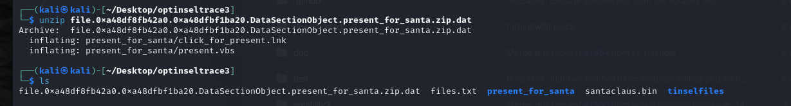

# OpTinselTrace-3 on HTB


## Box info:


"About OpTinselTrace-3


Operation Tinsel Trace consists of five Sherlocks following the compromise of Father Christmas’s festive operations by a formidable, infamous adversary: The Grinch! As the festive season approaches, the North Pole is buzzing with activity. But not all is merry in Santa's workshop as a series of sophisticated cyber attacks threaten to disrupt Christmas. Operation Tinsel Trace will lead you inside the technology of Santa’s tech, configuration, logs, and servers until, at a certain point, everything seems to be doomed. Will you be able to recover from this advanced attack? Please note - these Sherlocks are built to be completed sequentially and in order!"


* Senario


Oh no! Our IT admin is a bit of a cotton-headed ninny-muggins, ByteSparkle left his VPN configuration file in our fancy private S3 location! The nasty attackers may have gained access to our internal network. We think they compromised one of our TinkerTech workstations. Our security team has managed to grab you a memory dump - please analyse it and answer the questions! Santa is waiting… Please note - these Sherlocks are built to be completed sequentially and in order!


## Task 1:


* What is the name of the file that is likely copied from the shared folder (including the file extension)?
   * For this challenge we are given a memory dump of a windows system. Using Volatility we can pick apart this dump and obtain the forensic information that we need.
   * We can use the windows filescan plugin to list all the files in the dump and the addresses. I will save this in `files.txt`.
   * `vol -f santaclaus.bin windows.filescan.FileScan > files.txt`
   * Next we can begin to `grep` these results. I like to start with typical dies such as `Desktop`,`Downloads` etc...
   * `cat files.txt | grep -e Desktop -e Downloads`
   
   * Based on the above we see the file `present_for_santa.zip` as this is somewhat of a sus file. I submitted it for this first flag and it was correct.


## Task 2 and 3:
These tasks are completed side by side so I will group them together.
* What is the file name used to trigger the attack (including the file extension)?
   * In filescan dump we found the `present_for_santa.zip` we can use the dump files plugin in volatility to dump that file by supplying the virtual address of the file.


   * `vol -f santaclaus.bin  windows.dumpfiles.DumpFiles --virtaddr 0xa48df8fb42a0`


   


   * We can then unzip that zip folder.


   


   * Now we examine the files within.


   


   * These are our flags for tasks 2 and 3. The linker script points to the vbs script.


## Task 4:


* What is the name of the program used by the vbs script to execute the next stage?


   * First thing I did with the sample was upload it to VT for analysis.


   


   * Looking through the behavior we can see multiple HTTP requests.


   


   * We can also see what files the program interacts with.


   


   * Powershell jumps out so lets try that as the flag...


   


## Task 5:


* What is the name of the function used for the powershell script obfuscation?
   * Looking through more of the behavior tab on VT I saw reference to an interesting looking function.


   
   * This nets us "WrapPresent` as our flag.


## Task 6:


* What is the URL that the next stage was downloaded from?


   * We can find this in the network connections section of the VT behavior tab.


   * `GET http://77.74.198.52/destroy_christmas/evil_present.jpg`


## Task 7:


* What is the IP and port that the executable downloaded the shellcode from (IP:Port)?


   * We can find this below the network connections section in the ip traffic section of the present.exe file.


   * First we need to find the exe file and then dump it
   


   


   * Next I picked apart the file for a bit in Ghidra.


   * I found a reference to the ip that was used in the VBS script.


   


   * It wasn't until I looked at the VT page until I found the port. This probably could have been easily found with dynamic analysis but I didn't have a lab setup easily available.


   


## Task 8:


* What is the process ID of the remote process that the shellcode was injected into?


## Task 9:


* After the attacker established a Command & Control connection, what command did they use to clear all event logs?


`pipx install python-evtx`


`evtx_dump.py 'file.0xa48dfefe6e50.0xa48dfe639190.DataSectionObject.Windows PowerShell.evtx.dat' > powershell_log `


We can find the following line `Get-EventLog -List | ForEach-Object { Clear-EventLog -LogName $_.Log }`


I also noticed this line `Add-MpPreference -DisDisableRealtimeMonitoring True` this line disables antivirus monitoring.


## Task 10:


* What is the full path of the folder that was excluded from defender?


Next we can find the line here:
`Add-MpPreference -ExclusionPath c:\users\public`


## Task 11:


* What is the original name of the file that was ingressed to the victim?


   * First we can see a exe in the powershell log


   


   * Lets dig this up in the memory dump


   * `cat files | grep Public`


   


   * Now lets dump that exe `vol -f santaclaus.bin windows.dumpfiles.DumpFiles --virtaddr 0xa48e00d10a90 `


   


   * Now let's pop it into VT and see what we find.


   


   * It appears the alt name of this file is `procdump.exe`


## Task 12:


* What is the name of the process targeted by procdump.exe?


   * We can find this back in the powershell log.


   


   * A breakdown of the command from ChatGPT:


```
This command is using ProcDump, a Microsoft Sysinternals tool, to create a memory dump of the lsass.exe process, which is crucial for the Windows authentication system. Let's break it down to understand each part of the command.
Breaking it Down:


   C:\Users\public\procdump.exe:
       This specifies the location of the procdump.exe executable, which is a command-line tool used for capturing process dumps. These dumps contain the memory contents of a running process, useful for debugging or analysis.
       The tool is typically used to create crash dumps of a program's memory when it encounters a problem, or for forensic purposes.


   -accepteula:
       This flag automatically accepts the End User License Agreement (EULA) for ProcDump. Normally, when running procdump for the first time, it will ask the user to accept the EULA. This flag bypasses that prompt and automatically accepts it.


   -r:
       This flag tells procdump to capture a dump file when the process terminates unexpectedly (or based on specific criteria like performance triggers). It's typically used in situations where you want to capture a dump of a process only when it crashes.


   -ma:
       This flag indicates that a full memory dump should be created. A full dump includes all of the memory of the process, which can be quite large, but it provides comprehensive information about the state of the process at the time of the dump.


   lsass.exe:
       lsass.exe stands for Local Security Authority Subsystem Service. This is a critical Windows process responsible for enforcing the security policy on the system. It handles authentication, including login requests, password validation, and generating access tokens for user sessions.
       lsass.exe is sensitive because it contains authentication data, such as user credentials (password hashes), and is often targeted in attacks like credential dumping.


   C:\Users\public\stolen_gift.dmp:
       This is the location and name of the file where the memory dump will be saved. In this case, it's being saved to C:\Users\public\stolen_gift.dmp.
       A .dmp file is a dump file that contains the process's memory at the time the dump was created. It can be analyzed later to gather detailed information about the process's state, including any potentially sensitive information it contains.


What is the Command Doing?


   Capturing a Full Memory Dump of lsass.exe:
       This command is instructing procdump to create a full memory dump of the lsass.exe process.
   Potential Forensics or Malicious Activity:


       Why lsass.exe?: The lsass.exe process is critical because it handles security authentication and stores sensitive data, such as password hashes. By dumping the memory of lsass.exe, an attacker or malicious actor can extract this sensitive information (e.g., NTLM hashes, Kerberos tickets, or even plaintext passwords in certain circumstances).


       The memory dump is being saved to a file called stolen_gift.dmp in the C:\Users\public\ folder. The name stolen_gift is a suspicious choice, as it implies the dump is being taken for malicious purposes (i.e., stealing data).

```


# Conclusion:


Overall this was a fun forensics challenge that heavily involved volatility as well as VirusTotal results with some brief log analysis.


