#  Day 2: One man's false positive is another man's potpourri

## Challenge info:

This is the day 2 challenge for the advent of a cyber event that was held this past holiday season that I missed. These challenges are easy and digestible targeted towards beginners. I am mainly walking through them for some quick learning and brushing up on some skills, as well I want to find the keycards for the harder side quest challenges. This challenge focuses on a log analysis challenge that is focused on using Elastic SIEM.

## Walkthrough steps:

First we must navigate to the home page for elastic.

Next we can navigate to the "discover" page and set the event timeline. We are given the date `dec 1, 2024 9:00-9:30` so we will set that timeline in Elastic.

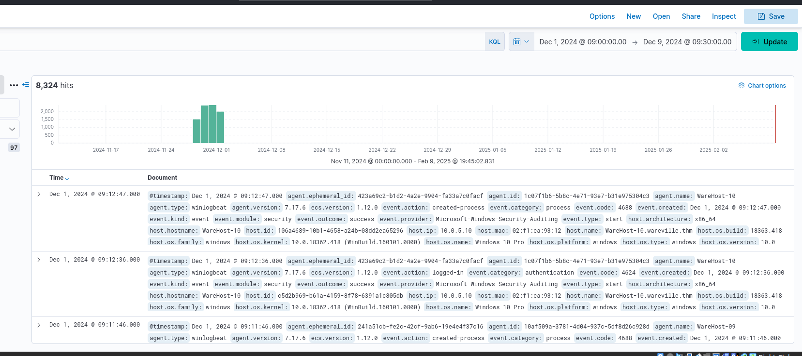

The log data is still somewhat ugly and difficult to read so let's add some columns as specified by the challenge.

* "The hostname where the command was run. We can use the host.hostname field as a column for that."
* "The user who performed the activity. We can add the user.name field as a column for this information."
* "We will add the event.category field to ensure we are looking at the correct event category."
* "To know the actual commands run using PowerShell, we can add the process.command_line field."
* "Finally, to know if the activity succeeded, we will add the event.outcome field."

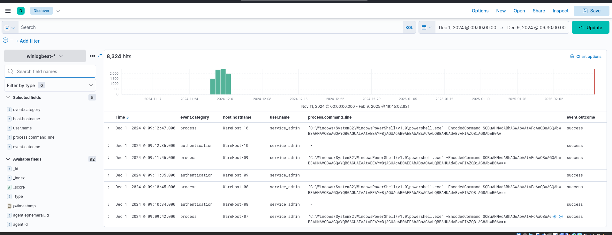

Here we can see that there is a powershell instance running an encoded command.

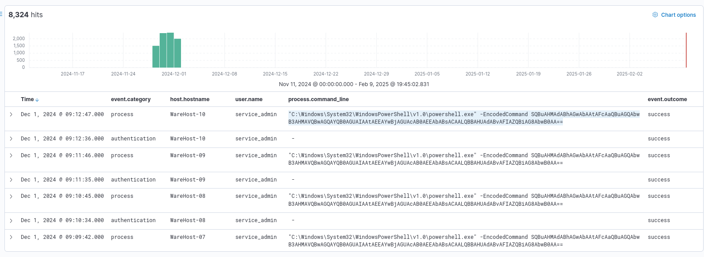

Lets decode it.

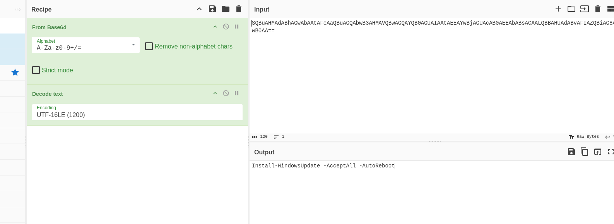

We will use that later for a flag but let's continue parsing through the logs.

We will need to expand our timeline to a new set of dates.

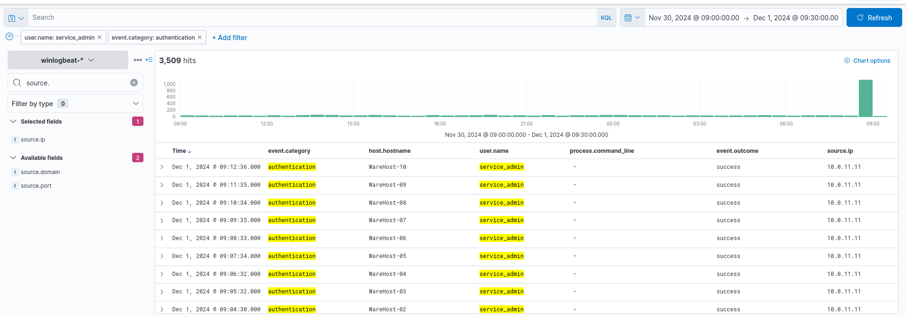

Lets filter our results with a `user.name` as `service_admin` and a `source.ip` of `10.0.11.11`.

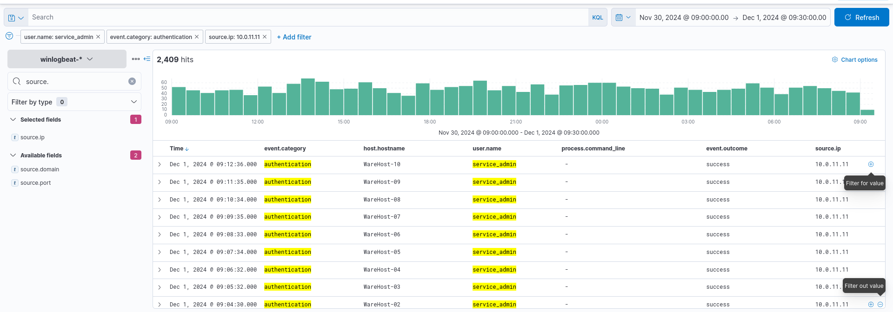

As stated by the challenge walkthrough these events do not explain the spike in requests so we must filter further. Lets exclude the ip of `10.0.11.11`.

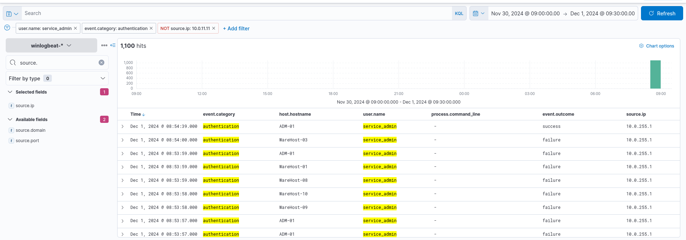

With this we get a large amount of results for an address ending in `255.1` we are told this address has already been cleared by the analysts so let's remove the ip filter.

We get some troubling results that look like someone tried to brute force their way in and it also looks like they were successful.

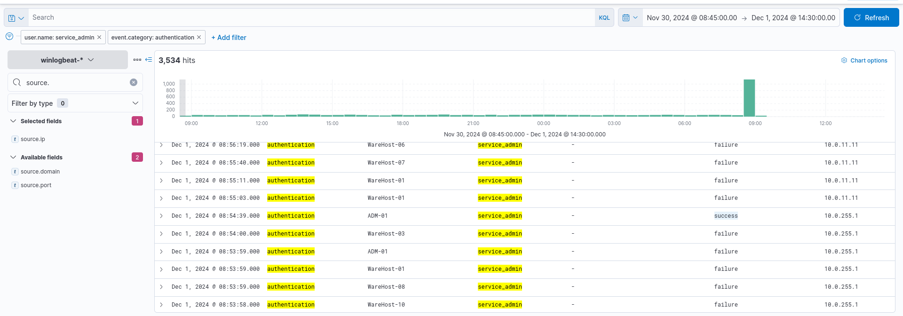

Overall the results of this mock investigation are a bit strange as it seems someone brute forced their way into the system just to update windows. The challenge walkthrough states the following in character with the storyline of these challenges...

"McSkidy further analysed the secret hero and came to a startling revelation. The credentials for the script in the machines that ran the Windows updates were outdated. Someone brute-forced the systems and fixed the credentials after successfully logging in. This was evident from the fact that each executed PowerShell command was preceded by a successful login from the same Source IP, causing failed logins over the past few days. And what's even more startling? It was Glitch who accessed ADM-01 and fixed the credentials after McSkidy confirmed who owned the IP address."

## Questions and Flags:

* What is the name of the account causing all the failed login attempts?

   * `service_admin`

* How many failed logon attempts were observed?

   * We can find this by applying a filter to the `event.outcome` for failure.
  
   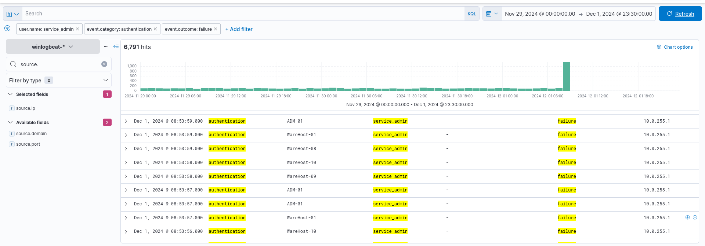

* What is the IP address of Glitch?
   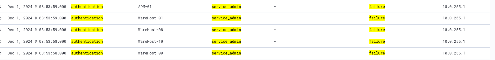

* When did Glitch successfully logon to ADM-01? Format: MMM D, YYYY HH:MM:SS.SSS

   * We can find this by inspecting the successful login attempt.

   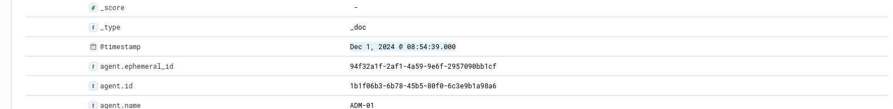

* What is the decoded command executed by Glitch to fix the systems of Wareville?

   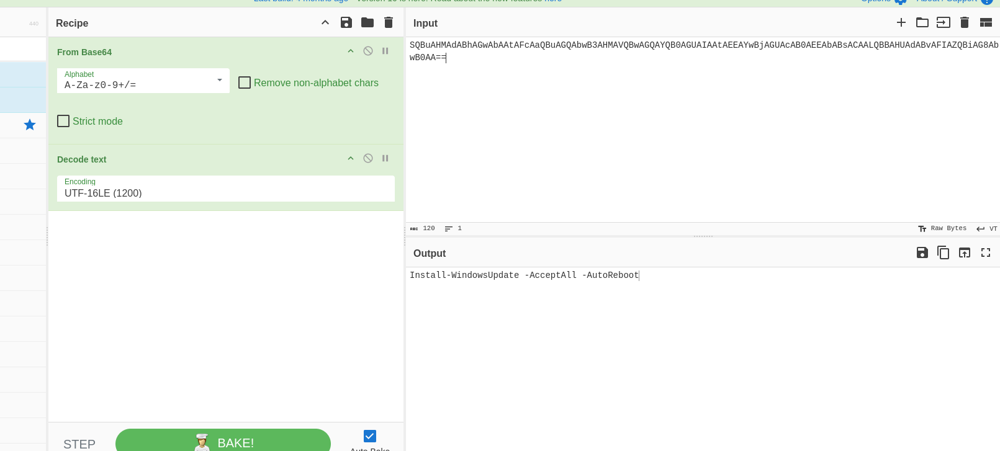

