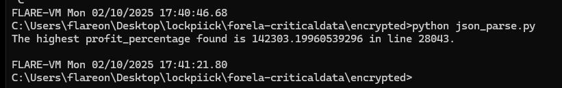

# Lockpick


## Box info:


**About:**


" In this Sherlock, you confront a serious threat at Forela: a significant number of UNIX servers have been infected by a suspected ransomware. Forela has decided not to negotiate with the attackers, putting the onus on the you to recover the encrypted files. This task demands players to utilize their understanding of ransomware operations, UNIX server structures, and digital forensics to restore the affected files. It's a high-pressure race against time, testing the your resilience, ingenuity, and technical prowess. Warning This is a warning that this Sherlock includes software that is going to interact with your computer and files. This software has been intentionally included for educational purposes and is NOT intended to be executed or used otherwise. Always handle such files in isolated, controlled, and secure environments. Once the Sherlock zip has been unzipped, you will find a DANGER.txt file. Please read this to proceed. "


**Senario**


"Forela needs your help! A whole portion of our UNIX servers have been hit with what we think is ransomware. We are refusing to pay the attackers and need you to find a way to recover the files provided. Warning This is a warning that this Sherlock includes software that is going to interact with your computer and files. This software has been intentionally included for educational purposes and is NOT intended to be executed or used otherwise. Always handle such files in isolated, controlled, and secure environments. Once the Sherlock zip has been unzipped, you will find a DANGER.txt file. Please read this to proceed."


## Inital Examination:


* After extracting all the files we can start diving into the malware sample.


  


* DIE Results:


## Task 1:


**Please confirm the encryption key string utilised for the encryption of the files provided?**
 


  * I'm going to start out by opening this up in IDA and getting right into the reversing.


  * Immediately off the bat we can find this string in `main`...


  


  * It appears these two strings are being passed in as vars to a function called `process_directory`.


  * Diving through this function we can see various references to file extensions and a function called `encrypt_file`.


  


  * This gives us a big hint that the string we found early on in main is the one used to encrypt the files.


  


## File Decryption:


We were given the encrypted files with this challenge in order to solve the next flag and others we will need to decrypt these files using the string we found in step 1.


Looking at the `encrypt_file` function we can begin to try to figure out how the files are being encrypted.


* This section of the function looks like it interacts and reads a file's data into memory. Then a var (`var_18`) is created to be stored at the first byte of the file to be used with the next section of code.


* Here we can see two paths. The one on the left appears to just be attaching the file extension and ransom note to the encrypted file. The path on the right seems to be the encryption method that the attackers used.


* It appears that this is a simple `XOR` algorithm. The code looks somewhat complicated when decompiled but it is simply taking the byte from `var_18` and XOR ing it with the same index byte from our encryption key then iterating by 1 until the file is fully encrypted.


## Chat GPT breakdown of XOR encryption:


Yes, you're absolutely right! This code is likely implementing a form of **XOR encryption** or **obfuscation**. Let me explain how this encryption scheme works in more detail:


**How XOR Encryption Works:**
XOR (exclusive OR) encryption is a simple symmetric encryption algorithm. It works by applying the XOR operation to each byte of the data with a corresponding byte from a key. The key is typically repeated or cycled over the data when the data length exceeds the key length.


**Breakdown of the XOR Encryption Process:**


1. **Key Setup (String `s`):**
  The string `s` acts as the key in the encryption process. The length of `s` is calculated using `_strlen`. The index (`var_18`) is then divided by the length of `s` to ensure that the key wraps around (if the data is longer than the key).


2. **Data Processing (Buffer at `ptr`):**
  - The buffer of data (pointed to by `[rbp+ptr]`) is being processed byte by byte.
  - For each byte of the data at `ptr`, the corresponding byte from the key `s` is retrieved using the remainder of the division of the index by the length of `s` (i.e., `rdx = var_18 % length_of_s`).
 
3. **The XOR Operation:**
  - The byte from the buffer is XORed with the byte from the key (string `s`).
  - This results in a transformed byte, which is then written back into the buffer at the same index.
  - XOR is a reversible operation, meaning that if you XOR the data again with the same key, you get back the original data. This is the fundamental property of XOR encryption.


**Detailed Steps in the Code (XOR Encryption):**
- **Accessing the data byte:**
  ```assembly
  mov     rdx, [rbp+var_18]
  mov     rax, [rbp+ptr]
  add     rax, rdx
  movzx   eax, byte ptr [rax]
  mov     r12d, eax
  ```
  This section retrieves the byte from the buffer at the position `var_18`.


- **Retrieving the key byte from `s`:**
  ```assembly
  mov     rbx, [rbp+var_18]
  mov     rax, [rbp+s]
  mov     rdi, rax        ; s
  call    _strlen
  mov     rsi, rax
  mov     rax, rbx
  mov     edx, 0
  div     rsi
  mov     rcx, rdx
  mov     rdx, rcx
  ```
  The key (`s`) is accessed using the remainder of the division of the index by the length of `s`. This is how the key is applied cyclically across the data.


- **Performing the XOR operation:**
  ```assembly
  mov     rax, [rbp+s]
  add     rax, rdx
  movzx   eax, byte ptr [rax]
  mov     ecx, r12d
  xor     ecx, eax
  ```
  The byte from the buffer (stored in `r12d`) is XORed with the byte from the key, and the result is stored in `ecx`.


- **Storing the transformed byte back into the buffer:**
  ```assembly
  mov     rdx, [rbp+var_18]
  mov     rax, [rbp+ptr]
  add     rax, rdx
  mov     edx, ecx
  mov     [rax], dl
  ```
  The result of the XOR operation (`ecx`) is written back to the same location in the buffer, replacing the original byte with the encrypted one.


- **Incrementing the index (`var_18`):**
  ```assembly
  add     [rbp+var_18], 1
  ```
  The index is incremented to process the next byte.


## Python code to decrypt files:


I started by asking Chat GPT for a simple XOR encryption script then made some modifications which allowed it to loop through our data folder and perform a decryption of the files.


```
def xor_decrypt(input_file, output_file, key):
   with open(input_file, 'rb') as f_in:
       data = f_in.read()


   key_bytes = key.encode('utf-8')  # Convert the string key to bytes
   key_length = len(key_bytes)


   # Apply XOR byte by byte loop through key bytes
   output_data = bytearray()
   for i, byte in enumerate(data):
       key_byte = key_bytes[i % key_length] 
       output_data.append(byte ^ key_byte)
   # Write to output file
   with open(output_file, 'wb') as


```


```
def main():
   key = "replace_me"
   # Used to get the current path, this script was used to decrypt files in a folder.
   folder_path = os.getcwd()


   for filename in os.listdir(folder_path):
       # full file path
       file_path = os.path.join(folder_path, filename)
      
       # Check if it is a file (not a subdirectory)
       if os.path.isfile(file_path):
           filename, file_extension = os.path.splitext(filename)
           print(file_extension)
           #print(filename)
           #sys.exit()


           # If the file text matches, decrypt the file.
           if file_extension == ".24bes":
               decrypted_filename= f"decrypted-{filename}"
               filename = f"{filename}.{file_extension}"
               print(f"Decrypting: {filename}")
               xor_decrypt(filename, decrypted_filename, key)
               print(f"Saved as: {decrypted_filename}")


```


> The full script can be found here: <https://github.com/saadams/CTF_Scripts/blob/main/decryption/xor_enc_dec.py>


## Task 2:


**We have recently received an email from wbevansn1@cocolog-nifty.com demanding to know the first and last name we have him registered as. They believe they made a mistake in the application process. Please confirm the first and last name of this applicant.**


   * We can find this in the decrypted `applicants.sql` file by searching for the email we are given.


## Task 3:


**What is the MAC address and serial number of the laptop assigned to Hart Manifold?**


   * We can find this in the decrypted `it-assets.xml` file by searching for the name above.


## Task 4:


**What is the email address of the attacker?**


   * We can easily find this in the ransom note left by the attacker...


   


## Task 5:


**City of London Police have suspicions of some insider trading taking part within our trading organisation. Please confirm the email address of the person with the highest profit percentage in a single trade alongside the profit percentage.**
  * To figure this out I used a simple json file parser and then modified it to return the largest value in the `profit_percentage` category.


 
```
import json
import re


def find_highest_profit_percentage(json_file, category):
   with open(json_file, 'r') as file:
       data = file.readlines()


   # Create a regex pattern to search for the category
   pattern = re.compile(rf'"{category}":\s*([0-9.-]+)')
  
   highest_value = None  # To keep track of the highest value found
   highest_line = None   # To keep track of the line where the highest value is found
  
   # Iterate through each line (assuming each line represents a JSON object)
   for index, line in enumerate(data):
       match = pattern.search(line)
       if match:
           value = float(match.group(1))  # Convert matched value to float for comparison
           if highest_value is None or value > highest_value:
               highest_value = value
               highest_line = index + 1  # Store the line number where the highest value was found


   if highest_value is not None:
       print(f"The highest {category} found is {highest_value} in line {highest_line}.")
   else:
       print(f"Category '{category}' not found in any line.")


# Vars:
json_file = 'test.json'
category = 'profit_percentage'
find_highest_profit_percentage(json_file, category)


```


  * That results in the following output:





  * We can then search the json file for this value...


* We will then find the following email when searching the document for the found profit percent.


"email": "fmosedale17a@bizjournals.com"


* Putting the email and profit percent together will net us this answer.


## Task 6:
**Our E-Discovery team would like to confirm the IP address detailed in the Sales Forecast log for a user who is suspected of sharing their account with a colleague. Please confirm the IP address for Karylin O'Hederscoll.**


* We can find this by searching through the excel document.


## Task 7:


**Which of the following file extensions is not targeted by the malware? .txt, .sql,.ppt, .pdf, .docx, .xlsx, .csv, .json, .xml**


* Reversing the process_directory function we can find the file extensions targeted by the malware.


* We can see that `.ppt` is not included in the targeting.


## Task 8:
**We need to confirm the integrity of the files once decrypted. Please confirm the MD5 hash of the applicant's DB.**


## Task 9:
**We need to confirm the integrity of the files once decrypted. Please confirm the MD5 hash of the trading backup.**


## Task 10:
**We need to confirm the integrity of the files once decrypted. Please confirm the MD5 hash of the complaints file.**


# Conclusion:


Overall this was a fun and easy malware analysis challenge.


