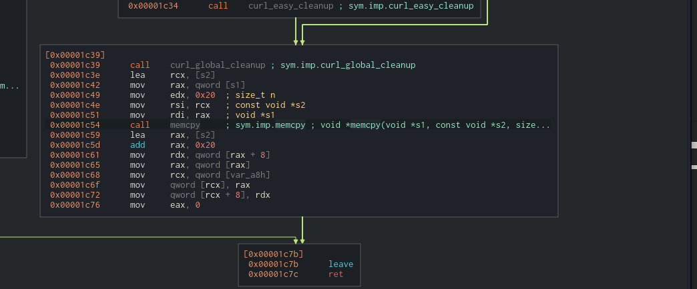

# Lockpick 2.0 Malware Analysis on HTB


## Box info:


**About:**


"About Lockpick 2.0


In this Sherlock, you confront another serious ransomware threat at Forela. Another significant number of UNIX servers have been infected by a suspected ransomware. Forela has decided not to negotiate with the attackers, putting the onus on the you to recover the encrypted files. This task demands players to utilize their understanding of ransomware operations, UNIX server structures, and digital forensics to restore the affected files. It's another high-pressure race against time, testing the your resilience, ingenuity, and technical prowess. Warning: This is a warning that this Sherlock includes software that is going to interact with your computer and files. This software has been intentionally included for educational purposes and is NOT intended to be executed or used otherwise. Always handle such files in isolated, controlled, and secure environments. Once the Sherlock zip has been unzipped, you will find a DANGER.txt file. Please read this to proceed.  "


**Senario**


"Forela needs your help! A whole portion of our UNIX servers have been hit with what we think is ransomware. We are refusing to pay the attackers and need you to find a way to recover the files provided. Warning This is a warning that this Sherlock includes software that is going to interact with your computer and files. This software has been intentionally included for educational purposes and is NOT intended to be executed or used otherwise. Always handle such files in isolated, controlled, and secure environments. Once the Sherlock zip has been unzipped, you will find a DANGER.txt file. Please read this to proceed."


## Initial Examination:


> The password can be found in the danger.txt file.


* After extracting all the files we can start diving into the malware sample.


* DIE Results:


Looks like this binary is packed with `UPX`, we will need to unpack it.


----


### Task 8:


**What was used to pack the malware?**


* `UPX`


----


## Analyzing:


Just for fun we can open up the packed binary in `ida` and see what it looks like.


pretty underwhelming...


Lets unpack it using `upx`:


and... muy bien!


Now we can start reversing.


Starting off we can see some calls to init the ssl crypto lib. This library is used with various crypto functions and encryption schemes.


We can also find a function that might fetch an encryption key:


Scrolling through the `get_key_from_url` function I think it's worth it to get a debugger out (i'll come back to this later on.)


Looking further through main we can find a `handle_directory` function call. It also takes `"/share/"` as an argument which matches the dir where our encrypted files are.


Scrolling through we can see it makes a curl request to a paste bin site.


In `download_lyrics`:


Write to a output file `countdown.txt`


Paste bin contents:


Matches the countdown.txt:


----


### Task 7:


**How much is the TA asking for?**


* `£1000000`


### Task 6:


**What is the BTC wallet address the TA is asking for payment to?**


* Bitcoin Address:
 * `1BvBMSEYstWetqTFn5Au4m4GFg7xJaNVN2`


----


Continuing down the `handle_directory` function it calls `encrypt_file`


open input file for read:


if it can't:


Setup a file to write to with ext .24bes (hacker group name)


Then encrypt using `AES 256`


----
### Task 1:
**What type of encryption has been utilised to encrypt the files provided?**


* `AES`
----


It then attempts to remove the original files leaving only the encrypted:


Targeted file types:


### Debugging for the key:


Returning to the `get_key_from_url` function...


Stepping through with GDB we can find the URL that the key is fetched from.


`rb.gy` is a URL shortener which is used to shorten URLs. However, we want to see the full path.


I threw this into virus total just to get an idea of what it could be doing.


Within VT we can find the full expanded URL.


We can get the file by navigating to the URL:


----


### Task 5:


**What is the file hash of the key utilised by the attacker?**


----


Poking around further this time in `cutter` (I switched to a linux vm)


`encrypt_file`:


`encrypt`:


Using the key in cyberchef results in us finding out the key is too long.


Examining further in cutter we can see that the malware uses `memcpy` to copy only the first 32 bytes.





> 0x20 is 32.


Now we need to deal with the `IV`. We should be able to find the `IV` value by searching for the `EVP_EncryptInit_ex` function.


It takes the following params:


`EVP_EncryptInit_ex(ctx, EVP_aes_256_cbc(), NULL, key, iv);`


ChatGPT-


```
ctx: Your initialized EVP_CIPHER_CTX *.


EVP_aes_256_cbc(): Specifies AES with 256-bit key in CBC mode.


NULL: Use default software crypto engine.


key: Your encryption key.


iv: Initialization Vector (or NULL if you want zero IV).
```


If you look at the docs you can see that the `IV` option is not needed.


Asking chatGPT for an example revealed that if no `IV` is passed it is just filled with zeros.


Trying an IV of all zeros works and we end up being able to decrypt the files.


> Didn't want to give away the most fun flags to find. Go get 'em :)


----


# Task 2 and 3:


**Which market is our CEO planning on expanding into? (Please answer with the wording utilised in the PDF)**


* You can find these by examining the now unencrypted docs.
----


# Conclusion:


This was a fun yet more challenging box with some fun reversing, debugging and file decryption.


Shoutout to `sebh24` for creating a fun challenge.


