# Getting Started Reverse Engineering with Radare2

## Introduction

Radare2 is a powerful open-source reverse engineering tool. This guide will cover the basics of reverse engineering with r2.

> This guide is based on a guide I wrote while working in university. It focuses on the basics of reversing and using r2.

## Getting the Challenge Binary

The binary for this guide can be found on my GitHub: <https://github.com/saadams/crackme_plz/tree/main/rev_ex1>

## Reversing

The goal of this reversing challenge is to determine the correct input that will output the flag.

Let's get started.

First, open the binary in r2 using `r2 <name of file>`.

Next, use `aaa` to analyze the functions and symbols.

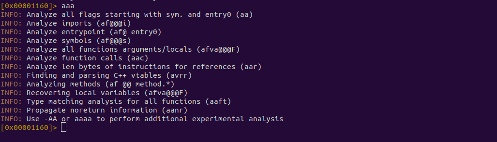

Next, type `afl` to print all the functions.

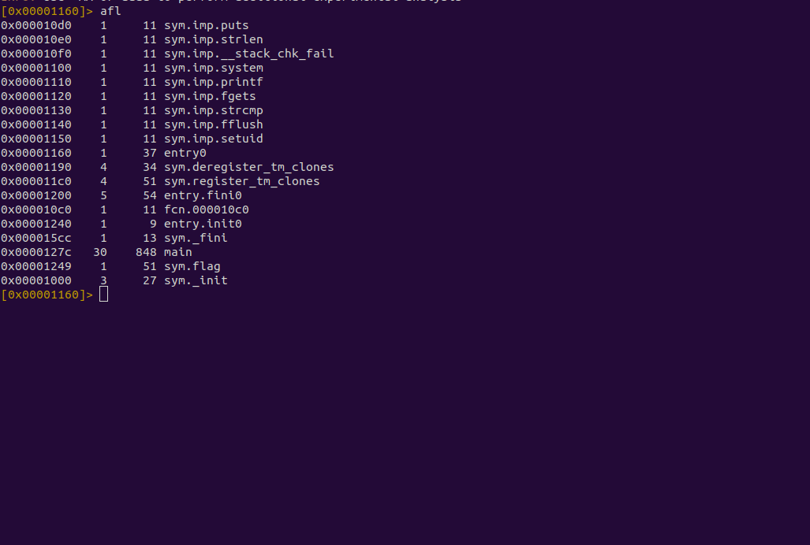

We can see there is a `main` function, so let's seek to it using `s <function name>`.

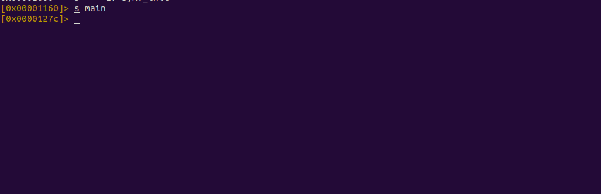

*   We can see that the address has changed to the address of the main function.

Now we can use `pdf` to print the disassembled function.

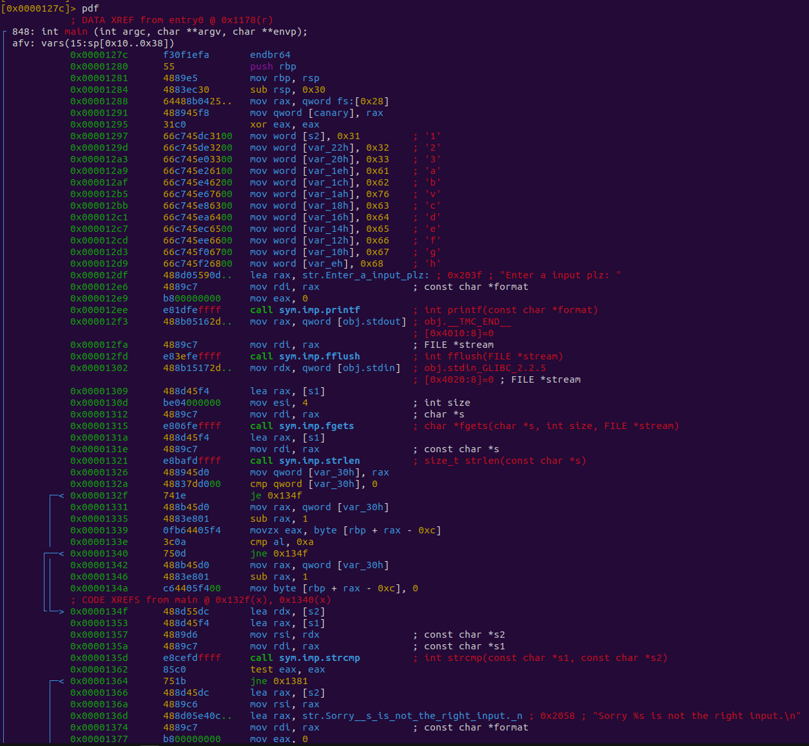

*   We will see the entire disassembled main function.

From here, we can start to examine the program.

At the top, we can see all the variable info for the function.

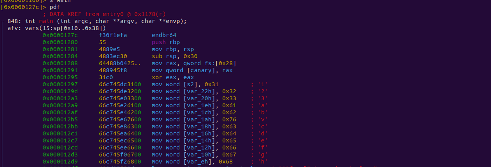

Scrolling down further, we can see various jmps and `strcmp` calls. This is probably a good place to start.

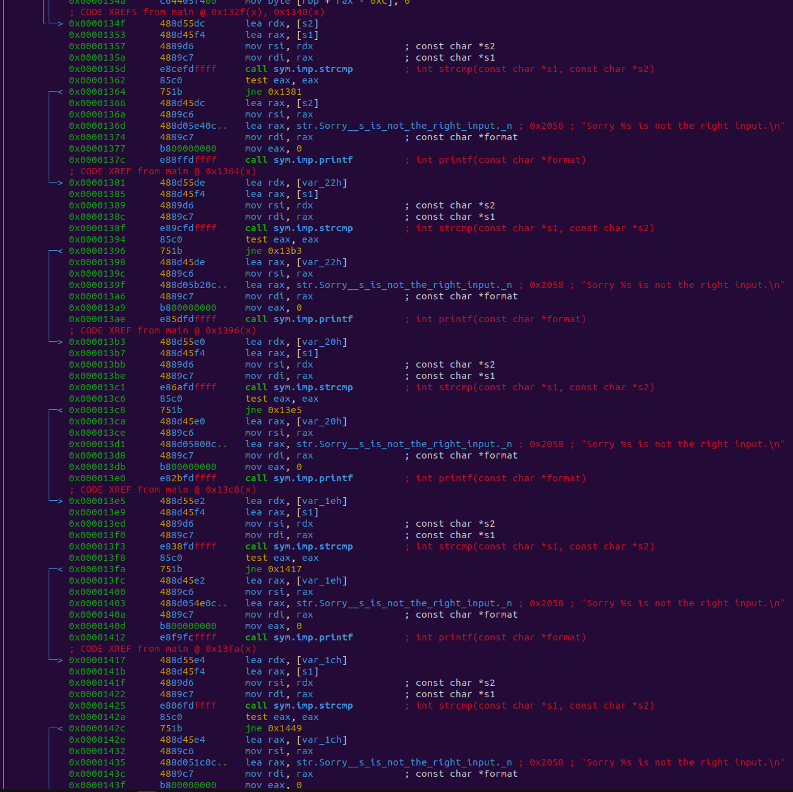

Let's walk through the first one.

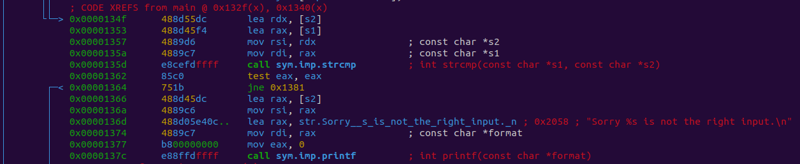

```
|           0x0000134f      488d55dc       lea rdx, [s2]
│           0x00001353      488d45f4       lea rax, [s1]
│           0x00001357      4889d6         mov rsi, rdx                ; const char *s2
│           0x0000135a      4889c7         mov rdi, rax                ; const char *s1
│           0x0000135d      e8cefdffff     call sym.imp.strcmp         ; int strcmp(const char *s1, const char *s2)
│           0x00001362      85c0           test eax, eax
│           0x00001364      751b           jne 0x1381
```

First, we have these two lines. These first instructions are used to load s2 and s1 into registers `rax` and `rdx`.

```
0x0000134f      488d55dc       lea rdx, [s2] ; Load s2 into rdx
0x00001353      488d45f4       lea rax, [s1]; Load s1 into rax
```

Next, we have two more lines moving the registers `rax` and `rdx` into `rsi` and `rdi`. These are the params passed to `strcmp`.

```
0x00001357      4889d6         mov rsi, rdx               ; const char *s2
0x0000135a      4889c7         mov rdi, rax                 ; const char *s1
```

Next is the `strcmp` call. First, we have the call to `strcmp` which is going to compare the two params that were passed in the previous instructions. It will return either -1, 0, or 1. If the values are equal, it will be `0`.

Next, `test eax, eax` is basically checking whether or not eax is 0 without storing the result in a register and instead will set the `zf` (zero flag).

Last, `jne 0x1381` will jump if the values are not zero.

```
 0x0000135d      e8cefdffff     call sym.imp.strcmp         ; int strcmp(const char *s1, const char *s2)

0x00001362      85c0           test eax, eax
0x00001364      751b           jne 0x1381
```

Let's explore what happens if the jump is not taken.

We are not going to break down the assembly for this section, but we can see that `printf` is called and a string is present stating the input is not correct.

```
0x00001366      488d45dc       lea rax, [s2]
0x0000136a      4889c6         mov rsi, rax

0x0000136d      488d05e40c..   lea rax, str.Sorry__s_is_not_the_right_input._n ; 0x2058  "Sorry %s is not the right input.\n"

0x00001374      4889c7         mov rdi, rax                ; const char *format
0x00001377      b800000000     mov eax, 0
0x0000137c      e88ffdffff     call sym.imp.printf         ; int printf(const char *format)
```

This is the path taken if the `strcmp` was equal to `0`, meaning the strings were the same. This means whatever string is being checked here is not the correct input.

Let's find out what string this was so we know not to use it.

Returning to the previous strcmp section, we can examine the params passed further. We can see that `s1` and `s2` are being loaded into the registers that are then moved into the param registers.

```
0x0000134f      488d55dc       lea rdx, [s2]
0x00001353      488d45f4       lea rax, [s1]
0x00001357      4889d6         mov rsi, rdx                ; const char *s2
0x0000135a      4889c7         mov rdi, rax                ; const char *s1
```

Let's find out what `s1` and `s2` are.

Looking at this section of code, we can see `s2` and `s1`.


`s2` is simply loaded as a local var with the value of `0x31`. `0x00001297 66c745e83100 mov word [s2], 0x31 ; '1'`

We can determine what this value is by using the `? <hex>` command.

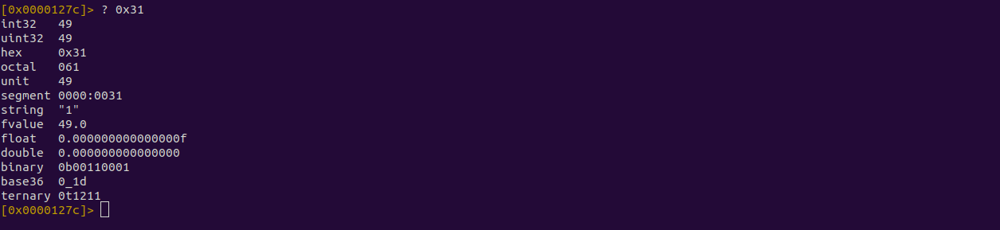

*   You can also see this value in the comment provided by the disassembler.

`s1` is a bit more complicated to figure out, but we can see in these lines that it is being used with `fgets`.

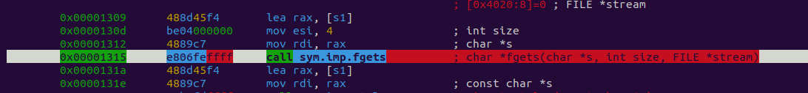

`fgets` is used to get user input, and the first param of `fgets` is the var to store the input. Most likely `s1` is storing the user input.

```
0x00001309      488d45f4       lea rax, [s1]
0x0000130d      be04000000     mov esi, 4                  ; int size
0x00001312      4889c7         mov rdi, rax                ; char *s
0x00001315      e806feffff     call sym.imp.fgets          ; char *fgets(char *s, int size, FILE *stream)
```

By analyzing what `s1` and `s2` are, we have learned that the first `strcmp` is checking whether or not the user input is equal to the value `1`. We also saw that if the user enters `1`, the string "Sorry %s is not the right input.\n" is printed.

Let's see what happens when the jump is taken.

`jne 0x1381`

This jump will jump to the address `0x1381`, so let's follow it.

We end up at a similar-looking conditional.

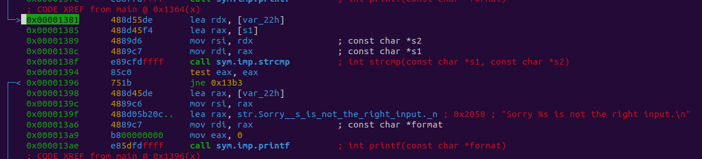

This time there is no `s2` but instead `var_22h`.

```
0x00001381      488d55de       lea rdx, [var_22h]
0x00001385      488d45f4       lea rax, [s1]
0x00001389      4889d6         mov rsi, rdx                ; const char *s2
0x0000138c      4889c7         mov rdi, rax                ; const char *s1
0x0000138f      e89cfdffff     call sym.imp.strcmp         ; int strcmp(const char *s1, const char *s2)
0x00001394      85c0           test eax, eax
0x00001396      751b           jne 0x13b3
```

If we follow `var_22h` back, we can see this is local var with the value of `0x32` or `2`.

Since this conditional is the same as the last, we can assume that the value 2 is also not the correct answer. Let's follow the jump yet again.

You will find it takes us to the same style of conditional.

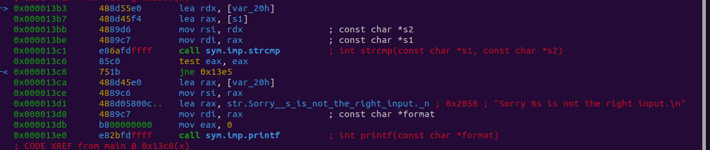

Let's follow the jumps until we get to a conditional that looks different.

Found one.

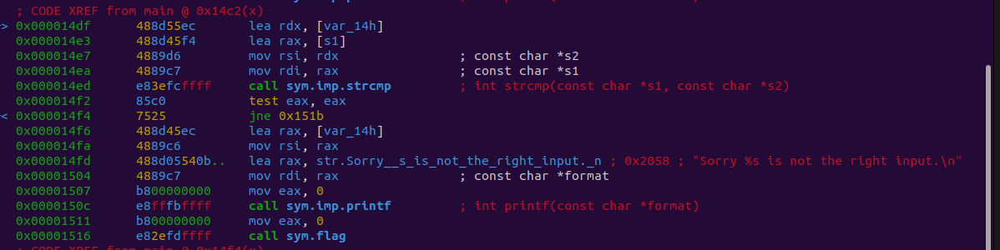

This conditional looks the same except for one key difference: an additional set of instructions.

```
0x00001543      b800000000     mov eax, 0
0x00001548      e8c3fbffff     call sym.imp.printf         ; int printf(const char *format)
```

The function call looks like it could be useful to us as it is named `flag`.

Let's examine it using `pdf @sym.flag`. The `@` symbol is used so we don't lose our place at the main function. Essentially, it allows us to view the disassembled function without seeking to it.

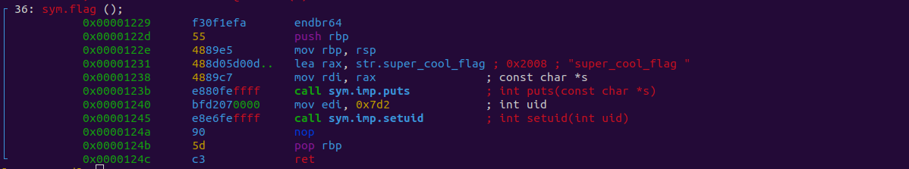

Well, well, well...

This looks like the function we want as it appears to print out our flag.

Let's go back to the conditional that got us here and see what input we need to use.

```
0x000014df      488d55ec       lea rdx, [var_14h]
0x000014e3      488d45f4       lea rax, [s1]
0x000014e7      4889d6         mov rsi, rdx                ; const char *s2
0x000014ea      4889c7         mov rdi, rax                ; const char *s1
0x000014ed      e83efcffff     call sym.imp.strcmp         ; int strcmp(const char *s1, const char *s2)
```

Looks like we need `var_14h`. Let's go see what its value is.

```
│           0x000012c7      66c745ec6500   mov word [var_14h], 0x65    ; 'e'
```

It has the value `0x65` or the ASCII char `e`.

Let's run our program and see if we found the right input.

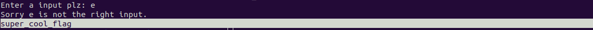

It worked, and we got our flag!

Hopefully, this guide can help you on your journey with reverse engineering and beyond as you explore the world of exploitation.
