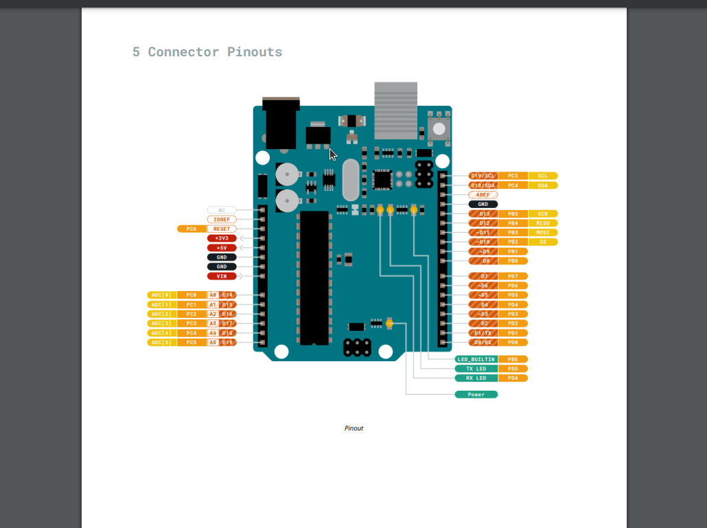
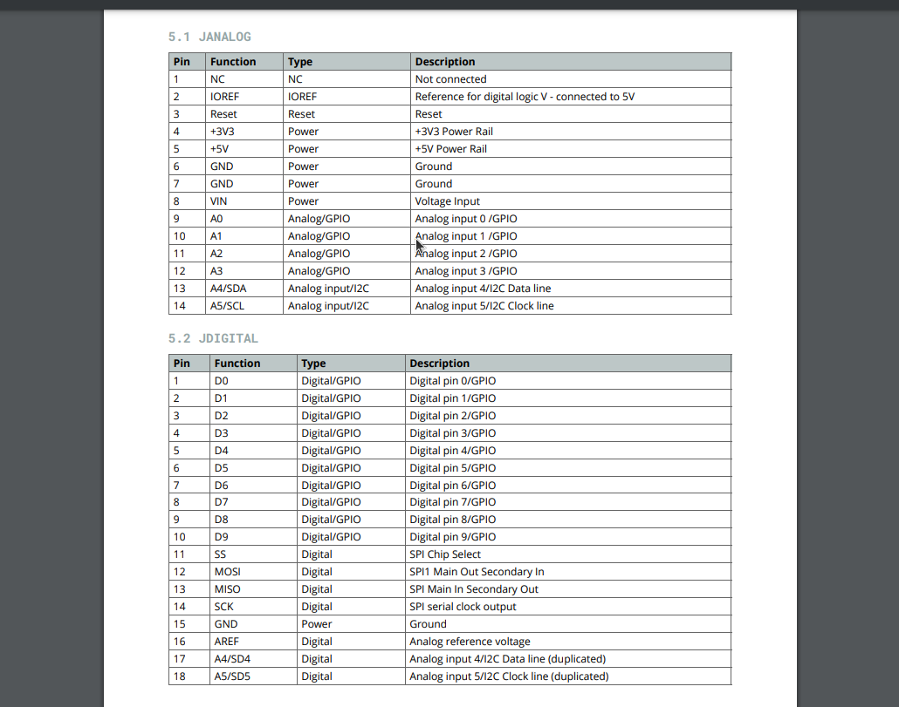
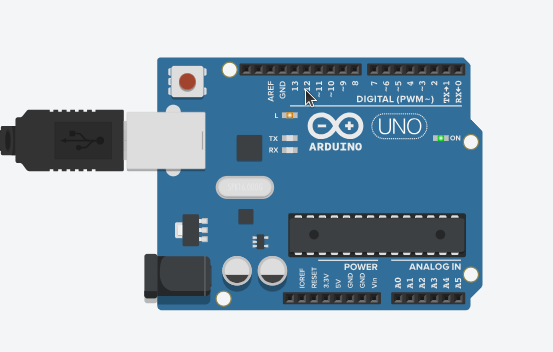

# An Introduction to Aurduino and Breadboards


This post is going to cover a basic introduction to using the Aurduino board and cover the basics of using a breadboard to build circuits. We will be "blinking" the onboard LED and building a basic circuit with an external LED attached to a breadboard.

> This post will be using TinkerCAD's aurduino simulator but I encourage to follow along with the physical components if you have them.

A cheap starter kit can be found here: <https://www.elegoo.com/products/elegoo-uno-r3-super-starter-kit>

If you want a "real" aurduino here is a slightly more expensive kit: <https://store.arduino.cc/products/arduino-starter-kit-multi-language>


## Getting to Know the Board:

For this post im going to assume we know how to and have already setup the board and IDE.


First things first lets state the goal for this section. The goal of this secton is to blink the onboard LED of the aurduino.


In order to do this we will need to send current to the correct "pin" on the board. We can find this pin by looking at the **Datasheet** of the board.


> Datasheets are an invaluable resource when working in embedded/hardware programing.

The datasheet for the uno R3 can be found here: <https://docs.arduino.cc/resources/datasheets/A000066-datasheet.pdf>




In the above image we can see all the pinouts on the board including the pin we want which is "LED_BUILTIN" this is constant variable is also used to control D13 on an uno as well.



Here we can see more information about the pinouts but we are going to ignore this for now. 

Now that we Know the pin we need to write some code to interface with that pin.

## Lets Get the Board Blinkin...

### Structure of an Aurduino Program:

Aurduino code is primaryly writtin in two functions: `setup` and `loop`. 

`setup` is where all the variables, pinmodes and more will be initiallized. This function only runs once.

`loop` is a super loop that consecutivly runs, this is what controls our board.

Code in Aurduino is written in C++ so all the normal conventions of that language apply.

### Writing the Code


**First lets build the structure for our program...**


```C++

void setup() {

}

//Super loop
void loop() { 

}
```

**Next we have to specify pinmode we want to use we will do this with `pinMode`. In this case we are using the `LED_BUILTIN` pin and `output` mode.**


```C++

void setup() {
    pinMode(LED_BUILTIN,OUTPUT);
}

//Super loop
void loop() { 

}

```
**Next we have to write the code to tell the pin what we want to do. We want to output `HIGH` voltage (5.5v or 3.3v depending on board) to turn on the LED. We will do this via `digitalWrite.`**

```C++


void setup()
{
  pinMode(LED_BUILTIN,OUTPUT);
}

void loop() // Super Loop
{

  digitalWrite(LED_BUILTIN,HIGH);
}

```
**When we run this code on the board we can see the light on the board turns on.**


**However we want the light to blink. In order to do that we are going to need to send a `LOW` voltage(0v) through the pin after a short delay.**

**Here is the code.**

```C++

void setup()
{
  pinMode(LED_BUILTIN,OUTPUT);
}

void loop() // Super Loop
{

  digitalWrite(LED_BUILTIN,HIGH);
  delay(1000); // In ms
  digitalWrite(LED_BUILTIN,LOW);
  delay(1000);
}

```



**Now we get the blinking light effect.**

Here we learned how to interface with a pin on the board and output "data"(voltage) via a pinout. Next lets interact with a external LED attached to a breadboard.


