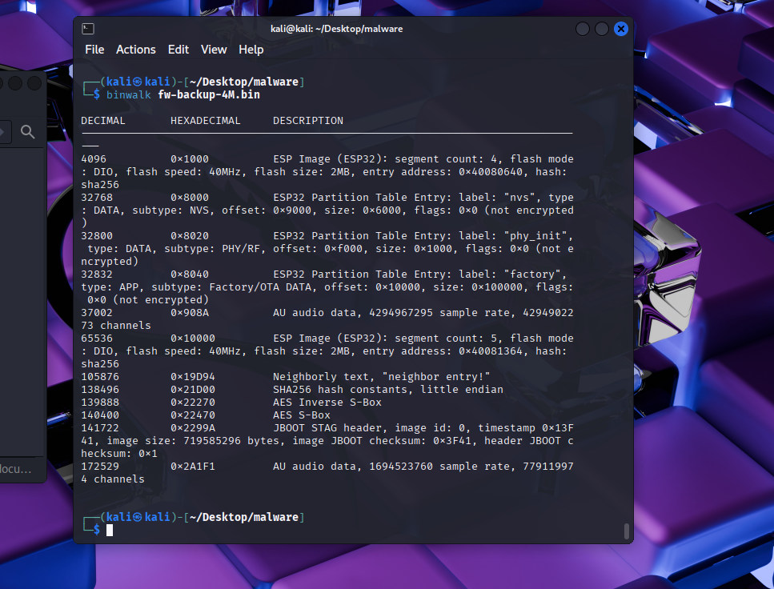
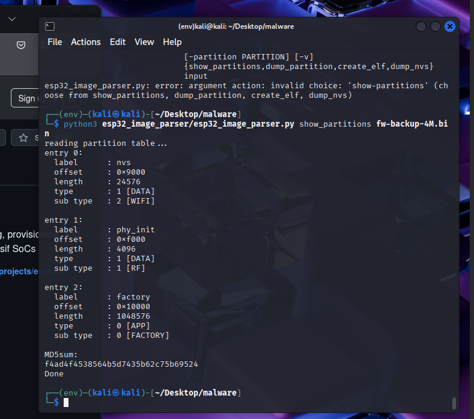
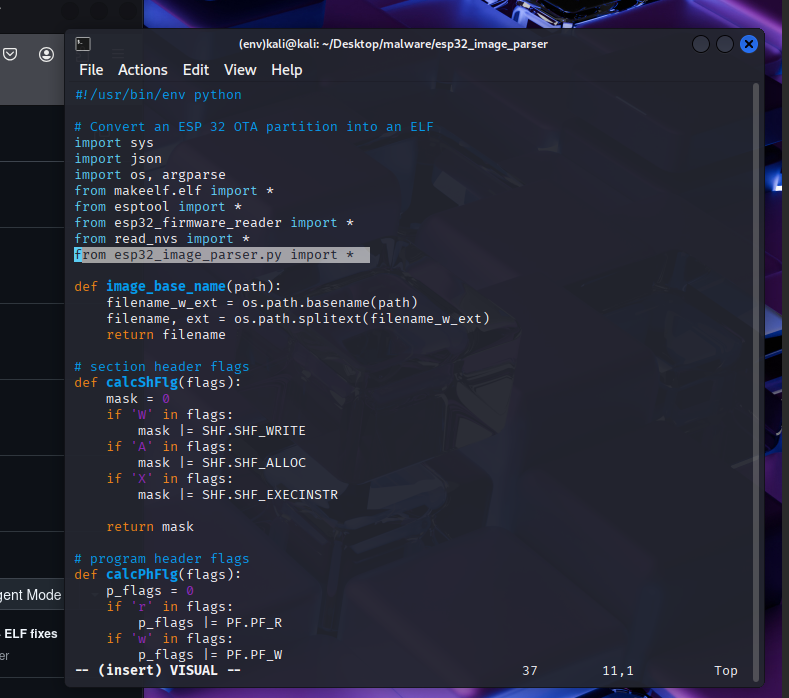
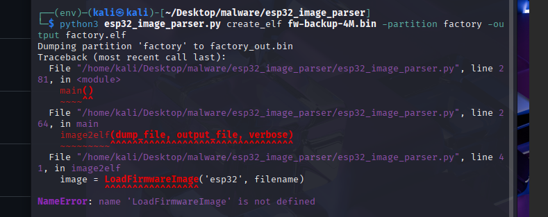
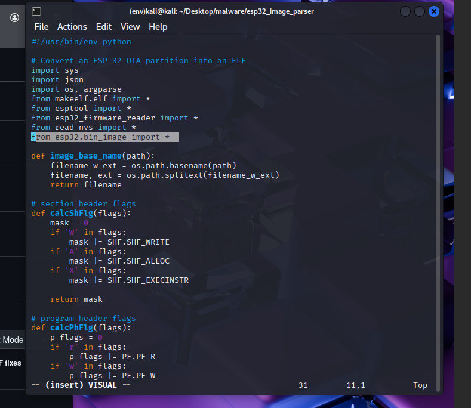
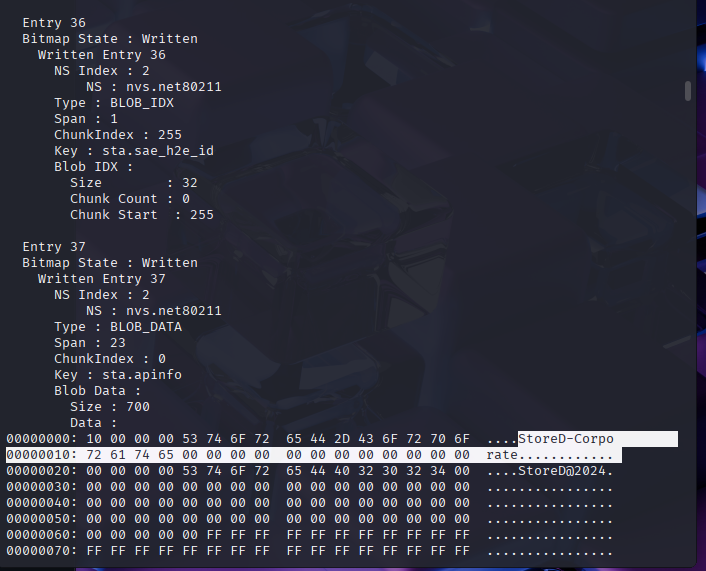
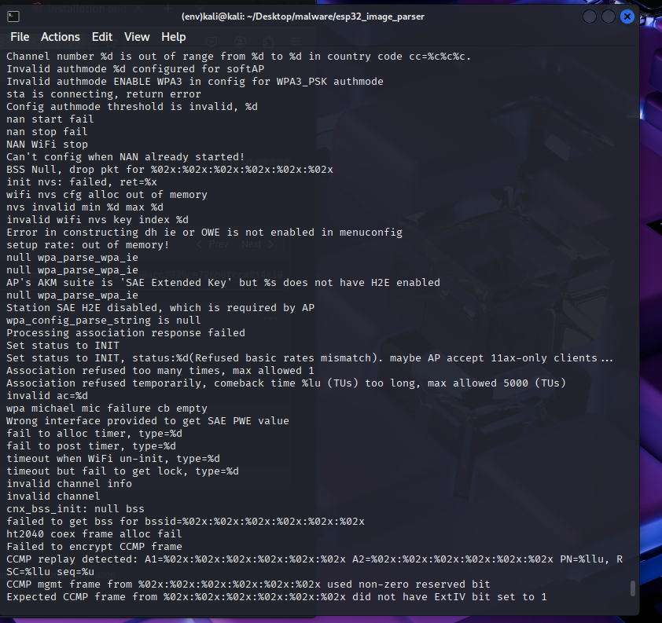
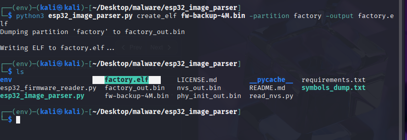
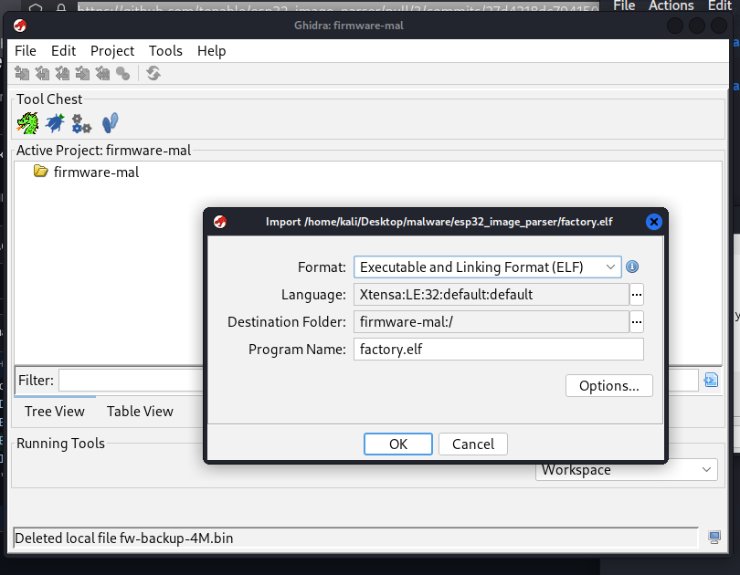

# OhSint on THM

## Room info:

**Link:** 

> <https://tryhackme.com/room/ohsint>

**Objectives**

* Task:

What information can you possible get with just one image file?

Note: This challenge was updated on 2024-02-01. If you are following any older walkthroughs, expect a small change. Additionally, the file is also available on the AttackBox, under the /Rooms/OhSINT directory.

## Investigation:

We are given one image file and the rest is up to us....

Upon first glance we can find absolutly nothing of interst in this image. Lets see if we can extract any metadata with `exiftool`.

Just like that we have a lot more data...

The first thing that I jumped at was the copyright name, `OWoodFlint`.

Lets search this up and see if we get any hits.

Bam! Tons of hits. 

Lets start checking out each link.

* Github:

* Blog: 

* Twitter/X 

These sites pretty much have all the info we need to anwser the following questions.

## Questions
* What is this user's avatar of?
  * This can be found on the users Twitter page and its an image of a cat.
  

 
* What city is this person in?
  * This can be found in the description of one of this users github repos.
  

* What is the SSID of the WAP he connected to?
  * We can find this doing a search using `wigle`

  

* What is his personal email address?
  * We can find this on the same github repo as the city location.
    

* What site did you find his email address on?
  * We found this on `github`.

* Where has he gone on holiday?
  * We can find this on his blog page.
  

* What is the person's password?
  * I first started on have I been pwnd. I found a leak related to `Gravater` and I tried looking into it based on this article.

  > <https://www.bleepingcomputer.com/news/security/online-avatar-service-gravatar-allows-mass-collection-of-user-info/>

  * I tried searching for our users hash based on the info from this breach but with little success. 

  * Then I moved on to the blog source code and ended up finding a weird password looking string in the sourcecode.

  * That was it! 

## Conclusion:

This was a fairly simple room but was fun nontheless.

