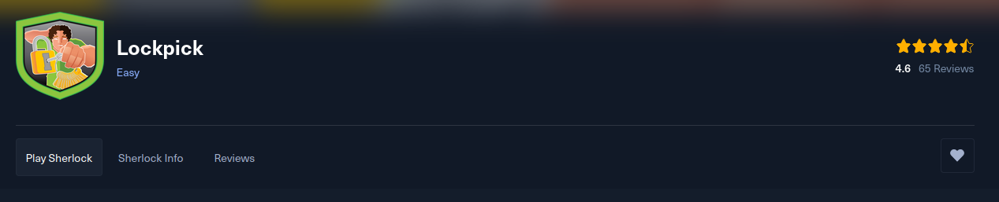
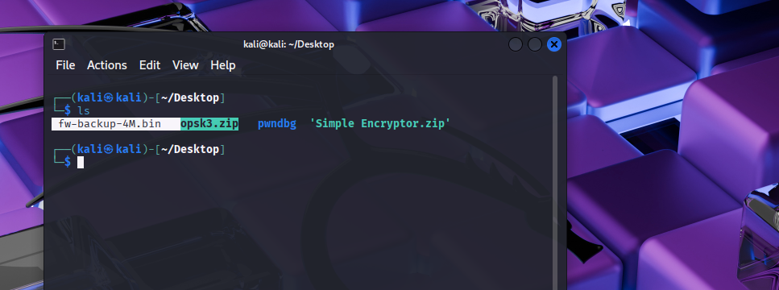
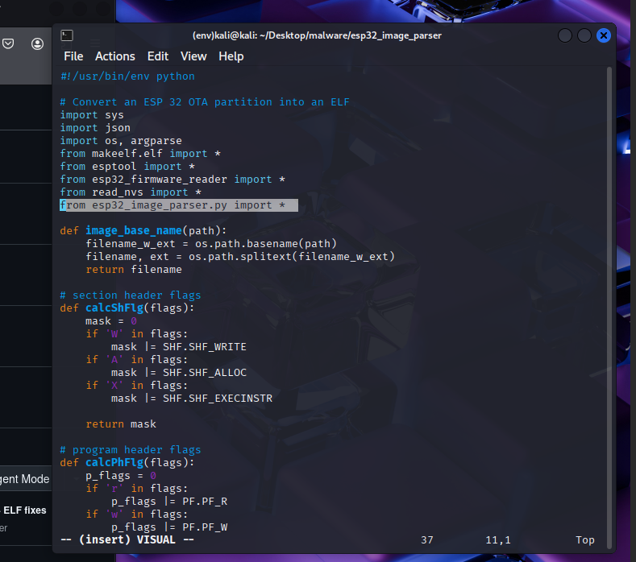
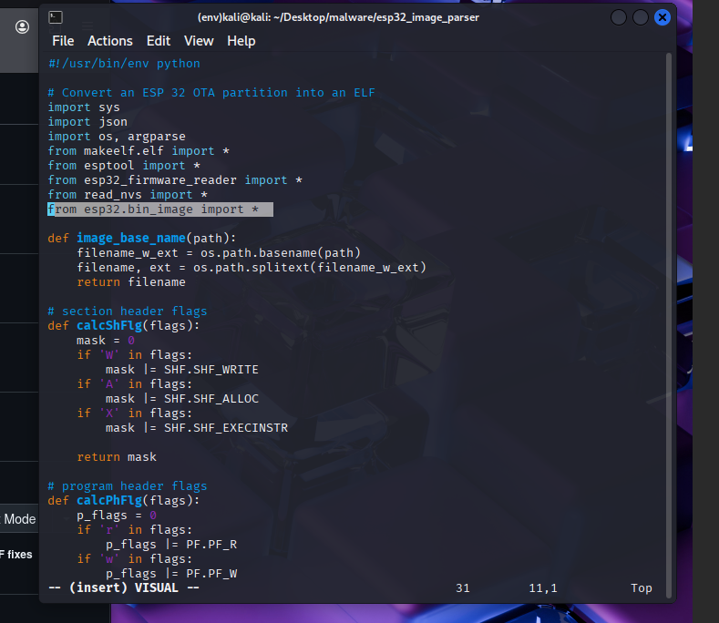
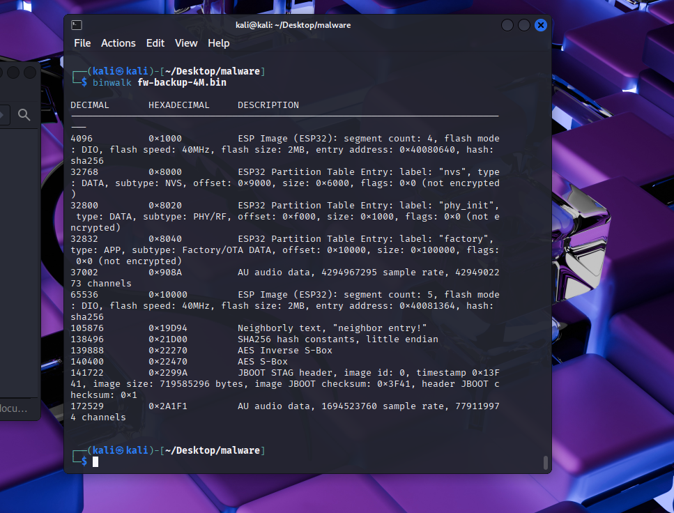

# Kape Room on THM





## Room info:

**Link:** 

> <https://tryhackme.com/room/kape>


**Objectives**


* In this room, we will:

  *  Learn about KAPE
  *  How KAPE works
  *  The different targets and modules used by KAPE
  *  Collection and analysis of forensic data using KAPE


## Introduction to KAPE:


#### Questions:

* From amongst kape.exe and gkape.exe, which binary is used to run GUI version of KAPE?
  * `gkape.exe`


## Target Options:

 Targets are artificats that must be collected during a kape memory aquisition. We can modify and create targets using TKAPE files.


 Here is an example from the room on a prefetch TKAPE file which will be used to target prefetch files on windows.

 


You can commpound TKAPE files together like this (image is also from the room):


Breakdown of "special" target directories from the THM Room: 

* !Disabled

  * "This directory contains Targets that you want to keep in the KAPE instance, but you don't want them to appear in the active Targets list." 
  
* !Local

  * "If you have created some Targets that you don't want to sync with the KAPE Github repository, you can place them in this directory. These can be Targets that are specific to your environment. Similarly, anything not present in the Github repository when we update KAPE will be moved to the !Local directory." 

#### Questions:

* What is the file extension for KAPE Targets?
  * `.TKAPE`

* What type of Target will we use if we want to collect multiple artifacts with a single command?
  * `Compound Targets`


## Module Options:

Modules in KAPE can be used to run specfic tools/programs against a set of files. It will then store the output of the result.


#### Questions:

* What is the file extension of the Modules files?
  * Module files are stored as `MKAPE` files.
* What is the name of the directory where binary files are stored, which may not be present on a typical system, but are required for a particular KAPE Module?
  * The bin folder holds tools/programs that we want to run, typically these files are not found nativly on Windows like the Eric Zimmerman tools.

## Kape GUI:
Here we can start exploring the Kape GUI.


"If we want to perform forensics on the same machine on which KAPE is running, we will provide C:\ for the Target source. We can select the target destination of our choice. All the triage files will be copied to the Target destination that we provide."



If checked the Flush checkbox will delete all the contents of the Target destination. We do not want this so lets uncheck this option.


* Add %d will append date info to the directory where the collected data is saved.  
* Add %m will append machine info to the Target destination directory. 

Using the search bar in the targets field we can select a target option, for this we are using `KapeTriage`. 

"KapeTriage collects most of the files needed for a DFIR Investigation. This Target pulls evidence from File System files, Registry Hives, Event Logs, Scheduled Tasks, Evidence of Execution, SRUM data, SUM data, Cloud metadata, WER, WBEM, Web Browser data (IE/Edge, Chrome, Mozilla history), LNK Files, JumpLists, 3rd party remote access software logs, 3rd party antivirus software logs, Windows 10/11 Timeline database, and $I Recycle Bin files."

> The code for this target can be found here <https://github.com/EricZimmerman/KapeFiles/blob/master/Targets/Compound/KapeTriage.tkape>'


"We can select if we want to process Volume Shadow Copies by enabling Process VSCs. We can select the transfer checkbox if we want to transfer the collected artifacts through an SFTP server or an S3 bucket. For transfer, the files must be enclosed in a container, which can be Zip, VHD, or VHDX. Similarly, we can provide exclusions based on SHA-1, and KAPE will not copy the excluded files. When enclosing in a container, we will need to give a Base name that will be used for all the created files. It is not required if we are not transferring files or enclosing them in a container."



We can then setup the modules we want to use. For this example we are going to use the EZParsers.


Lets execute this Kape command and see what happens.


...


...

> I will be honest this took a ludicruiously long time in the provided VM so I skipped onto the next steps.


#### Questions:


* In the second to last screenshot above, what target have we selected for collection?

  * If we look at the screenshot we can see that the target selected is `KapeTriage`

* In the second to last screenshot above, what module have we selected for processing?
  * We used the `!EZParser` module.

* What option has to be checked to append date and time information to triage folder name?
  * `%d`

* What option needs to be checked to add machine information to the triage folder name?
  * `%m`


## Kape CLI:

We can do everything that we just did in the GUI above but instead in the CLI which can be easy and fast. 

Here are some examples of KAPE commands:

```

Examples: kape.exe --tsource L: --target RegistryHives --tdest "c:\temp\RegistryOnly"
          kape.exe --tsource H --target EvidenceOfExecution --tdest "c:\temp\default" --debug
          kape.exe --tsource \\server\directory\subdir --target Windows --tdest "c:\temp\default_%d" --vhdx LocalHost
          kape.exe --msource "c:\temp\default" --module LECmd --mdest "c:\temp\modulesOut" --trace --debug

          Short options (single letter) are prefixed with a single dash. Long commands are prefixed with two dashes

          Full documentation: https://ericzimmerman.github.io/KapeDocs/

```

Lets recreate what we did above with a command starting with the target.

`kape.exe --tsource C: --target KapeTriage --tdest C:\Users\thm-4n6\Desktop\Target`

This will target the system C drive for aqusition we are using the target file KapeTriage then we specify where to send the target files in this case its a `Target` folder on the desktop.

Then we can add the module we wish to use for processing of the files:

`kape.exe --tsource C: --target KapeTriage --tdest C:\Users\thm-4n6\Desktop\Target --mdest C:\Users\thm-4n6\Desktop\module --module !EZParser`

This will now automatically get the files from the target dest and run them through the `!EZParser` module and store the output in a folder called module on the desktop.


#### Questions:

All of these can be found by reading the usage instructions when you run the kape command with no args.

* Run the command `kape.exe` in an elevated shell. Take a look at the different switches and variables. What variable adds the collection timestamp to the target destination?
  * `%d`

* What variable adds the machine information to the target destination?
  * `%m`

* Which switch can be used to show debug information during processing?
  * `debug   Show debug information during processing`

* Which switch is used to list all targets available?
  * `tlist List available Targets. Use . for Targets directory or name of subdirectory under Targets.`

* Which flag, when used with batch mode, will delete the _kape.cli, targets and modules files after the execution is complete?
  * ` cu              When using _kape.cli, if true, KAPE will delete _kape.cli and both Target/Module directories upon exiting. Default is FALSE`


## Hands on with Kape:

#### Task:
```
"So, now that we have learned how to use KAPE let's put it into practice. For this task, you will need to utilize your skills gained in this room and the previous Windows Forensics 1 and Windows Forensics 2 rooms.

Organization X has an Acceptable Use Policy for their Portable Devices, including Laptops. This policy forbids users from connecting removable or Network drives, installing software from unknown locations, and connecting to unknown networks. It looks like one of the users has violated this policy. Can you help Organization X find out if the user violated the Acceptable Use Policy on their device? The user's machine is attached to the room as a VM.

Navigate to the KAPE directory placed on the Desktop in the attached VM. Run KAPE with your desired Target and Module options, and answer the following questions.

Hint: You can use EZviewer placed in the EZtools folder on Desktop to open CSV files."

```


Lets start by running our previous KAPE command, 


#### Questions:

* Two USB Mass Storage devices were attached to this Virtual Machine. One had a Serial Number  0123456789ABCDE. What is the Serial Number of the other USB Device?


  * 

* 7zip, Google Chrome and Mozilla Firefox were installed from a Network drive location on the Virtual Machine. What was the drive letter and path of the directory from where these software were installed?

* What is the execution date and time of CHROMESETUP.EXE in MM/DD/YYYY HH:MM?

* What search query was run on the system?

* When was the network named Network 3 First connected to?

* KAPE was copied from a removable drive. Can you find out what was the drive letter of the drive where KAPE was copied from?
