# Firmware/Malware analysis on HTB (OPSK Snake-Pill)


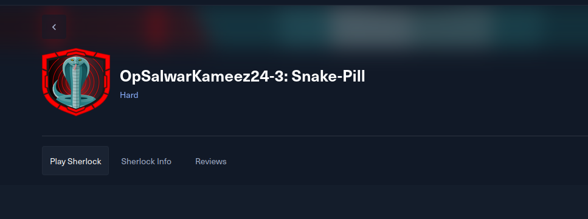


## Box info:


**About:**


Sherlock Scenario

An attacker has gained access to the supply chain of StoreD and has successfully uploaded malicious firmware to an environmental sensor which has then attempted to connect to many hosts on the network. Your task is to reverse engineer the firmware to discover what the device tries to do.


## Initial Examination and Extraction:


>Yes I am using kali for this.... I am too lazy to setup remnux


Lets use binwalk...


Esp-image python tool


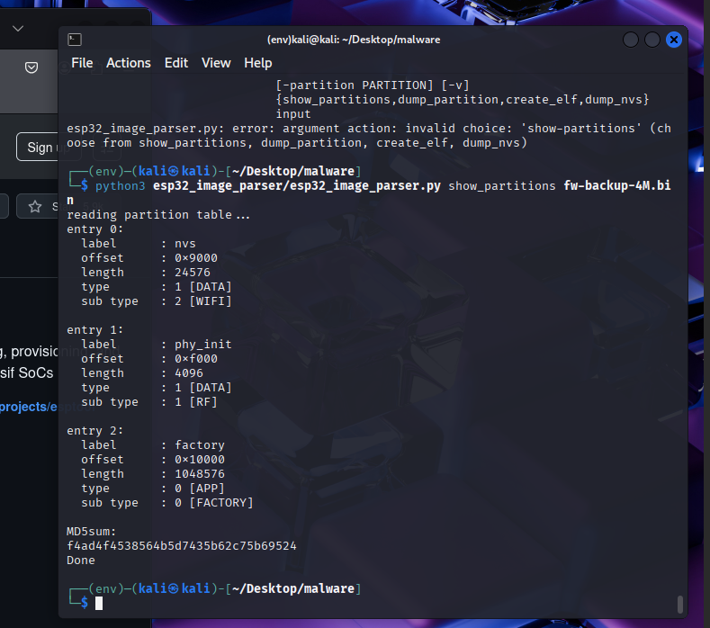


I asked chatGPT to give me a rundown of the partition sections of the ESP32 and got the following: 


```
📋 General Partition Table Explanation (ESP32)

The ESP32 uses a partition table to define how flash memory is divided into sections. Each partition has attributes like:

    Label: A human-readable name

    Offset: Where the partition starts in flash (in bytes)

    Length: Size of the partition (in bytes)

    Type: What kind of data it holds (e.g., app code, data storage)

    Sub Type: More specific info about the type (e.g., WiFi settings, factory app)

Now, let's go through each entry:
🔹 Entry 0: nvs

    Label: nvs

    Offset: 0x9000 (36 KB into flash)

    Length: 24576 bytes (24 KB)

    Type: 1 [DATA]

    Sub Type: 2 [WIFI] — although usually subtype 2 is just "NVS", not strictly "WIFI" (might be a mislabel, but the intent is clear)

🔍 Purpose:
This is Non-Volatile Storage (NVS). It stores key-value data like:

    Wi-Fi credentials

    Calibration values

    App settings

🔹 Entry 1: phy_init

    Label: phy_init

    Offset: 0xf000 (60 KB)

    Length: 4096 bytes (4 KB)

    Type: 1 [DATA]

    Sub Type: 1 [RF]

🔍 Purpose:
This stores PHY (physical layer) initialization data, used to calibrate RF (radio frequency) settings like Wi-Fi or Bluetooth performance.
🔹 Entry 2: factory

    Label: factory

    Offset: 0x10000 (64 KB)

    Length: 1048576 bytes (1 MB)

    Type: 0 [APP]

    Sub Type: 0 [FACTORY]

🔍 Purpose:
This is the main application firmware partition. It’s called factory because it's the default image that's flashed during production. This is where your actual app runs from unless OTA (Over-the-Air update) changes it later.

```

Article that was helpful:
<https://olof-astrand.medium.com/reverse-engineering-of-esp32-flash-dumps-with-ghidra-or-ida-pro-8c7c58871e68>


Dumping the partitions:


* `nvs` partition:


This contains useful information regarding wifi connections and provides some anwsers to the questions below in the Analysis section.

`python3 esp32_image_parser.py dump_nvs fw-backup-4M.bin -partition nvs`

This contains useful information regarding wifi connections and provides some anwsers to the questions below in the Analysis section.

* `phy_init`

`python3 esp32_image_parser.py dump_partition fw-backup-4M.bin -partition phy_init `

Nothing of value in here.

* `factory`

`python3 esp32_image_parser.py dump_partition fw-backup-4M.bin -partition factory_out.bin`

This is the crucial app section of the firmware and has a lot of infomation inside. We can pick through the `bin` file with strings but lets try to create an `elf` file so we can properly reverse and debug the program.


Dumping the "app" section to an elf:


`python3 esp32_image_parser.py create_elf fw-backup-4M.bin -partition factory -output factory.elf`


Need to add a line to the python script:

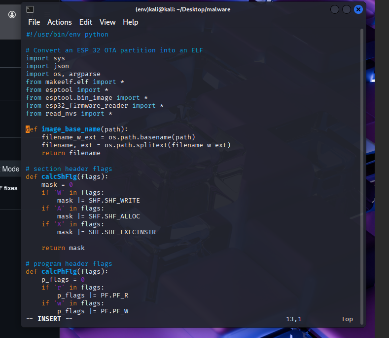

> Coresponding issue: <https://github.com/tenable/esp32_image_parser/issues/4>


Issue with DRAM when creating and elf: 

<https://github.com/tenable/esp32_image_parser/pull/3/commits/27d4218dc7941508acc2326ce726b6fcca914a10>


After solving the errors we get the following...


We can now open the file with ghidra using the Xtensa extension for the ESP32 chip.

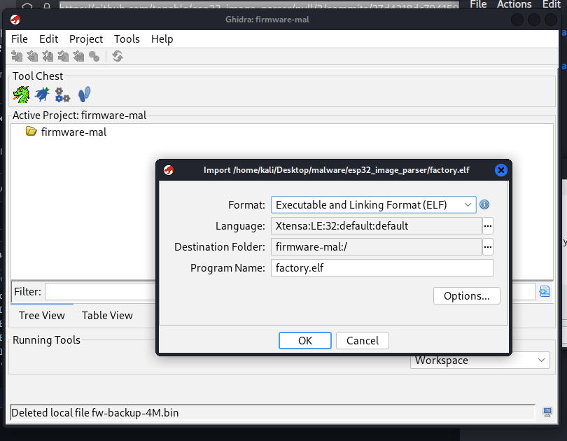


----


## Analysis and Reversing:

### Task 1 and 2:

**What WiFi network does the device connect to?**
and
**What was the WiFi password?**

These can be found by looking through the `nvs` partition dump:


----


## Analyzing:


Just for fun we can open up the packed binary in `ida` and see what it looks like.


pretty underwhelming...


Lets unpack it using `upx`:


and... muy bien!


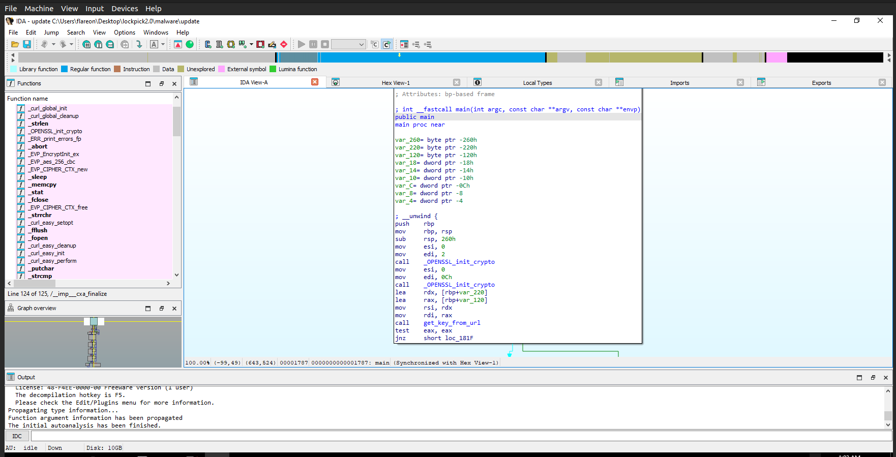


Now we can start reversing.


Starting off we can see some calls to init the ssl crypto lib. This library is used with various crypto functions and encryption schemes.


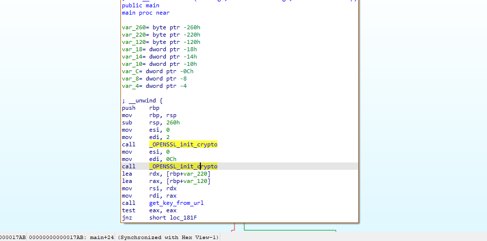


We can also find a function that might fetch an encryption key:


Scrolling through the `get_key_from_url` function I think it's worth it to get a debugger out (i'll come back to this later on.)


Looking further through main we can find a `handle_directory` function call. It also takes `"/share/"` as an argument which matches the dir where our encrypted files are.


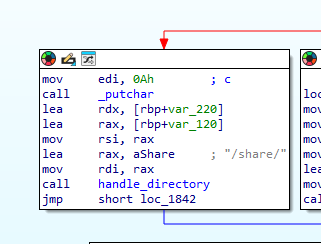


Scrolling through we can see it makes a curl request to a paste bin site.


In `download_lyrics`:


Write to a output file `countdown.txt`


Paste bin contents:


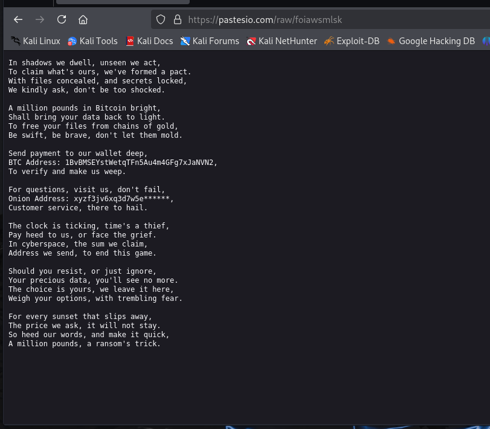


Matches the countdown.txt:


----


### Task 7:


**How much is the TA asking for?**


* `£1000000`


### Task 6:


**What is the BTC wallet address the TA is asking for payment to?**


* Bitcoin Address:
 * `1BvBMSEYstWetqTFn5Au4m4GFg7xJaNVN2`


----


Continuing down the `handle_directory` function it calls `encrypt_file`


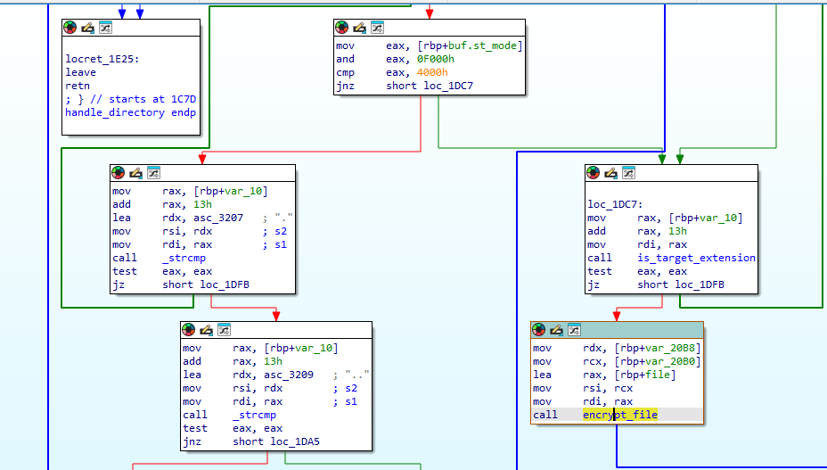


open input file for read:


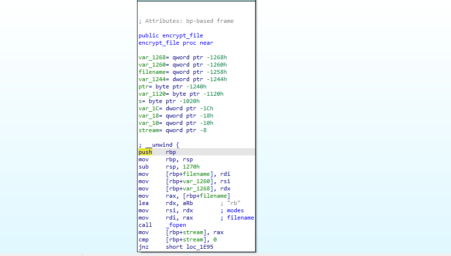


if it can't:


Setup a file to write to with ext .24bes (hacker group name)


Then encrypt using `AES 256`


----
### Task 1:
**What type of encryption has been utilised to encrypt the files provided?**


* `AES`

----


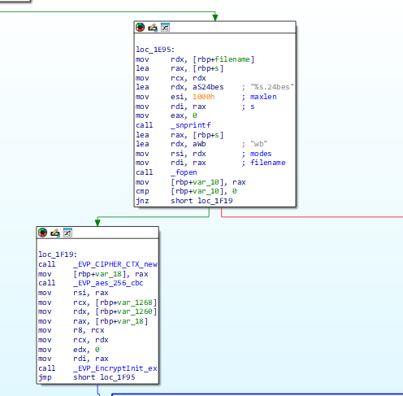


It then attempts to remove the original files leaving only the encrypted:


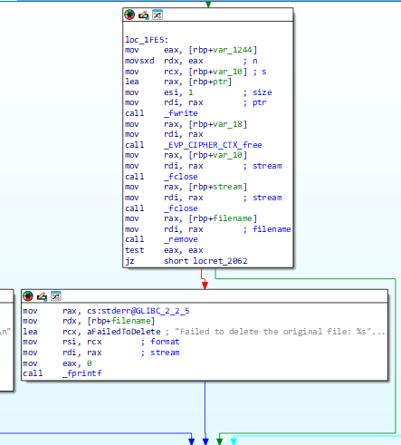


Targeted file types:


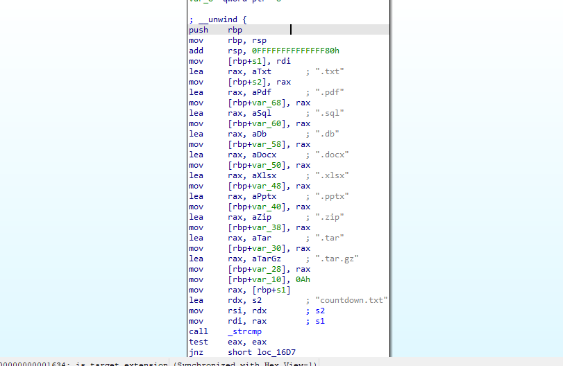


### Debugging for the key:


Returning to the `get_key_from_url` function...


Stepping through with GDB we can find the URL that the key is fetched from.


`rb.gy` is a URL shortener which is used to shorten URLs. 
I threw this into virus total just to get an idea of what it could be doing.


Within VT we can find the full expanded URL.


We can get the file by navigating to the URL:


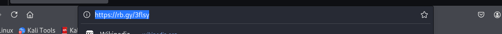


----


### Task 5:


**What is the file hash of the key utilised by the attacker?**


----


Poking around further in `cutter` (I switched to a linux vm)


`encrypt_file`:


`encrypt`:


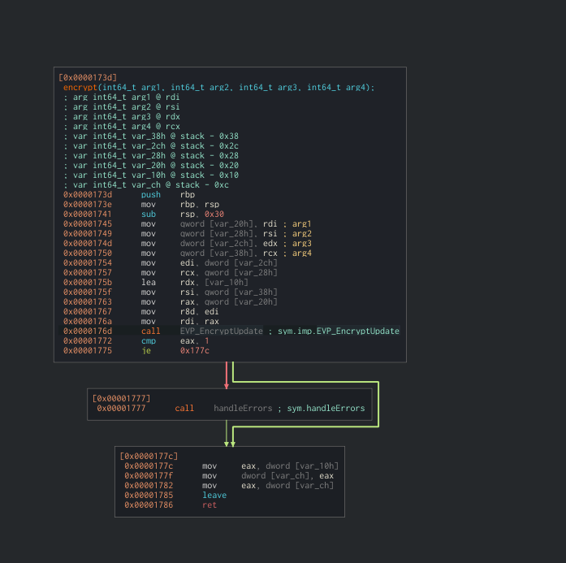


Using the key in cyberchef results in us finding out the key is too long.
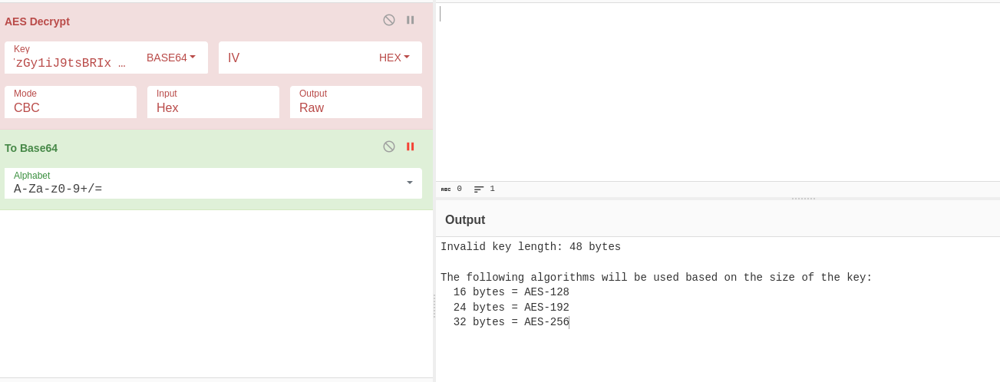


Examining further in cutter we can see that the malware uses `memcpy` to copy only the first 32 bytes.


> 0x20 is 32.


Now we need to deal with the `IV`. We should be able to find the `IV` value by searching for the `EVP_EncryptInit_ex` function.


It takes the following params:


`EVP_EncryptInit_ex(ctx, EVP_aes_256_cbc(), NULL, key, iv);`


ChatGPT-


```
ctx: Your initialized EVP_CIPHER_CTX *.


EVP_aes_256_cbc(): Specifies AES with 256-bit key in CBC mode.


NULL: Use default software crypto engine.


key: Your encryption key.


iv: Initialization Vector (or NULL if you want zero IV).
```


If you look at the docs you can see that the `IV` option is not needed.
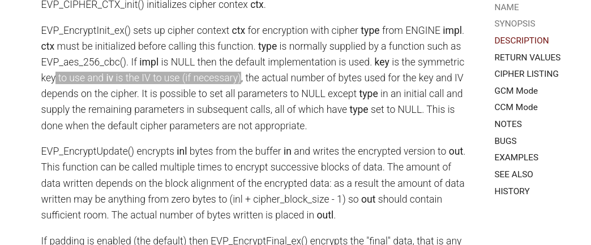


Asking chatGPT for an example revealed that if no `IV` is passed it is just filled with zeros.


Trying an IV of all zeros works and we end up being able to decrypt the files.


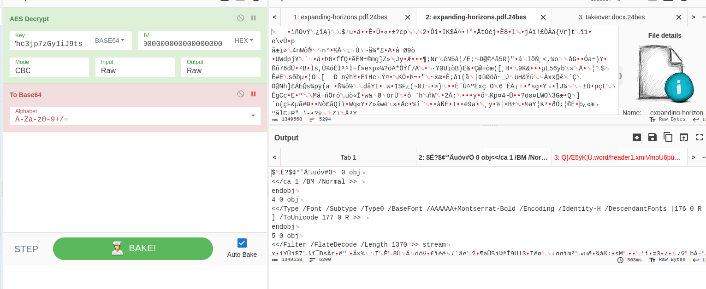


> Didn't want to give away the most fun flags to find. Go get 'em :)


----


### Task 2 and 3:


**Which market is our CEO planning on expanding into? (Please answer with the wording utilised in the PDF)**


* You can find these by examining the now unencrypted docs.

----


# Conclusion:


This was a fun yet more challenging box with some fun reversing, debugging and file decryption.


Shoutout to `sebh24` for creating a fun challenge.


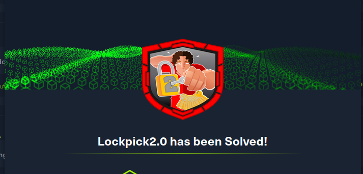


