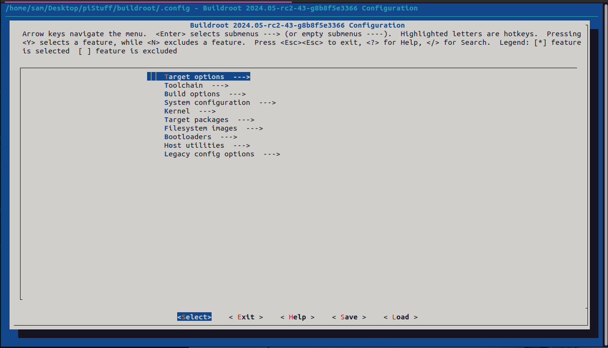
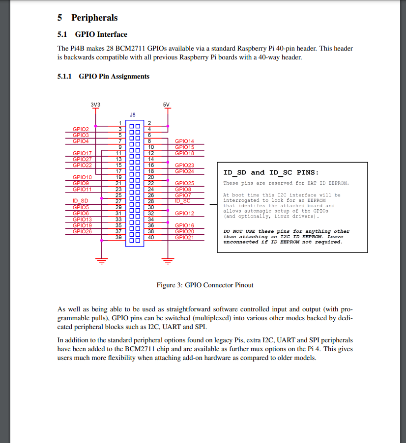
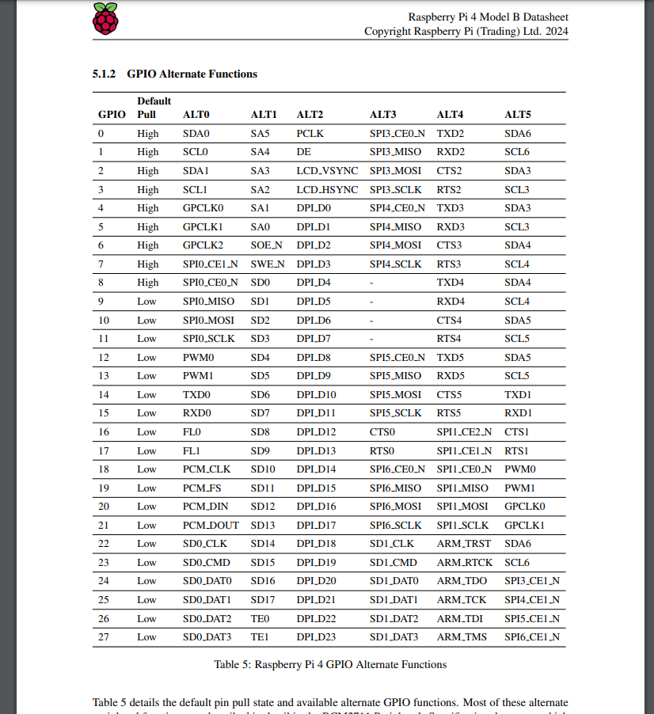
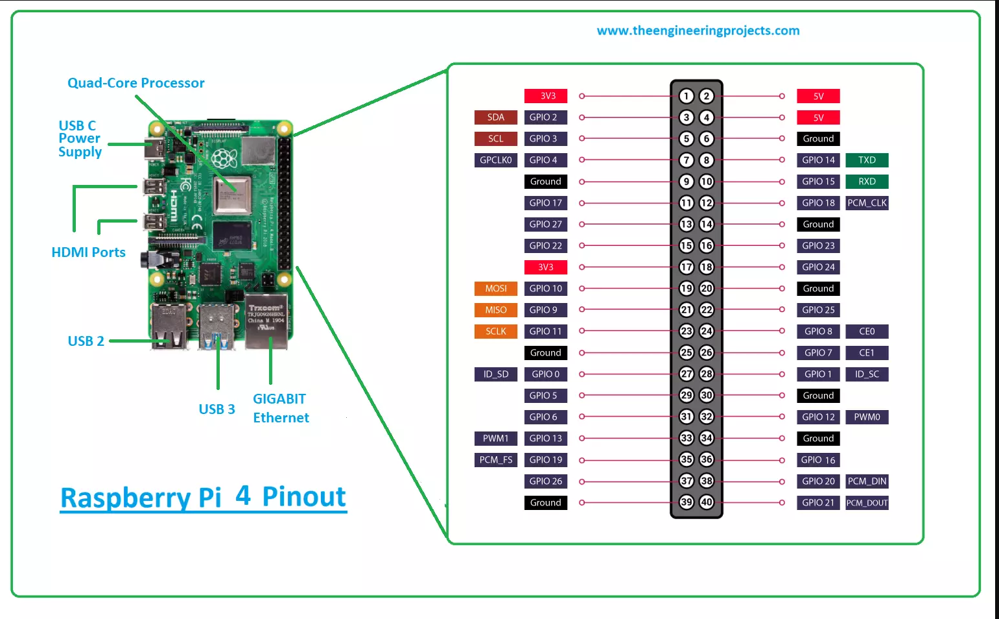

# Using buildroot to create a simple embedded linux system on the Raspberry pi.

## Hardware needed:
* A raspberry pi.
* A USB to serial adapter. 

## Installing buildroot:

* Instructions can be found here
    * https://buildroot.org/download.html


`sudo apt install -y git build-essential wget cpio unzip rsync bc libncurses5-dev screen`


The easy way is a simple `git clone`:
`git clone https://gitlab.com/buildroot.org/buildroot.git`
```
Cloning into 'buildroot'...
remote: Enumerating objects: 546198, done.
remote: Counting objects: 100% (2165/2165), done.
remote: Compressing objects: 100% (1167/1167), done.
remote: Total 546198 (delta 1066), reused 1749 (delta 967), pack-reused 544033 (from 1)
Receiving objects: 100% (546198/546198), 129.09 MiB | 11.06 MiB/s, done.
Resolving deltas: 100% (387489/387489), done.
```

Next we have to checkout a branch.
`git checkout 2024.02.3`

```
Note: switching to '2024.02.3'.

You are in 'detached HEAD' state. You can look around, make experimental
changes and commit them, and you can discard any commits you make in this
state without impacting any branches by switching back to a branch.

If you want to create a new branch to retain commits you create, you may
do so (now or later) by using -c with the switch command. Example:

  git switch -c <new-branch-name>

Or undo this operation with:

  git switch -

Turn off this advice by setting config variable advice.detachedHead to false

HEAD is now at a73dd8f787 Update for 2024.02.3

```


## Run buildroot:

From within the build root directory run the following command:

`make menuconfig`

You will see this screen:


There are a lot of custom options to be defined in here but for this example we are going to use a prebuilt config for the pi.

`ls configs/ | grep raspberry` - This will show you your prebuilt options.

I have a pi 4 so I will use `raspberrypi4_64_defconfig`

Next we run another make command:

`make raspberrypi4_64_defconfig`

This will output:

`configuration written to /home/sam/Desktop/piStuff/buildroot/.config`

Next we can run `make menuconfig` again to see the settings and change anything we want to. For now im just going to leave it all default.

Next we run `make` and it will build our system. 

> This can take a while.... but its still typically takes less time than using something more custom like yacto.


## Creating the boot drive:

Once our system is done compiling we can find our image in `output/images/` from the root of the buildroot dir.

We should see `sdcard.img`. 

Next we will flash this our sd card.

Here is the gui method:
* Open disk utility
* Find your sd card
* Click the three dots one the top right and select `restore disk image` 
* select the `sdcard.img` file from above.

Here is the command line command from the buildroot dir:

* Use the `mount` command or `dmesg` to find your drive.

Run the following to write to the drive.
`sudo dd if=output/images/sdcard.img of=/dev/"yourdevice"`

Then run `sync`


## Interfacing with the pi:

You can find all the raspberry pi datasheets here: https://datasheets.raspberrypi.com/


I need to find out what pins to use for UART and Serial connections.






We can also usual look up "*Board name* pinout or datasheet" in our favorite search engine.


> Source: https://www.theengineeringprojects.com/2021/03/what-is-raspberry-pi-4-pinout-specs-projects-datasheet.html


